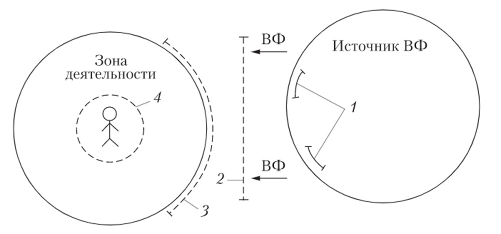

*[СЗЗ]: Санитарно-защитная зона
*[ВФ]: Вредный фактор

# Основные пути достижения безопасности: защитное зонирование, защитная техника

## Пути достижения безопасности

1. Для снижения риска (`↓Ri`):
    - Совершенствование производственного процесса (использование более безопасных технологий и т.п.)
    - Улучшение подготовки персонала
    - Использование защитной техники (в том числе индивидуальных средств защиты)

1. Для снижения числа лиц, находящихся в опасной зоне (`↓N∑`):
    - Использование дистанционного управления производством
    - Исключение человека из производственного процесса (максимальная автоматизация, вплоть до роботизации)
    - Размещение опасных объектов вдали от населенных районов

## Защитное зонирование

!!! quote ""
    Защита расстоянием

Техногенные объекты, являющиеся источником загрязнения, имеют санитарно-защитную зону **(СЗЗ)**, отделяющие их от жилых кварталов.

СЗЗ предназначена для уменьшения отрицательного влияния предприятий и обеспечения требуемых гигиенических норм содержания вредных веществ в атмосферном воздухе. Концентрация вредных веществ,
выбрасываемых промышленным предприятиям, на границе СЗЗ должна быть меньше ПДК.

Обладает барьерными функциями.

Запрещена:

- Любая хозяйственная деятельность (но могут размещаться предприятия меньшей категории опасности)
- Проживание людей и размещение любых социальных объектов.

## Специальная защитная техника

Используется при невозможности снижения уровня опасности даже с применением защитных зон.

Общая схема действия защитной техники

1. Защитные устройства, входящие в состав источника воздействия (нейтрализаторы, глушители, пылеулавливатели)
2. Устройства, устанавливаемые между источником и зоной деятельности (экраны)
3. Устройства для защиты зоны деятельности (кабины наблюдения и управления процессом)
4. СИЗ

ВФ – вредный фактор

## Принцип действия

1. Для защиты от вредных веществ используется принцип поглощения (фильтры, циклоны, дожигатели)
2. Для защиты от энергетических факторов (шум, излучение и т.п.) используют:

- Принцип изоляции – установка экранов между источником энергии и защищаемым объектом (источник и приемник `Е` расположены по разные стороны от `ЗУ`)

