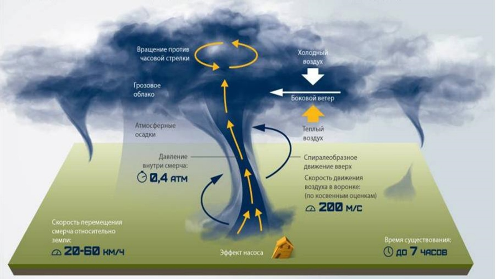

# Ураганы, бури, смерчи: определение, механизм возникновения, действующие негативные факторы, последствия

## Определения

### Ураган

`Ураган`– ветер большой разрушительной силы и значительной продолжительности. По своей разрушительной силе сравним с землетрясением

Условно, к ураганному относится ветер, нижняя граница скорости которого ≥ 30 м/с (120 км/ч)

Принципиальная особенность – прямолинейное («луч света») распространение воздушных масс

### Буря

`Буря` – разновидность линейного распространения воздушных масс, уступающая по силе урагану (скорость ветра – 70-115 км/ч)

### Смерч

`Смерч (торнадо)` – восходящие вихри быстро вращающегося воздуха, имеющего вид земляного (водяного) столба диаметром до сотен метров с вертикальной (иногда изогнутой) осью вращения. 
Внутри столба разрежение (пониженное давление), обусловливающее всасывание всего встречающегося на пути смерча (земля, песок, вода и т.д.)

Смерч возникает в грозовом облаке и затем распространяется в виде тёмного рукава или хобота по направлению к поверхности суши или моря. В верхней части смерч имеет воронкообразное расширение,
сливающееся с облаками. Когда смерч опускается до поверхности земли или воды, нижняя часть его тоже становится расширенной, похожей на опрокинутую воронку. Высота смерча может достигать 800 – 1500 м.
Вихрь вращается как правило против часовой стрелки, причем одновременно поднимается по спирали вверх, втягивая в себя всё встречающееся на пути. Внутри потока скорость может достигать 200 км/час.
Смерч возникает обычно в тёплом секторе циклона, чаще перед холодным фронтом. Образование его связано с особо сильной неустойчивостью закономерного распределения по высоте температур атмосферного
воздуха (стратификации атмосферы)

???+ info "Схема образования смерча"
    

## Последствия

Разрушение строений, сооружений, транспортных коммуникаций, линий связи, ЛЭП

Эрозия, выветривание почв, нарушение сельскохозяйственной деятельности

## Меры защиты

При нахождении в здании:

1. Закрыть окна, двери
2. По возможности убрать с балконов предметы, представляющие опасность при падении (стекло, острые предметы и т.п.)

При нахождении на открытой местности:

1. Максимально быстро отойти потенциально опасных мест (в городе – рекламные щиты, линии электропередач, деревья)
2. По возможности укрыться в капитальных зданиях или сооружениях
3. При отсутствии такой возможности – укрыться в естественных выемках земли (ямы, канавы, овраги): лечь на дно и плотно прижаться к земле
    - При возникновении смерча наиболее благоприятное место укрытия – подземные сооружения: подвал дома, погреб и т.п
