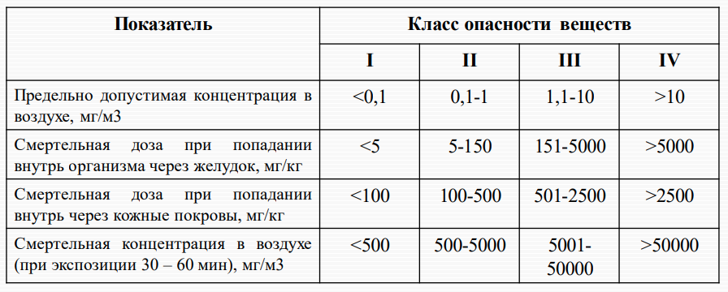

*[ХОВ]: Химически опасные вещества
*[АХОВ]: Аварийно химически опасные вещества
*[СИЗ]: Средства индивидуальной защиты

# Химически опасные вещества: классификация, виды, понятие предельно допустимой концентрации, действующие факторы

[:fontawesome-solid-file-download:](files/lection_03_chemical_substances.pdf){:download='lection_03_chemical_substances.pdf'} 
[Презентация](files/lection_03_chemical_substances.pdf){ target='_blank' }

## Определение

Химические вещества, предназначенные для применения в хозяйственных целях и обладающие токсичностью, способной вызвать массовое поражение людей, животных и растений, принято
называть `химически опасными веществами` (ХОВ)

## Классификация ХОВ

По степени воздействия на человека выделяют 4 класса ХОВ

1. `Чрезвычайно опасные`:
    - Cоединения ртути, свинца, талия, кадмия
    - Вещества содержащие цианид-ионы
    - Галогены - фтор, хлор, бром
    - Фтор- и фосфорорганические соединения
2. `Высоко опасные `
    - Минеральные и органические кислоты
    - Щелочи
    - Аммиак
    - Галогензамещенные углеводороды
    - Некоторые спирты и альдегиды
3. (и 4) `Умеренно- и малоопасные` (остальные химические соединения)

## Степень опасности ХОВ

## Классификация ХОВ по характеру воздействия на человека

1. Вещества с `преимущественно удушающим действием`:
    - С выраженным прижигающим действием (фтор, хлор и др. галогены)
    - Со слабым прижигающим действием (фосген)
2. Вещества `общеядовитого действия` (синильная кислота и её соли - цианиды)
3. Вещества, `обладающие удушающим и общеядовитым действием`:
    - С выраженным прижигающим действием (акрилонитрил)
    - Со слабым прижигающим действием (сероводород, оксиды азота)
4. `Нейротропные яды`, действующие на генерацию, проведение и передачу нервных импульсов (сероуглерод)
5. `Вещества удушающего и нейротропного действия` (аммиак)
6. `Метаболические яды`, отравляющие организм в результате не прямого действия, а внутриклеточного обмена веществ и их биохимического превращения в опасные соединения (метиленхлорид, окись этилена)
7. `Канцерогенные вещества`

## По возможной опасности воздействия на человека

Условно можно выделить два типа ХОВ:

- ХОВ, которые наиболее вероятно воздействуют длительное время в малых концентрациях, приводя к хроническим расстройствам: тяжелые металлы, оксид углерода, некоторые вещества, обладающие
  канцерогенными свойствами
- ХОВ, представляющие наибольшую опасность при техногенных авариях и вызывающие, в основном, острые поражения – аварийно химически опасные вещества (АХОВ)

## Аварийно химически опасные вещества

### Аварийно химически опасные

Представляют собой ХОВ, которые могут попасть в окружающую среду в результате производственных аварий, стихийных бедствий, террористических актов на химически опасных объектах (предприятия, средства
транспорта, склады)

### Очаг заражения

Это территория, подвергшаяся воздействию химически опасных веществ, в результате которого возникают или могут возникнуть поражения людей, животных и растений

### Предельно допустимая концентрация

Это максимальное количество вредных веществ в единице объёма воздуха или воды, которое при ежедневном воздействии в течение длительного времени не вызывает патологических изменений или заболеваний, а
также не нарушает нормальной деятельности человека

## Правила безопасного поведения при авариях с выбросом АХОВ

Основные способы защиты:

- Укрытие в убежищах и герметизированных помещениях
- Использование средств индивидуальной защиты с учетом того, какое АХОВ является источником заражения (практически от всех АХОВ защищает противогаз)
- Ограничение времени пребывания на открытой местности
- Удаление АХОВ с кожных покровов, слизистых оболочек и из организма; обезвреживание (нейтрализация) АХОВ или продуктов его распада (выбор способа обезвреживания зависит от типа АХОВ)

## Алгоритм действий при получении сообщения об угрозе химического заражения

1. Надеть подручные средства индивидуальной защиты (СИЗ) органов дыхания и покинуть предполагаемый район заражения
2. Если выйти из зоны заражения не удается, остаться в помещении, надеть подручные СИЗ органов дыхания, загерметизировать помещение (с помощью различных пленок, лейкопластыря, бумаги заделайте щели в
  окнах и дверях, плотно закройте дымоходы и вентиляционные отдушины)
3. В случае невозможности дальнейшего нахождения в помещении, необходимо отключить нагревательные и бытовые электроприборы, газ, одеть детей и престарелых, взять теплую одежду и непортящиеся продукты
  на 3 суток, и, выйдя, двигаться перпендикулярно направлению ветра, соблюдая следующие правила:
    - Двигаться быстро, но не бежать
    - Не касаться окружающих предметов
    - Избегать перехода через заглубленные места (тоннели, лощины)
    - При выходе из зоны заражения снять верхнюю одежду, промыть глаза и открытые участки тела водой
4. По возможности оказать первую помощь пострадавшим

## Основные принципы оказания доврачебной помощи при поражении АХОВ

1. Прекращение поступления АХОВ в организм (вынести пострадавшего из зоны заражения, удалить АХОВ с кожи или со слизистых оболочек, снять загрязненную одежду)
2. Восстановление нарушенных функций организма и поддержание жизни (сердечно-легочная реанимация при необходимости)
3. Выведение АХОВ из организма (промывание желудка, рвотные средства, адсорбенты, смывание большим количеством воды попавшее на кожу АХОВ), при возникновении химических ожогов применение 2% раствора
  соды (ожоги кислотами) или 2% раствора уксусной кислоты (ожоги щелочами)
4. Применение соответствующих противоядий и медикаментов, усиливающих защитные свойства организма
