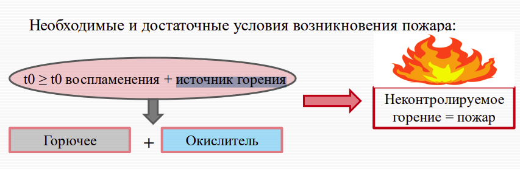

# Пожарная безопасность: определение, понятия «горение», «пожар», «источник зажигания». Необходимые условия возникновения пожара

[:fontawesome-solid-file-download:](files/lection_03_fire.pdf){:download='lection_03_fire.pdf'}
[Презентация](files/lection_03_fire.pdf){ target='_blank' }

## Определения

### Пожар

`Пожар` – неконтролируемый процесс горения, сопровождающийся уничтожением материальных ценностей и создающий опасность для жизни и здоровья людей

### Горение

`Горение` – химическая реакция взаимодействия горючего с окислителем (кислород воздуха), при которой выделяется тепло

### Источник зажигания

!!! warning
    Определение из инета

`Источник зажигания` – это средство, обладающее достаточным объемом энергии, температурой, которое при длительном воздействии на внешнюю среду способно вызвать воспламенение(горение)

## Необходимые и достаточные условия возникновения пожара

