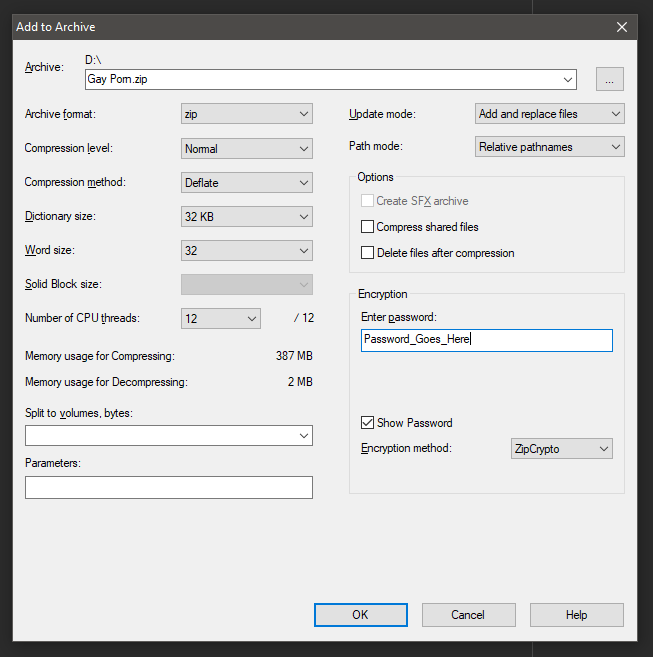

# Алгоритм создания парольной защиты архивов (ограничение доступа и редактирования)

Создание архива с парольной защитой на примере программы 7-Zip.

1. Нажмём правой кнопкой мышки на папку, которую хотим заархивировать и выберем из контекстного меню пункт «7-Zip»
1. Далее «Добавить к архиву»
1. В появившемся функциональном окне архиватора изменим несколько значений:

