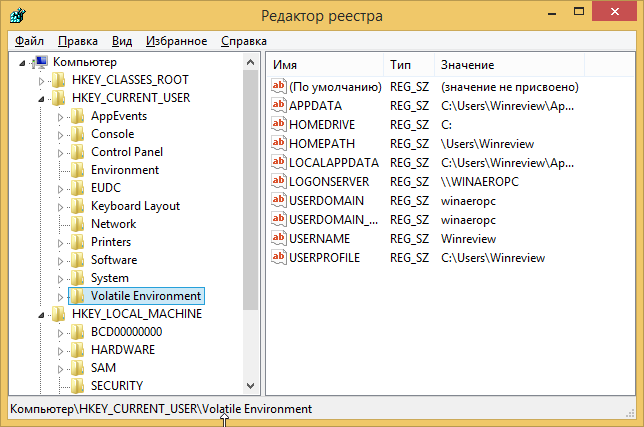

*[UI]: User Interface

# Алгоритм работы с редактором реестра Windows (разделами, параметрами и ключами)

[Редактор реестра для новичка и не только](https://winreviewer.com/redaktor-reestra-dlya-novichka-i-ne-tolko/){:target='_blank'}

[Что такое куст реестра?](https://solutics.ru/windows/chto-takoe-kust-reestra/){:target='_blank'}

## Описание

**Редактор реестра** был создан для пользователей, которым необходимо изменить параметры Windows, недоступным через UI.
Основная функция этой программы — просмотр и изменение настроек в системном реестре, то есть в набор специальных
бинарных файлов, которые содержат информацию и о конфигурации Windows, и почти обо всех программах, установленных на
вашем компьютере. ОС Windows, и многие программы (за исключением портативных) хранят свои настройки в реестре.

Он состоит из двух панелей:

- **Слева** - разделы (ключи)
- **Справа** - параметры. Они представляют собой пары `имя = данные` и хранятся внутри ключей

## Определения

**Улей в реестре Windows** – это имя, данное главному разделу реестра, который содержит ключи реестра, подразделы
реестра и значения реестра

Все ключи, которые считаются кустами, начинаются с `HKEY` и находятся в корне или в верхней части иерархии реестра,
поэтому их иногда называют **корневыми ключами**

## Что показывает Редактор реестра

**Разделы** (или ключи) являются виртуальным представлением данных из нескольких файлов, которые образуют базу данных
реестра

## Запуск

Чтобы запустить редактор реестра, в любой версии Windows (от XP) вы можете нажать клавиши `Win + R` и ввести `regedit`
в окно `Выполнить`

???+ danger
    Прежде чем вносить изменения в реестр, рекомендуется выполнить экспорт и создать его резервную копию.

???+ info
    Можно сделать резервную копию как всего реестра в целом, так и отдельных разделов и подразделов. Позже эту резервную
    копию можно импортировать, чтобы отменить внесенные изменения.

???+ tip
    Операции экспорта и импорта используются не только для создания резервных копий

## Создаем полную копию реестра

1. Запускаем редактор реестра
1. Оставаясь в корне реестра, открываем меню `Файл` и выбираем пункт `Экспорт`
1. Выбираем место, где будет сохранена резервная копия, и указываем `Имя файла`
1. Нажимаем на кнопку `Сохранить`

## Восстановление реестра из резервной копии (импорт)

Чтобы импортировать сохраненный файл реестра, достаточно дважды нажать левой кнопкой мыши по файлу с расширением `.reg`

Также можно:

1. Открыть редактор реестра
1. В меню `Файл` выбрать пункт `Импортировать файл реестра`
1. Выбрать файл, который следует импортировать и нажать `Открыть`

## Поиск в реестре

Для быстрого доступа к параметрам можно воспользоваться поиском по реестру, который находится в
меню `Правка → Найти` `Ctrl+F`

Для перемещения между найденными значениями используется **`Правка → Найти далее`** `F3`

## Загрузка и выгрузка куста

Допустим, имеется жесткий диск с нерабочего компьютера. Чтобы получить доступ к определенным веткам реестра, который
хранится на этом жестком диске, необходимо:

1. Подключить жесткий диск к рабочему компьютеру
2. Открыть реестр на рабочем компьютере
3. Выбрать необходимую ветку реестра
4. Перейти в меню `Файл → Загрузить куст`
5. Задать произвольное имя загруженному кусту. После завершения работы с загруженными кустами, их желательно выгрузить.
   Для этого необходимо перейти в `Файл → Выгрузить куст`

## Права доступа

!!! warning
    Все разделы реестра имеют права доступа или разрешения. Если у текущего пользователя нет прав на определенный раздел, то
    будет выведено сообщение об ошибке и запрете доступа к данному разделу

!!! info "Прав доступа может не быть по нескольким причинам"
    1. У текущего пользователя, залогиненного в системе, нет прав администратора 1. Группа `Администраторы` является
       владельцем раздела, но не имеет полных прав на него 1. Владельцем раздела является системная
       служба `TrustedInstaller`
    1. Владельцем раздела является системная учетная запись `Система`

!!! success "Решение"
    1. Необходимо обращаться к системному администратору, чтобы он предоставил доступ к учетной записи администратора или
       дал администраторские права пользователю 1. Достаточно просто выдать группе `Администраторы` полные права 1.
       Необходимо сначала стать владельцем раздела, а затем выдать своей группе полные права 1. Аналогично
       с `TrustedInstaller`