# Алгоритм работы с журналом брандмауэра Windows в режиме повышенной безопасности (включение, настройка и отключение)

## Описание
Что такое режим повышенной безопасности? 
Это оснастка управления для брандмауэра, из которой вы можете управлять всеми его **настройками**, **правилами** и **исключениями**. 
Для получения доступа к расширенным настройкам вам нужно открыть брандмауэр, а затем нажать на **Дополнительные параметры** в левом столбце.

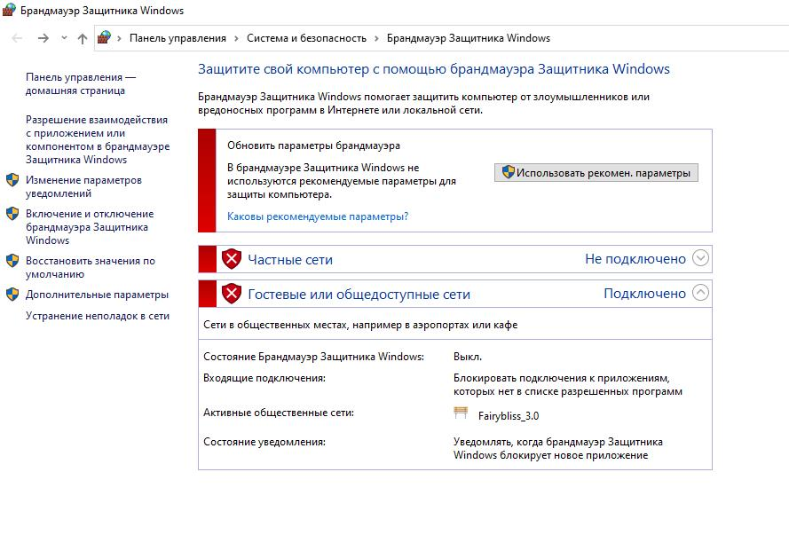

Брандмауэр Windows теперь открыт в режиме повышенной безопасности. Эта оснастка выглядит сначала непонятной, и не без оснований. Здесь сохраняются и редактируются все правила на продвинутом уровне

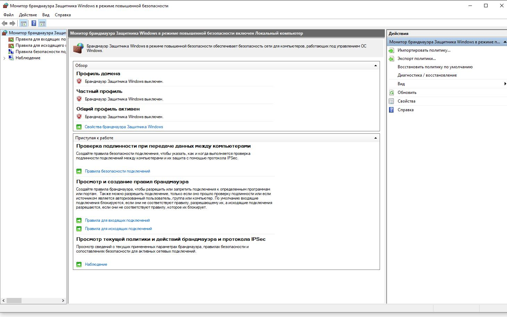

## Общие сведения о профилях и типах трафика 

### Профили

> Microsoft рекомендует активировать все профили и позволить API-интерфейсу установленному в системе, выбрать, какой из них использовать. 

- **Профиль домена**: используются для компьютеров, подключенных к сети, содержащей доменные контроллеры, к которым принадлежат сетевые компьютеры. Этот профиль не используется для домашних ПК. Когда компьютер успешно зарегистрирован в домене, он автоматически использует данный профиль. 
- **Частный профиль**: предназначен для домашних или офисных сетей, которые не подключены напрямую к Интернету, но находится за каким-то устройством безопасности, таким как маршрутизатор или другой аппаратный брандмауэр. 
- **Общий профиль**: обычно используется, когда компьютер подключен к публичной сети (Интернет или публичная точка доступа Wi-Fi), например в кафе, гостинице или по кабельному соединению дома. По умолчанию будут заблокированы все входящие подключения, которые не входят в список разрешенных. 

### Типы трафика 

- **Входящий** - это трафик поступающий из сети или Интернета на компьютер или другое устройство. Например, если вы загружаете файл через uTorrent, скачивание этого файла фильтруется входящим правилом. 
- **Исходящий** - трафик, который исходит от вашего компьютера в сеть или Интернет. Например, ваш запрос на загрузку веб-сайта в браузере - это исходящий трафик, и он фильтруется через исходящее правило. 
- **Правила безопасности подключений** - общие правила, которые используются для защиты трафика между двумя конкретными компьютерами и используется в очень контролируемых средах с особыми требованиями безопасности. В отличие от входящих и исходящих, применяющихся только к вашему компьютеру или устройству, правила безопасности подключения требуют, чтобы оба компьютера, участвующие в соединении и применяли одни и те же правила. 

Все они могут быть настроены специфическим образом для определенных компьютеров, учетных записей пользователей, программ, приложений, служб, портов, протоколов или сетевых адаптеров. 

Вы можете просматривать правила определенного типа, выбрав соответствующую категорию в столбце слева.

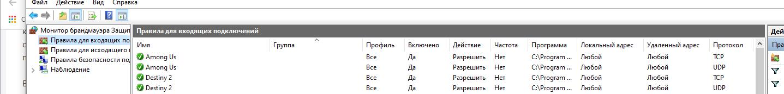

Здесь увидите множество правил входящего и исходящего трафика. Некоторые из них будут иметь зеленую галочку рядом с их именем, в то время как другие будут показаны серым цветом. Зеленая галочка означает что они используются. Те, у которых установлен серый флажок, отключены, и не используются.

Правила брандмауэра Windows имеют следующие параметры, которые можно редактировать:

- **Имя** - имя просматриваемого правила.
- **Группа** - описывает приложение или функцию Windows, к которой принадлежит это правило. Например, правила, относящиеся к определенному приложению или программе, будут иметь имя приложения / программы в качестве группы. Правила, относящиеся к одной и той же сетевой функции, например «Общий доступ к файлам и принтерам», будут иметь название группы, к которой они относятся.
- **Профиль** - сетевое местоположение / профиль, к которому применяется правило: домен частный или публичный (для сетей компании с сетевыми доменами).
- **Включено** - сообщает вам, включено ли правило и применяется ли брандмауэром.
- **Действие** - действие может «Разрешить» или «Блокировать» в зависимости от того, что должно делать правило.
- **Частота** - указывает, переопределяет ли это правило существующее правило блока. По умолчанию все правила должны иметь значение «Нет» для этого параметра.
- **Программа** - настольная программа, к которой применяется правило.
- **Локальный адрес** - указывает, применяется ли правило только тогда, когда ваш компьютер имеет определенный IP-адрес или нет.
- **Удаленный адрес** - указывает, применяется ли правило только при подключении устройств с определенными IP-адресами.
- **Протокол** - разделяет сетевые протоколы, для которых применяется правило.
- **Локальный порт** - указывает, применяется ли правило для соединений, сделанных на определенных локальных портах, или нет.
- **Удаленный порт** - указывает, применяется ли правило для соединений, сделанных на определенных удаленных портах, или нет.
- **Авторизованные пользователи** - учетные записи пользователей, для которых применяется правило (только для входящих правил).
- **Разрешенные компьютеры** - компьютеры, для которых применяется правило.
- **Авторизованные локальные субъекты** - учетные записи пользователей, для которых применяется правило (только для исходящих правил).
- **Локальный пользователь-владелец** - учетная запись пользователя, установленная как владелец / создатель правила.
- **Пакет приложения** - относится только к приложениям из Microsoft Store, и отображает имя пакета приложения, к которому применяется правило.

## Что можно отслеживать в брандмауэре Windows в режиме повышенной безопасности

Под тремя типами правил, вы найдете раздел с названием **наблюдение** и если развернуть его, то можно просмотреть активные правила брандмауэра, правила безопасности активных соединений и сопоставления безопасности.

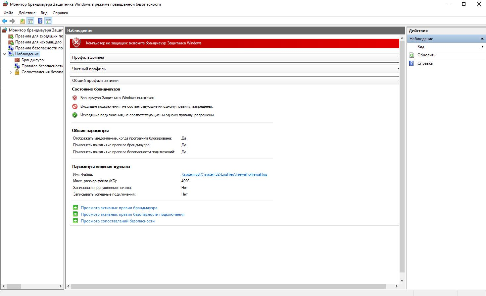

**Сопоставления безопасности** - это информация о безопасном зашифрованном канале на локальном компьютере или устройстве, информация может использоваться для будущего сетевого трафика на конкретном удаленном компьютере или устройстве. Здесь вы можете посмотреть, какие одноранговые узлы подключены к вашему компьютеру и какой пакет защиты использовался Windows для формирования сопоставлений безопасности.

## Как управлять существующими правилами

Помните, лучше отключить правило, чем его удалить. Тогда будет очень легко все восстановить, просто повторно включив отключенные правила.

Для отключения правила, нужно отметить его и нажать соответствующую кнопку в правом меню.

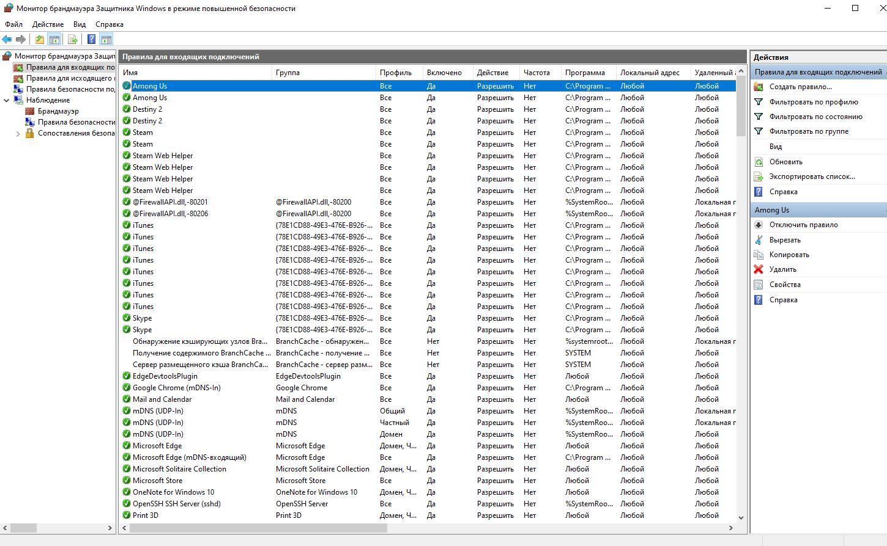

Кроме того, можно просто щелкнуть правой кнопкой мыши по правилу и **отключить**

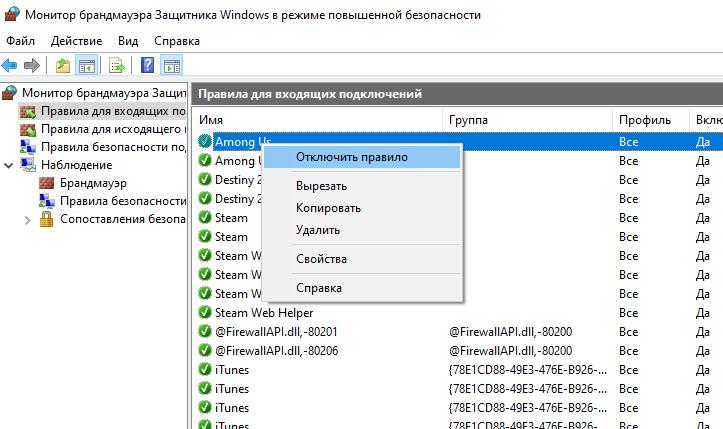

Если необходимо отредактировать правило, сделайте это в столбце справа зайдя в **свойства** или через контекстное меню вызванное правым щелчком мыши.

Все параметры, упомянутые ранее в нашей инструкции, могут быть изменены в окне **свойства** для конкретного правила.

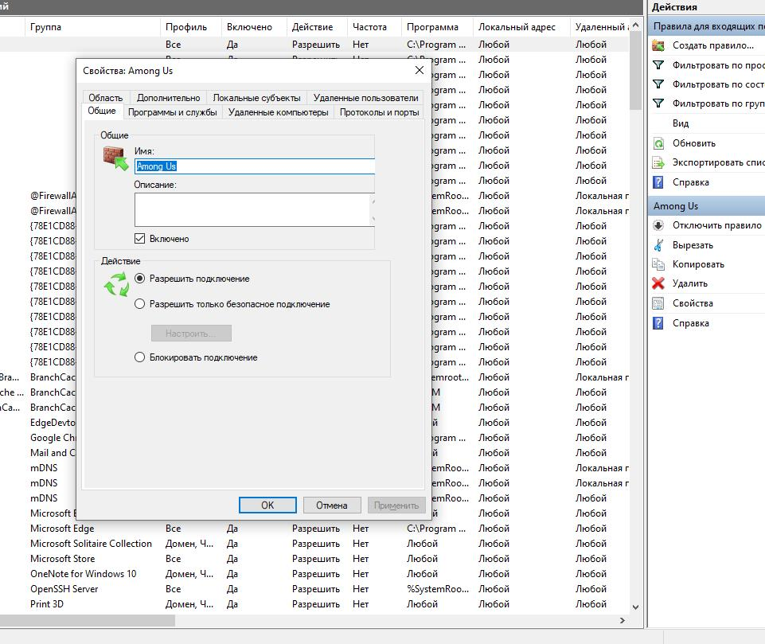

Когда изменения внесены, не забудьте нажать **ОК**, для их применения.

## Как создать исходящее правило

Создание правил в режим повышенной безопасности гораздо проще, чем вы думаете. Чтобы продемонстрировать это, давайте создадим исходящее правило, которое блокирует автоматическое обновление Microsoft Edge в публичных сетях, т.е. только когда вы подключены к ненадежным общедоступным сетям.

Для этого перейдите в «Правила для исходящего подключения» и нажмите «Создать правило» в столбце справа.

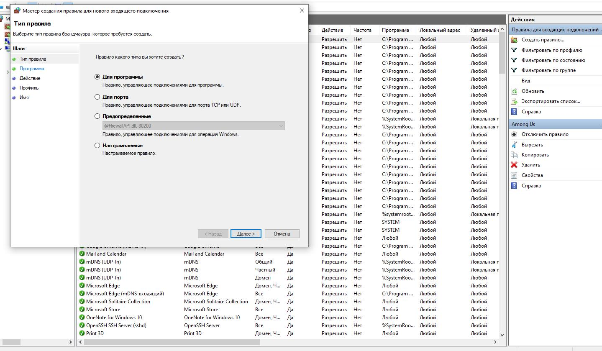

Откроется **Мастер создания правила для нового исходящего подключения**, где вы создадите новое правило всего за пару шагов. Во-первых, вас попросят выбрать тип правила, которое вы хотите создать.

Ваш выбор:

- **Для программ** - правило управляющее конкретной программой
- **Для порта** - правило управляющее подключениями для порта TCP или UDP.
- **Предопределенные** - правило, контролирующее подключения, выполняемые определенной службой или функцией Windows.
- **Настраиваемые** - настраиваемое правило, которое может блокировать все программы и порты или определенную комбинацию.

В нашем случае выбираем **для программ** и нажимаем **далее**.

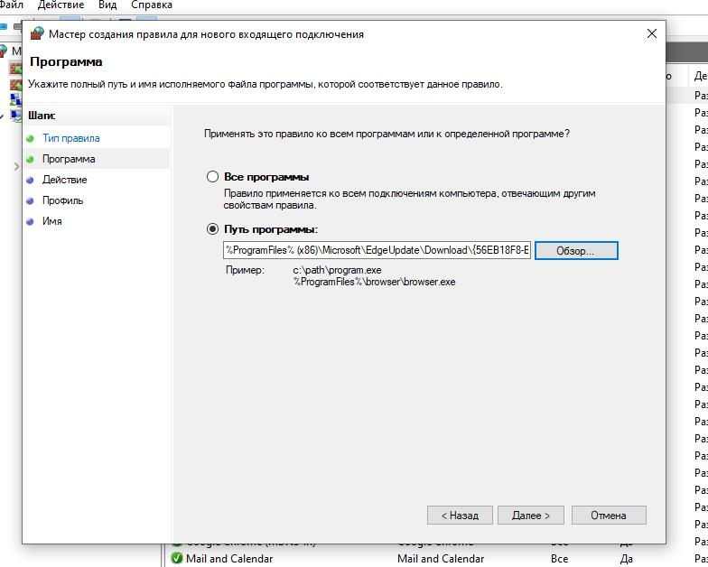

Вам предлагается выбрать все программы или определенную программу.

Выбираем исполняемый файл программы, которую хотим заблокировать - *Microsoft Edge Update* и переходим **далее**.

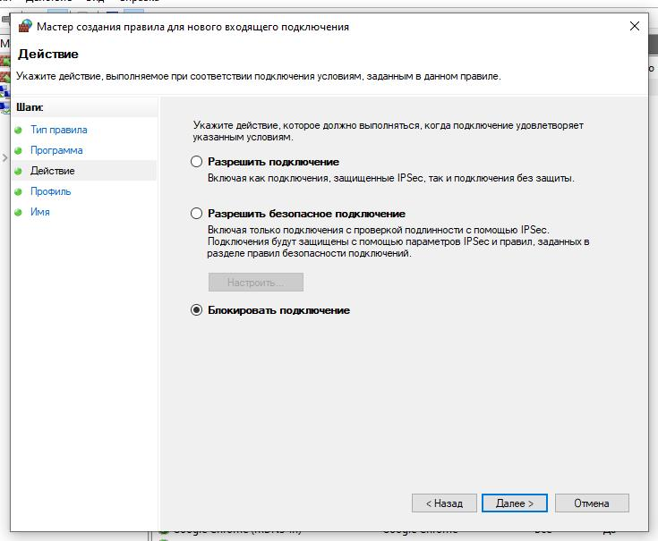

Затем указываем действие, которое необходимо предпринять:

- **Разрешить подключение** - включает как защищенные IPSec, так и соединения без защиты.
- **Разрешить безопасное подключение** - включает только подключения с проверкой подлинности с помощью IPSec. Вы можете указать тип аутентификации и шифрования, которые вы хотите применить, нажав «Настроить».
- **Блокировать подключение** - блокирует соединение, независимо от того, является ли оно безопасным или нет.

Выбираем **блокировать подключение** и нажимаем **далее**.

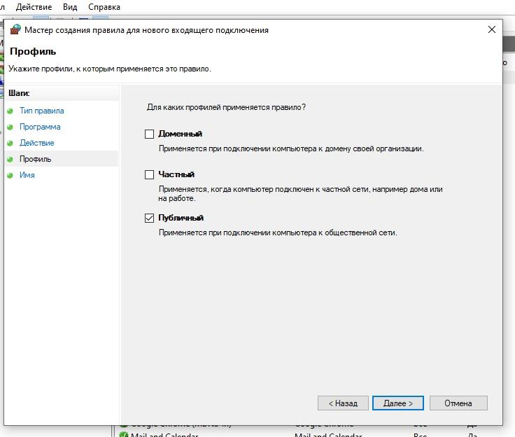

Теперь вас попросят выбрать, для каких профилей применяется правило:

- **Доменный** - применяется при подключении компьютера к домену своей организации.
- **Частный** - применяется, когда компьютер подключен к частной сети, например домашней или рабочей.
- **Публичный** - применяется если компьютер подключен к ненадежной общественной сети.

Мы выбрали **публичный**, потому что хотели заблокировать доступ только тогда, когда компьютер подключен к общественной сети.

Когда выбор сделан, нажмите **далее**.

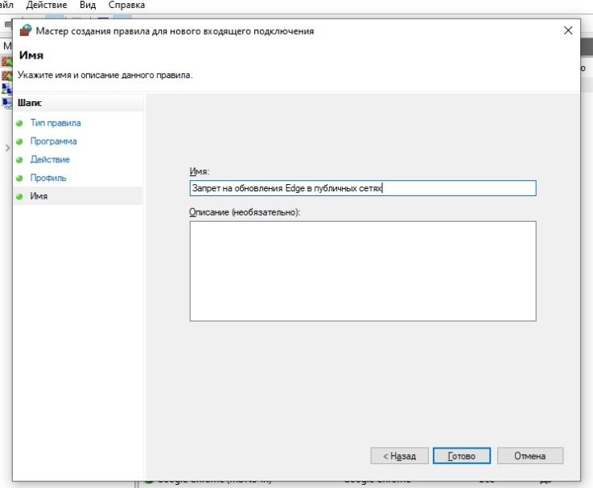

Введите имя, и описание для вновь созданного правила. Напишите подробно, чтобы потом было легче понять.

Нажмите **«готово»**.

## Как создать входящее правило

Перейдите к **«Правилам для входящих подключений»** и нажмите «Создать правило» в столбце справа.

Запустится **«Мастер создания правила для нового входящего подключения»**.

Создадим правило, которое блокирует весь входящий трафик, созданный с использованием протокола TCP на порте **30770**. На первом этапе мы выбрали **«Для порта»**.

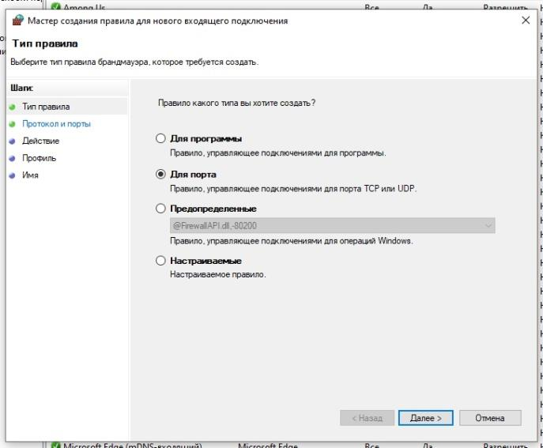

Выбрали протокол и порт, для которого применяется правило. Выбор протоколов идет между - **TCP** и **UDP**. Если вам нужно правило, применяемое к обоим протоколам, придется создать два правила: по одному для каждого.

У нас есть выбор, заблокировать все порты или только выбранные. Мы выбрали «Определенные локальные порты» и ввели **«30770»**

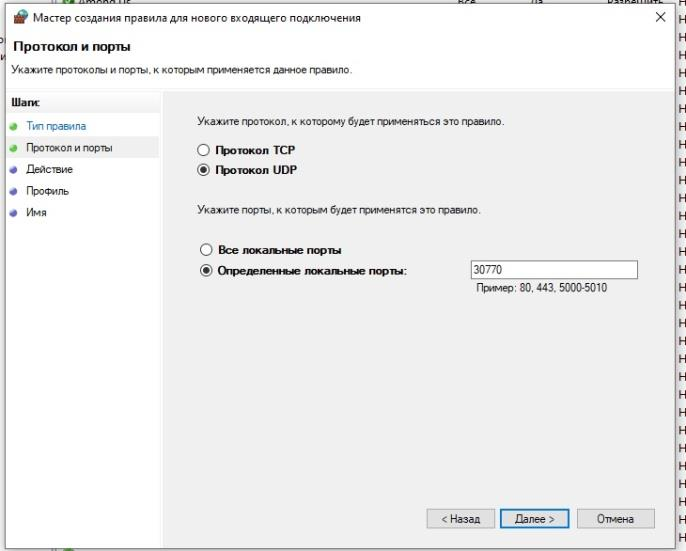

Отметим «Блокировать подключение» и проследуем **«Далее»**.

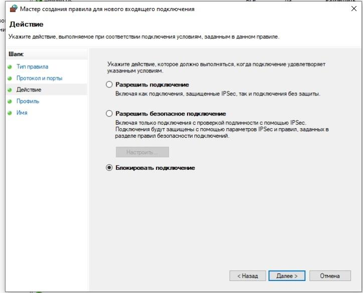

Теперь необходимо сделать выбор профилей, для которых применяется правило. Поскольку мы блокируем весь TCP-трафик на порте 30770, выбираем все три профиля и продолжаем.

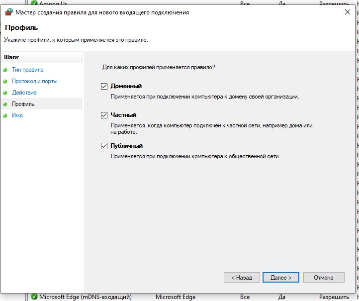

Вводим имя и описание для вновь созданного правила, нажимаем **«Готово»**.

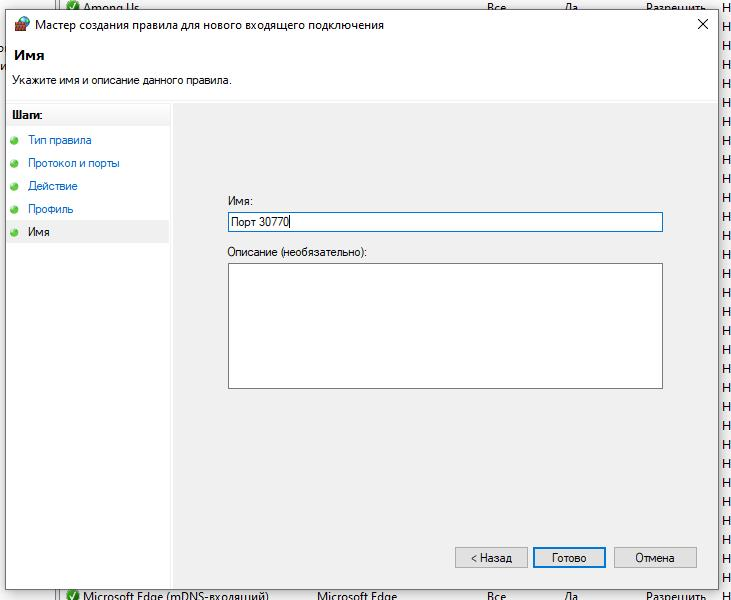

Правило создано и теперь используется.

## Как восстановить параметры по умолчанию

Если вы намудрили с правилами и все стало работать неправильно, можно легко отменить все настройки и восстановить брандмауэр Windows по умолчанию. Не забывайте, это можно сделать только из под учетной записи администратора.

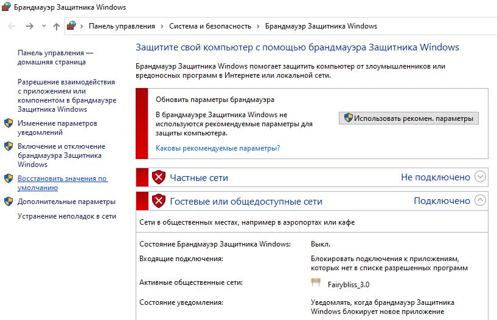

1. Для этого, откройте брандмауэр Windows и в левом столбце, нажмите по ссылке **«Восстановить значения по умолчанию»**.
1. Нажмите на кнопку **«Восстановить значения по умолчанию»**.
1. Подтвердите, восстановление нажав на **«Да»**.
   
Параметры будут сброшены до значений по умолчанию. 

Теперь вы можете заняться настройкой с нуля и решить возникшие проблемы.
