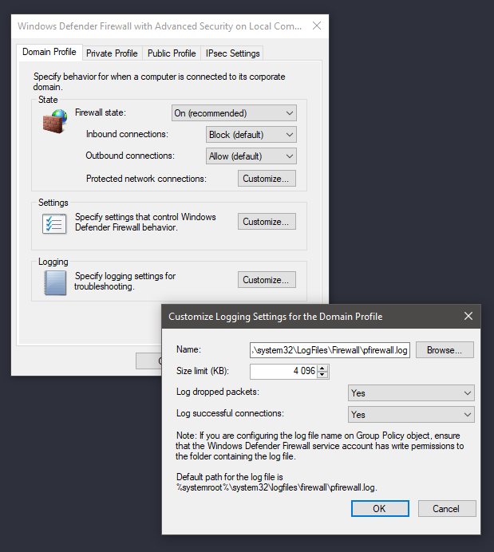

# Алгоритм работы с журналом брандмауэра Windows в режиме повышенной безопасности (включение, настройка и отключение)

## Источники

[Брандмауэр Windows в режиме повышенной безопасности – диагностика и решение проблем](http://www.oszone.net/6589/){ target='_blank' }

`Microsoft` [Настройка брандмауэра Защитник Windows с помощью журнала advanced Security Log](https://docs.microsoft.com/ru-ru/windows/security/threat-protection/windows-firewall/configure-the-windows-firewall-log){ target='_blank' }

## Информация

!!! info
    Максимальный размер файла журнала по умолчанию составляет ==4096 КБ==

!!! info 
    Путь к журналу по умолчанию: `%windir%\system32\logfiles\firewall\pfirewall.log`. Вы можете выбрать другое
    расположение файла. Для этого нажмите на кнопку `Обзор`

!!! info 
    Указанному расположению должны быть назначены разрешения, позволяющие службе брандмауэра `Защитника Windows`
    записывать в файл журнала

## Запуск

Нужно перейти к расширенным настройкам брандмауэра Windows:

Режим просмотра

=== "Мелкие/крупные значки"
    1. Откройте панель управления: ПКМ по меню `Пуск` &#8594; `Панель управления`
    1. Выберите `Брандмауэр Windows`
    1. В окне фаервола выберите в левом навигационном меню `Дополнительные параметры`

=== "Категория"
    1. Откройте панель управления: ПКМ по меню `Пуск` &#8594; `Панель управления`
    1. Выберите `Система и безопасность` &#8594; `Брандмауэр Windows`
    1. В окне фаервола выберите в левом навигационном меню `Дополнительные параметры`

## Доступ к настройкам журнала

Выберите опцию `Брандмауэр Windows в режиме повышенной безопасности (Локальный компьютер)`

Кликните правой кнопкой мыши по ней и выберите опцию `Свойства`. Откроется окно с тремя вкладками: (==Профиль домена==,
==Частный профиль==, ==Общий профиль==) можно заметить, что их содержимое идентично, но относится к трем различным
профилям, название которых указано в заголовке вкладки. На вкладке каждого профиля содержится кнопка настройки ведения
журнала. Каждый журнал будет соответствовать отдельному профилю, но какой профиль используете вы?

## Профили

=== "Домена"
    Для подключения к беспроводной сети Wi-Fi, когда домен задается контроллером домена. Если вы не уверены,
    что это значит, лучше не используйте данный профиль

=== "Частный"
    Для подключения к частным сетям, включая домашние или персональные сети — именно данный профиль вы скорее
    всего будете использовать

=== "Общий"
    Для подключения к общественным сетям, включая сети ресторанов, аэропортов, библиотек и других учреждений

Если вы используете компьютер в сети

=== "Домашней"
    1. Перейдите на вкладку `Частный профиль`
    1. Нажмите на кнопку `Настроить` в секции `Ведение журнала`

=== "Публичной"
    1. Перейдите на вкладку `Общий профиль`
    1. Нажмите на кнопку `Настроить` в секции `Ведение журнала`

## Активация журнала событий

Если вы хотите запустить регистрацию событий, в обоих выпадающих меню `Записывать пропущенные пакеты`
и `Записывать успешные подключения` установите значение `Да` и нажмите кнопку `ОК`

Для отключения функции логирования установите значение `Нет (по умолчанию)` в обоих выпадающих меню

!!! warning
    Постоянная работа функции может привести к проблемам производительности, поэтому активируйте ее только когда
    действительно нужно выполнить мониторинг подключений

## Изучение журналов

Теперь компьютер будет фиксировать сетевую активность, контролируемую фаерволом.

Для того, чтобы просмотреть логи:

1. Перейдите в окно `Дополнительные параметры`
1. Выберите опцию `Наблюдение` в левом списке
1. В секции `Параметры ведения журнала` кликните на `Имя файла`

Затем откроется журнал сетевой активности. Содержимое журнала может запутать неопытного пользователя. Рассмотрим
основное содержимое записей журнала:

### Дата и время подключения

Что произошло с подключением

| Статус      | Описание                                 |
| ----------- | ---------------------------------------- |
| `ALLOW`     | Фаервол разрешил подключение             |
| `DROP`      | Подключение было заблокировано фаерволом |

!!! info
    Если вы столкнулись с проблемами подключения к сети отдельной программы, то сможете точно определить, что
    причина проблемы связана с политикой брандмауэра

### Тип подключения: `TCP` или `UDP`

1. IP-адрес источника подключения (компьютера)
1. IP-адрес получателя (например, веб-страницы) и используемый на компьютере сетевой порт

!!! info
    Последняя запись позволяет выявлять порты, которые требуют открытия для работы ПО. Также следите за подозрительными
    подключениями — они могут быть совершены вредоносными программами

### Был ли успешно отправлен или получен пакет данных

Информация в журнале поможет выяснить причину проблем подключения

Журналы могут регистрировать и другую активность, например, ==целевой порт== или ==номер подтверждения TCP==

Если вам нужны подробности, ознакомьтесь со строкой `#Fields` в верхней части лога, чтобы идентифицировать значение
каждого показателя

!!! warning
    Не забудьте отключить функцию ведения журнала после завершения работы

## Создание собственной оснастки

Выполните следующие действия:

- `Win + R`
- В текстовом поле `Открыть` введите `mmc` и нажмите клавишу `ENTER`
- Если появится диалоговое окно контроля учетных записей пользователей, подтвердите выполнение запрашиваемого действия и
  нажмите кнопку `Продолжить`
- В меню `Консоль` выберите пункт `Добавить` или `Удалить оснастку`. В списке `Доступные оснастки` выберите оснастку
  `Брандмауэр Windows в режиме повышенной безопасности` и нажмите кнопку `Добавить`. Нажмите кнопку `ОК`. Повторите шаги
  с 1 по 6, чтобы добавить оснастки `Управление групповой политикой` и `Монитор IP безопасности`
  
!!! info
    Перед тем как закрыть оснастку, сохраните консоль для дальнейшего использования

## Устранение неполадок

!!! info
    Если журналы медленно появляются в Sentinel, вы можете отключить размер файла журнала. Но это приведет к
    увеличению использования ресурсов
