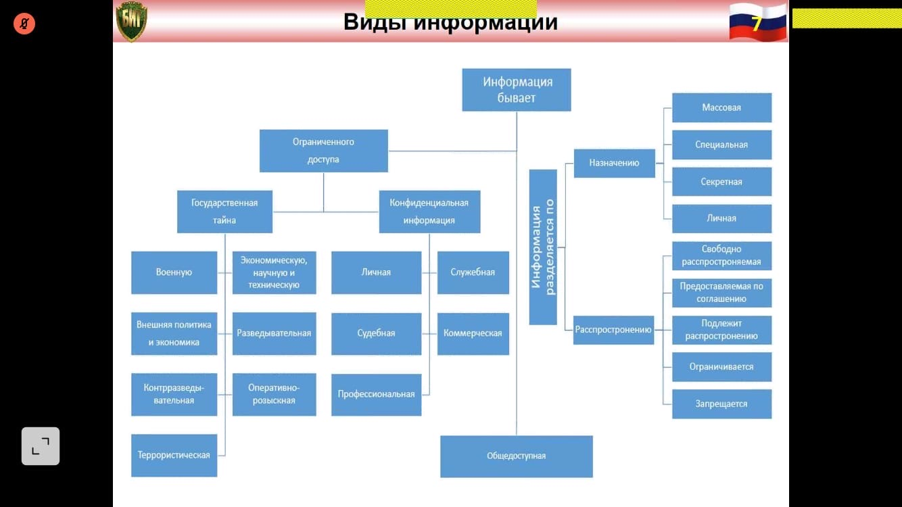
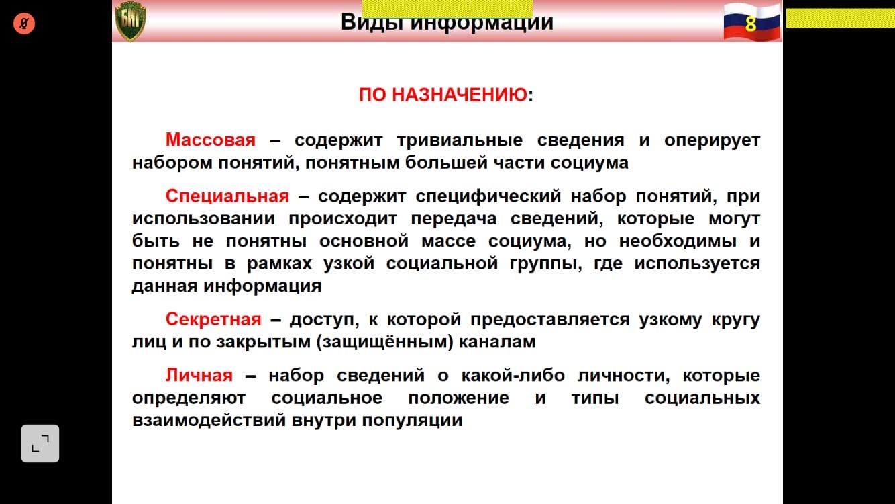
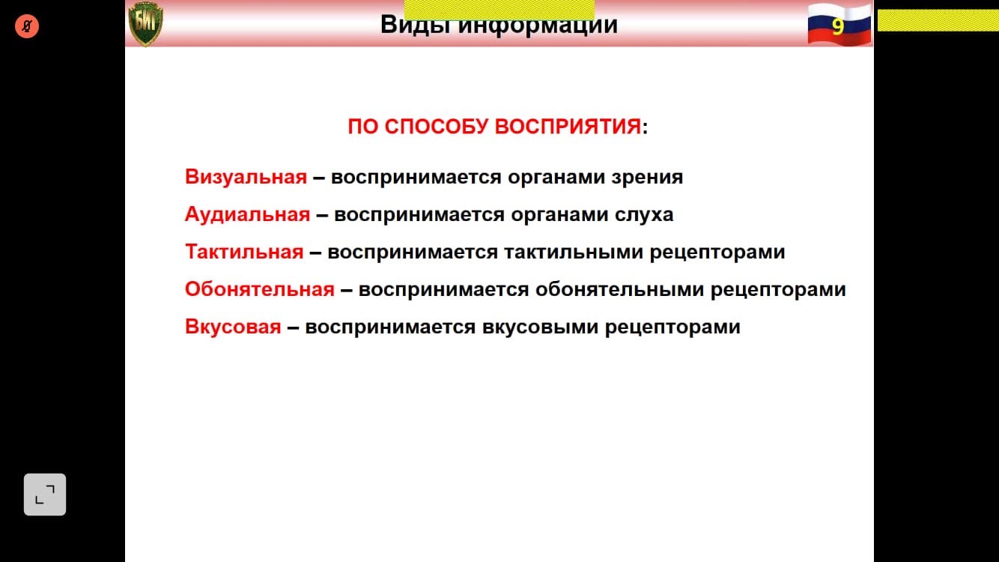
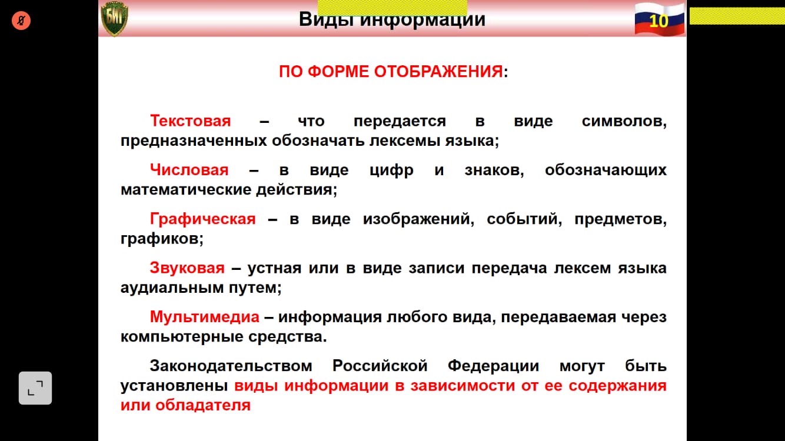
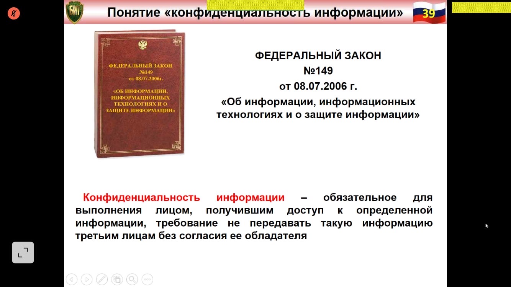

# Понятие информации. Виды информации. Конфиденциальная информация. Виды конфиденциальной информации, ее сущность.

## Понятие Информации

В информатике наиболее часто используется следующее определение этого термина:

### Определения

**Информация** — осознанные сведения об окружающем мире, которые являются объектом хранения, преобразования передачи и
использования

**Сведения** — это знания, выраженные в сигналах, сообщениях, известиях, уведомлениях и т.д.

### Виды Информации

### Конфиденциальная Информация

**Конфиденциальность информации** — обязательное для выполнения лицом, получившим доступ к определенной информации,
требование

Не передавать такую информацию третьим лицам без согласия ее обладателя. ==федеральный закон №149 от 08.07.2006==

#### Виды конфиденциальной информации

> Не знаю, если честно, не хочу брать что-то умное с инета

> Ну тип чтобы не украли информацию и строгое хранение инф. Ну и от себя добавьте.