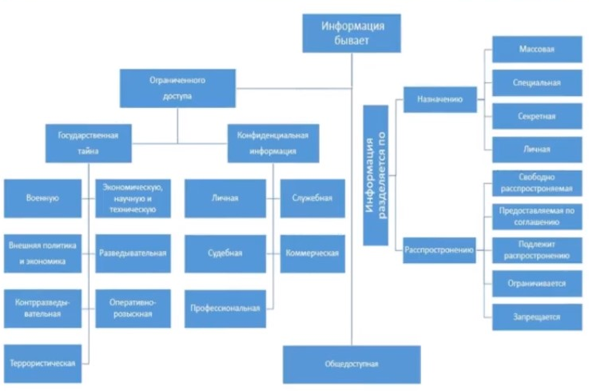

# Понятие информации. Виды информации. Конфиденциальная информация. Виды конфиденциальной информации, ее сущность.

## Понятие информации

### Определения

**Информация** - сведения (сообщения, данные) независимо от формы их представления

**Сведения** — это знания, выраженные в сигналах, сообщениях, известиях, уведомлениях и т.д.

**Информационные технологии** - процессы, методы поиска, сбора, хранения, обработки, предоставления, распространения
информации и способы осуществления таких процессов и методов

**Информационная система** - совокупность содержащейся в базах данных информации и обеспечивающих ее обработку
информационных технологий и технических средств

## Информация как окружающая среда человека

### Нейтральная информация

Сведения (сообщения, данные), которые в стандартной картине мира не описываются в ценностных категориях (к такой
информации неприменимы оценки хорошо или плохо - это есть, было, будет и только)

### Агрессивная информация

Сведения (сообщения, данные), навязываемые человеку различными — информационными способами для достижения конкретных
целей. При этом агрессивная информация может быть истинной или ложной

### Ложная информация

Сведения (сообщения, данные), характеризующие какое-либо действие, свойства, и прочую информацию неверно или не до конца
верно

### Защищаемая информация

Сведения (сообщения, данные), являющиеся предметом собственности и подлежащие защите в соответствии с требованиями
правовых документов или требованиями, устанавливаемыми собственником информации

### Конфиденциальная информация

Обязательное для выполнения лицом, получившим доступ к определенной информации, требование не передавать такую
информацию третьим лицам без согласия ее обладателя

## Виды информации

??? info "В картинках"
    
    
    

### По назначению

#### Массовая

Содержит тривиальные сведения и оперирует набором понятий, понятным большей части социума

#### Специальная

Содержит специфический набор понятий, при использовании происходит передача сведений, которые могут быть не понятны
основной массе социума, но необходимы и понятны в рамках узкой социальной группы, где используется данная информация

#### Секретная

Доступ, к которой предоставляется узкому кругу лиц и по закрытым (защищённым) каналам

#### Личная

Набор сведений о какой-либо личности, которые определяют социальное положение и типы социальных взаимодействий внутри
популяции

### По способу восприятия

#### Визуальная

Воспринимается органами зрения

#### Аудиальная

Воспринимается органами слуха

#### Тактильная

Воспринимается тактильными рецепторами

#### Обонятельная

Воспринимается обонятельными рецепторами

#### Вкусовая

Воспринимается вкусовыми рецепторами

### По форме отображения

#### Текстовая

Что передается в виде символов, предназначенных обозначать лексемы языка

#### Числовая

В виде цифр и знаков, обозначающих математические действия

#### Графическая

В виде изображений, событий, предметов, графиков

#### Звуковая

Устная или в виде записи передача лексем языка аудиальным путем

#### Мультимедиа

Информация любого вида, передаваемая через компьютерные средства

### Конфиденциальная информация

**Конфиденциальность информации** — обязательное для выполнения лицом, получившим доступ к определенной информации,
требование

Не передавать такую информацию третьим лицам без согласия ее обладателя. ==федеральный закон №149 от 08.07.2006==

## Виды конфиденциальной информации

### Персональные данные

Любая информация, относящаяся к прямо или (косвенно) определяемому физическому лицу (субъекту персональных данных)

**Оператор** — государственный орган, муниципальный орган, юридическое или физическое лицо, самостоятельно или совместно
с другими лицами организующие и/или осуществляющие обработку персональных данных, а также определяющие цели обработки
персональных данных, состав персональных данных, подлежащих обработке, действия (операции), совершаемые с персональными
данными

### Государственная тайна

Защищаемые государством сведения в области его военной, внешнеполитической, экономической, разведывательной,
контрразведывательной и оперативно-розыскной деятельности, распространение которых может нанести ущерб безопасности
Российской Федерации

**Степени секретности сведений** (грифы секретности):

- Особой важности
- Совершенно секретно
- Секретно

**Перечень сведений, отнесенных к государственной тайне**

1. Сведения в военной области
1. Сведения в области экономики, науки и техники
1. Сведения в области внешней политики и экономики
1. Сведения в области разведывательной, контрразведывательной и оперативно-розыскной деятельности, а также в области
   противодействия терроризму и в области обеспечения безопасности лиц, в отношении которых принято решение о применении
   мер государственной защиты

**Не подлежат отнесению к государственной тайне и засекречиванию сведения**

- О чрезвычайных происшествиях и катастрофах, угрожающих безопасности и здоровью граждан, и их последствиях, а также о
  стихийных бедствиях, их официальных прогнозах и последствиях
- О состоянии экологии, здравоохранения, санитарии, демографии, образования, культуры, сельского хозяйства, а также о
  состоянии преступности
- О привилегиях, компенсациях и социальных гарантиях, предоставляемых государством гражданам, должностным лицам,
  предприятиям, учреждениям и организациям
- О фактах нарушения прав и свобод человека и гражданина
- О размерах золотого запаса и государственных валютных резервах Российской Федерации
- О состоянии здоровья высших должностных лиц Российской Федерации
- О фактах нарушения законности органами государственной власти и их должностными лицами

### Коммерческая тайна

**Коммерческая тайна** - режим конфиденциальности информации, позволяющий ее обладателю при существующих или возможных
обстоятельствах увеличить доходы, избежать неоправданных расходов, сохранить положение на рынке товаров, работ, услуг
или получить иную коммерческую выгоду

**Информация, составляющая коммерческую тайну** - сведения любого характера
(производственные, технические, экономические, организационные и другие), в том числе о результатах интеллектуальной
деятельности в научно-технической сфере, а также сведения о способах осуществления профессиональной деятельности,
которые имеют действительную или потенциальную коммерческую ценность в силу неизвестности их третьим лицам, к которым у
третьих лиц нет свободного доступа на законном основании и в отношении которых обладателем таких сведений введен режим
коммерческой тайны

**Режим коммерческой тайны не может быть установлен в отношении следующих сведений**

- Содержащихся в учредительных документах юридического лица, документах, подтверждающих факт внесения записей о
  юридических лицах и об индивидуальных предпринимателях в соответствующие государственные реестры
- Содержащихся в документах, дающих право на осуществление предпринимательской деятельности
- О составе имущества государственного или муниципального унитарного предприятия, государственного учреждения и об
  использовании ими средств соответствующих бюджетов
- О загрязнении окружающей среды, состоянии противопожарной безопасности, санитарно-эпидемиологической и радиационной
  обстановке, безопасности пищевых продуктов и других факторах, оказывающих негативное воздействие на обеспечение
  безопасного функционирования производственных объектов, безопасности каждого гражданина и безопасности населения в
  целом
- О численности, о составе работников, о системе оплаты труда, об условиях труда, в том числе об охране труда, о
  показателях производственного травматизма и профессиональной заболеваемости, и о наличии свободных рабочих мест
- О задолженности работодателей по выплате заработной платы и социальным выплатам
- О нарушениях законодательства Российской Федерации и фактах привлечения к ответственности за совершение этих нарушений
- Об условиях конкурсов или аукционов по приватизации объектов государственной или муниципальной собственности
- О размерах и структуре доходов некоммерческих организаций, о размерах и составе их имущества, об их расходах, о
  численности и об оплате труда их работников, об использовании безвозмездного труда граждан в деятельности
  некоммерческой организации
- О перечне лиц, имеющих право действовать без доверенности от имени юридического лица
- Обязательность раскрытия которых или недопустимость ограничения доступа к которым установлена иными федеральными
  законами

### Служебная тайна

**Служебная тайна** - это охраняемая законом конфиденциальная информация о деятельности государственных органов,
организаций, доступ к которой ограничен в силу служебной необходимости

**Режим служебной тайны** - совокупность правовых, организационных, технических и иных мер, принимаемых уполномоченными
должностными лицами органов государственной власти и организаций, обеспечивающих ограничения на распространение
сведений, составляющих служебную тайну, и на доступ к этим сведениям

**Не подлежат отнесению к служебной тайне сведения**

- Содержащиеся в законодательных и иных правовых актах, устанавливающих права, свободы, обязанности граждан и порядок их
  реализации, а также правовой статус органов государственной власти, органов местного самоуправления, организаций
- О чрезвычайных ситуациях, происшествиях и катастрофах, угрожающих безопасности и здоровью граждан, а также о стихийных
  бедствиях, их официальных прогнозах и последствиях
- в области экологии, метеорологии, демографии, эпидемиологии и санитарии, культуры, сельского хозяйства, о состоянии
  преступности и другие сведения, необходимые для обеспечения безопасности граждан и населения в целом
- О привилегиях, компенсациях и льготах, предоставляемых государством гражданам, должностным лицам, организациям и
  учреждениям
- О фактах нарушения прав и свобод человека и гражданина, нарушении законности должностными лицами органов
  государственной власти, органов местного самоуправления, организаций и учреждений
- Об использовании органами государственной власти, органами местного самоуправления бюджетных средств, иных
  государственных и местных ресурсов, о состоянии экономики и потребностях населения, если иное не предусмотрено
  федеральным законом
- О размерах золотого запаса и государственных валютных резервах Российской Федерации
- О деятельности органов государственной власти и органов местного самоуправления, накапливаемые в информационных
  системах органов и организаций и представляющие общественный интерес или необходимые для реализации прав, свобод и
  обязанностей граждан, а также содержащиеся в официальных изданиях, поступающих в фонды библиотек и архивов
- О состоянии здоровья лиц, занимающих государственные должности категории «А»
- Сведения о деятельности органов государственной власти, обязательные для размещения в информационных системах общего
  пользования в соответствии с законодательством Российской Федерации

### Иная тайна

В соответствии с законодательством (врачебная, нотариальная, адвокатская тайна, тайна переписки, телефонных переговоров,
почтовых отправлений, телеграфных или иных сообщений и так далее)

## Перечень сведений конфиденциального характера

1. Сведения о фактах, событиях и обстоятельствах частной жизни гражданина, позволяющие идентифицировать его личность
   (==персональные данные==), за исключением сведений, подлежащих распространению в средствах массовой информации в
   установленных федеральными законами случаях
1. Служебные сведения, доступ к которым ограничен органами государственной власти в соответствии с Гражданским кодексом
   Российской Федерации и Федеральными законами (==служебная тайна==)
1. Сведения, составляющие ==тайну следствия и судопроизводства==, сведения о лицах, в отношении которых в соответствии с
   Федеральными законами от 20 апреля 1995 года № 45-ФЗ «О государственной защите судей, должностных лиц
   правоохранительных и контролирующих органов» и от 20 августа 2004 года № 119-ФЗ «О государственной защите
   потерпевших, свидетелей и иных участников уголовного судопроизводства», другими нормативными правовыми актами
   Российской Федерации принято решение о применении мер государственной защиты, а также сведения о мерах
   государственной защиты указанных лиц, если законодательством Российской Федерации такие сведения не отнесены к
   сведениям, ==составляющим государственную тайну==
1. Сведения, связанные с профессиональной деятельностью, доступ к которым ограничен в соответствии с Конституцией
   Российской Федерации и Федеральными законами (==врачебная, нотариальная, адвокатская тайна, тайна переписки,
   телефонных переговоров, почтовых отправлений, телеграфных или иных сообщений и так далее==)
1. Сведения, связанные с коммерческой деятельностью, доступ к которым ограничен в соответствии с Гражданским кодексом
   Российской Федерации и федеральными законами (==коммерческая тайна==)
1. Сведения о сущности изобретения, полезной модели или промышленного образца до официальной — публикации информации о
   них
1. Сведения, содержащиеся в личных делах осужденных, а также сведения о принудительном исполнении судебных актов, актов
   других органов и должностных лиц, кроме сведений, которые являются общедоступными в соответствии с Федеральным
   законом от 2 октября 2007 года № 229-ФЗ «Об исполнительном производстве»