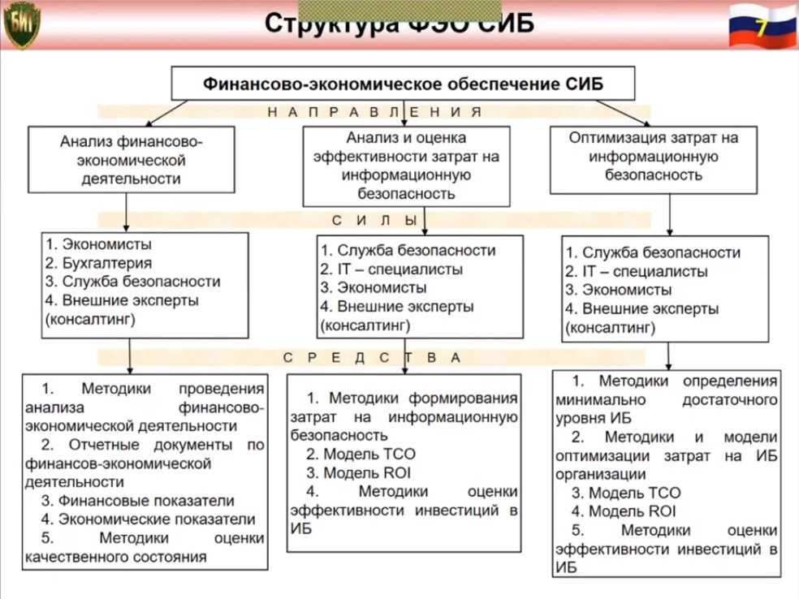
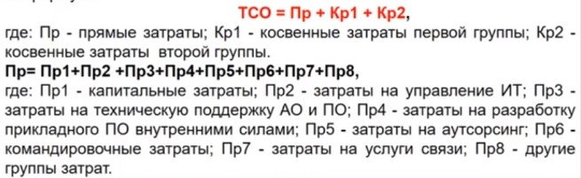
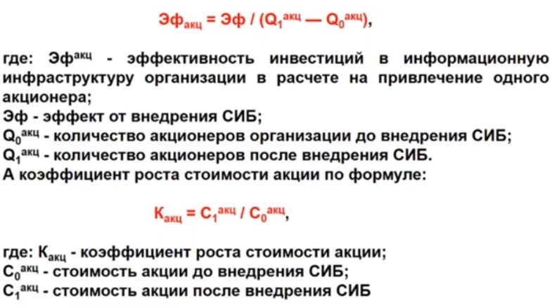
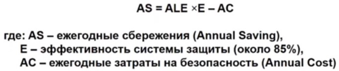

*[ТСО]: Total Cost of Ownership
*[ROI]:  Return on Investment
*[BCP]: Bussiness Continuity Plannin
*[LE]: Loss Expectancy
*[SAEM]: Security Attribute Evaluation Method

# Финансово-экономическое обеспечение системы обеспечения информационной безопасности. Цель, задачи, структура, содержание, средства

## Описание

**Финансово-экономическое обеспечение системы информационной безопасности (ФЭО СИБ)** – совокупность норм-принципов,
закрепляющих и регулирующих производственные отношения, связанные с функционированием СИБ, материальной собственностью
объекта, его бюджета и иного финансирования в интересах функционирования объекта.

**Цель ФЭО СИБ** – создание оптимальных финансово-экономических условий функционирования системы обеспечения
информационной безопасности.

**Задачи ФЭО СИБ** (с помощью чего достигается данная цель):

1. Структурирование затрат на информационную безопасность.
2. Анализ и оценка эффективности затрат на информационную безопасность.
3. Оптимизация затрат на информационную безопасность.

## Структурирование затрат на информационную безопасность

## Категории затрат на обеспечение СИБ

- структурные подразделения организации(по каждому подразделению);
- защищаемый ресурс(по всем типам ресурсов);
- рабочие места пользователей информационной системы организации;
- риски по каждой категории информации;

## Обоснование затрат на обеспечение СИБ

- **Первый подход** (наукообразный) – Основан на оценке стоимости инф. ресурсов, оценке потенциального ущерба от
  нарушений в области ИБ.

    > Если информация ничего не стоит, угроз активам компании нет, то и затраты на СИБ минимальны. Если информация чего-то стоит, есть угрозы, то нужно задуматься о расходах на СИБ.

- **Второй подход** (практический) – основан на подборе стабильного варианта корпоративной системы защиты информации.

    > Есть риски – завышенная стоимость, мало или много функций, ошибки при создании СИБ.

## Составляющие определения затрат на обеспечение СИБ

1. ### Структурирование затрат на предупредительные мероприятия
    - Управление системой защиты информации;
    - Регламентное обслуживание средств защиты информации;
    - Обеспечение должного качества информационных технологий;
    - Обеспечение требований стандартов;
    - Обучение персонала;
    - Прочие предупредительные затраты;

2. ### Структурирование затрат на контроль СИБ
    - Затраты на контроль;
    - Внутренний аудит системы безопасности;
    - Внеплановые проверки и испытания;
    - Затраты на внешний аудит;
    - Контроль за соблюдением политики ИБ;

3. ### Структурирование внутренних затрат на компенсацию нарушений политики СИБ
    - Затраты на выявление причин нарушения политики безопасности;
    - Пересмотр политики информационной безопасности предприятия(периодически проводится);
    - Восстановление информационных ресурсов предприятия;
    - Затраты на ликвидацию последствий нарушения ИБ;
    - Затраты на совершенствование системы ИБ;

4. ### Структурирование внешних затрат на компенсацию нарушений политики СИБ
    - Внешние затраты на ликвидацию последствий нарушения политики безопасности;
    - Затраты, связанные с нарушениями СИБ;

5. ### Анализ методов оценки эффективности затрат на информационную безопасность

## Модели и методы оценки экономической эффективности инвестиций в СИБ

1. ### Модель оценки совокупной стоимости владения информационными системами – ТСО
    
    **Цель** – оценка вложений вложенных в IT средств.
    
    **Метод применения** – сравнение ТСО своего предприятия с ТСО других предприятий.
    
    **В основе две категории затрат** – прямые и косвенные.
   
     
   
    Формула расчета ТСО
    
    

2. ### Модель оценки возврата инвестиций – ROI
   
    Рассчитывает коэффициент возврата инвестиций в инфраструктуру предприятия по формуле:
    
    `ROI = ЭФ/И`
    
    `ЭФ` – величина эффекта от внедрения СИБ
   
    `И` – инвестиции в бизнес

3. ### Стандартные методы оценки экономической эффективности инвестиций (NPV, PI, ARR, PP, DPP)
    
    > например, возврата инвестиций

    Делятся на:
    
    - **Простые методы** – метод расчета срока окупаемости инвестиций, метод расчета коэффициента эффективности инвестиций
    
    - **Методы дисконтирования** – метод расчета чистой текущей стоимости, метод расчета индекса рентабельности инвестиций

4. ### Метод оценки отдачи активов (K)
    
    Коэффициент превышения ставки доходности СИБ над ставкой альтернативной доходности по формуле:
    
    `К = Сдсоиб/Cдальт`
    
    `Сдсоиб` – ставка доходности СИБ;
    
    `Cдальт` – ставка альтернативной доходности;

5. ### Метод оценки «цены» акционера (Эф~акц~, К~акц~)
    
    Проводится оценка эффективности инвестиций в СИБ в расчете на привлечение одного акционера по формуле:
    
    

6. ### Метод оценки единовременных затрат на внедрение и закупку программных, программно-аппаратных и др. средств защиты информации (З~ед~)
    
    Рассчитывают единовременные затраты по формуле:
    
    

7. ### Планирование непрерывности бизнеса – BCP
    
    **Цель** – снижение рисков прерывания бизнеса и их последствий.
    
    Основана на статистических данных. Могут позволить себе крупные компании.

8. ### Метод ожидаемых потерь – LE
    
    Основан на расчете эффекта от внедрения СИБ.  
    Показатель вычисляется по формуле:
    
    

9. ### Метод оценки свойств системы безопасности – SAEM
    
    Основан на сравнении архитектур СИБ для получения результатов оценки выгод от внедрения СИБ.
    
    **Минус** – эксперты редко имеют точные данные от выгод технологий.

10. ### Анализ дерева ошибок – FTA (Fault Tree Analysis)
    
    Графическое средство.
    
    **Цель** – показать в чем заключаются причины нарушения политики ИБ и сглаживающие контрмеры.

11. ### Оценка эффективности затрат на ИБ

    Выбор метода оценки эффективности затрат на ИБ зависит от уровня организационной зрелости предприятия.

    #### Уровни организационной зрелости предприятия
    
    - **Уровень 1** - начальный (анархия)
    - **Уровень 2** - повторяемый (фольклор)
    - **Уровень 3** - определенный (стандартный)
    - **Уровень 4** - управляемый (измеряемый)
    - **Уровень 5** - оптимизируемый

    #### Признаки уровня организационной зрелости предприятия

    - отношение руководства к СИБ;
    - наличие нормативно-правовой базы СИБ;
    - состояние СИБ организации.
