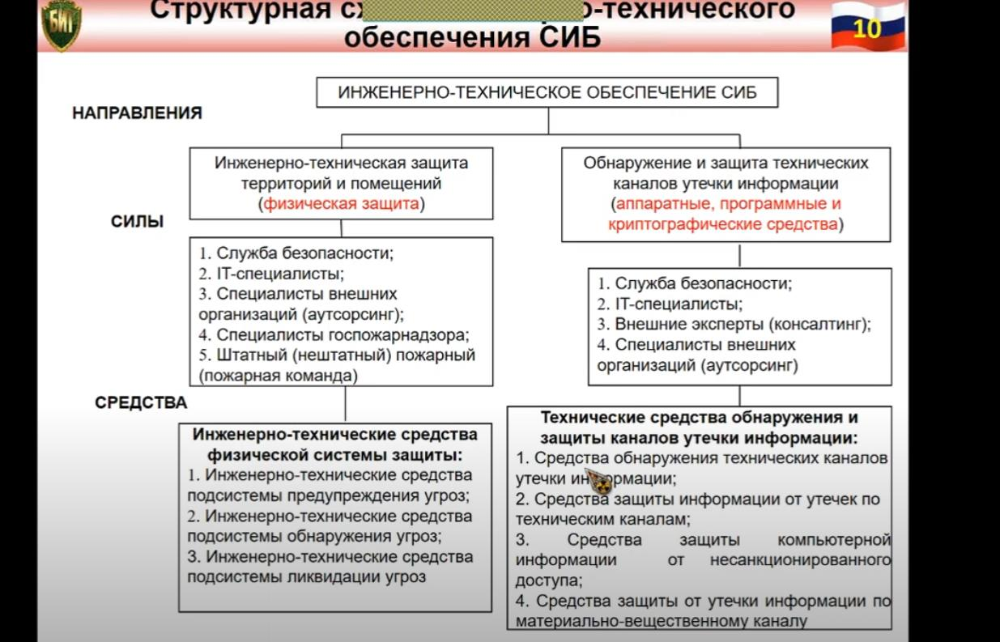

*[ИБ]: Информационная безопасность
*[СИБ]: Системы информационной безопасности
*[СКУД]: Средства контроля и управления доступом

# Инженерно-техническое обеспечение системы обеспечения информационной безопасности. Цель, задачи, структура, содержание, средства.

## Определение

**Инженерно-техническое обеспечение СИБ** — совокупность средств, инженерно-технической защиты территорий и помещений,
объекта, средств обнаружения и защиты информации, организованная направленность применения которых состоит в создании
системы охраны и защиты информации на объектах и элементах информационной системы организации (предприятия) от угроз ее
хищения, модификации или уничтожения

**Подсистема инженерно-технического обеспечения** охватывает совокупность работ по инженерно-техническому оборудованию
элементов (объектов) информационной инфраструктуры хозяйствующего субъекта. Кроме этого, по обеспечению видеонаблюдения,
противопожарной защиты на объектах, и защиты информации, в том числе и компьютерной, от утечек по различным каналам

## Цель

**Цель инженерно-технического обеспечения СИБ** — обеспечение выполнения физических и технических требований по защите
конфиденциальности, доступности и целостности защищаемой информации организации, а также обеспечение безопасности
персонала, владеющего этой информацией

## Задачи

- Воспрещение проникновение злоумышленника к источникам информации с целью её уничтожения хищения или модификации

- Защита носителей информации от уничтожения в результате воздействия стихийных сил и прежде всего пожара и воды при его
  тушение

- Предотвращение утечки информации по различным техническим каналам

## Средства

1. Способы и средства инженерной защиты и технической охраны объектов (способы и средства обнаружения злоумышленников и
   пожара, подсистема наблюдения, средства управления системой охраны)

2. Способы и средства противодействию наблюдению (в оптическом диапазоне, радиолокационном и гидроакустическом
   наблюдении)

3. Способы и средства противодействия подслушиванию (скрытие речевой информации, энергетическое скрытие акустических
   сигналов, предотвращение несанкционированной записи речевой информации на диктофон)

4. Способы и средства предотвращения утечки информации с помощью закладных устройств, аппаратура радиоконтроля

5. Способы контроля телефонных линий и цепей электропитания, технические средства подавления сигналов закладных
   устройств, аппаратура нелинейнойлокации, обнаружители пустот, металлодетекторные рентгеновкие аппараты

6. Способы и средства предотвращения утечки информации через побочные электромагнитные излучения и наводки (например, с
   экрана монитора). Подавление опасных электрических сигналов — аккусто-электрических преобразователей, экранирование
   электромагнитных полей

7. Способы и средства предотвращения утечки информации по материально-вещественному каналу

## Классификация

1. Физические средства, включающие различные средства и сооружения, препятствующие физическому проникновению (или
   доступу) злоумышленников на объекты защиты и к материальным носителям конфиденциальной информации и осуществляющие
   защиту персонала, материальных средств, финансов и информации от противоправных воздействий

2. Аппаратные средства — приборы, устройства, приспособления и другие технические решения, используемые в интересах
   защиты информации

3. Программные средства, охватывающие — специальные программы, программные комплексы и системы защиты информации в
   информационных системах различного назначения и средствах обработки (сбора, накопления, хранения, обработки и
   передачи) данных

4. Криптографические средства, ПИТА. математические и алгоритмические средства защиты информации, передаваемой по
   системам и сетям связи, хранимой и обрабатываемой на компьютере с использованием разнообразных методов шифрования

## Защита территории и помещений

### Определение

Подсистема инженерно-технической защиты территорий и помещений (физическая защита) - это совокупность
инженерно-технических средств физической системы защиты, содержащей в своем составе средства, препятствующие —
физическому проникновению (доступу) злоумышленников на объекты защиты и к материальным носителям конфиденциальной
информации, а также осуществляющие защиту персонала, материальных средств, финансов и информации от противоправных
действий

### Задачи

1. Охрана территории предприятия и наблюдение за ней
2. Охрана зданий, внутренних помещений и контроль за ними
3. Охрана оборудования, продукции, финансов и информации
4. Осуществление контролируемого доступа в здания и помещения

### Подсистема предупреждение угроз

#### Инженерные средства физ. защиты:

- Естественные и искусственные преграды
- Особые конструкции периметров, проходов, оконных переплетов и дверных проемов, зданий и помещений, сейфов и хранилищ
- Зоны безопасности

#### Система управления доступом

**Система управления доступом** – программно-аппаратный комплекс, включающий в себя:

- Контроллеры СКУД
- Управляемые замки
- Считыватели
- Металлодетекторы
- Преграды в виде дверей, ворот, турникетов и шлюзовых кабин
- Компьютеры и программное обеспечение верхнего уровня, облегчающее настройку, мониторинг и оперативное управление
  правами доступа персонала.

#### Основные средства

- Контроллер
- Считыватель
- Преграда
- Исполнительный механизм устройства контроля состояния
- Преграды
- Датчики различных типов
- Средства управления устройством
- Запирание с модулем идентификации
- Контроллер со считывателем
- Идентификаторы

### Подсистема обнаружения угроз

**Средства охранно-пожарной сигнализации** — извещатель охранный и охранно-пожарный, шлейф охранный, охранно-пожарной
сигнализации, приемно-контрольные приборы

#### Охранного телевидения (видеонаблюдение)

- Передающие телевизионные камеры (видеокамеры)
- Устройства отображения видеоинформации — мониторы
- Устройства обработки видеоинформации (коммутаторы, квадраторы, мультиплексоры)
- Устройства регистрации информации (видеопринтеры, бытовые и специальные, видеомагнитофоны)
- Кабели, обеспечивающие электрические связи элементов системы видеонаблюдения

#### Средства телевизионного (видео) наблюдения обеспечивают:

- Визуальный контроль за зонами и рубежами защиты
- Наблюдение за нарушителями рубежей охраны, определение их количества, вооружённости, действий и намерений
- Контроль за действиями лиц охраны и персонала организации
- Запись видеоизображений для последующего обнаружения и опознавания злоумышленников, контроля и анализа действий
  сотрудников охраны

**Охранного дежурного освещения** – предназначается для постоянного использования в нерабочие часы, в вечернее и ночное
время как на территории объекта, так и внутри здания

### Средства

- Лампы накаливание (вакуумные, криптоновые и галогенные лампы накаливания общего назначения до 1000 вт)
- Разрядные лампы (газо- и паросветные, люминесцентные с пускорегулирующим устройством и электродосветные)
- ИК-прожекторы

#### Подсистема Ликвидации угроз

**Средства (и классификация):**

##### Тревожной сигнализации

Ручные охранные извещатели, т.е. изделия типа разнообразных кнопок, радиобрелков, браслетов и т.п., перевод в состояние
тревоги которых осмысленно осуществляет персонал объекта:

1. Ручные или ножные стационарные кнопки тревожной сигнализации;
1. Носимые радиобрелки
1. Специализированные изделия, так называемые ловушки, срабатывание которых происходит вследствие действий либо
   персонала, либо злоумышленников
1. Охранные извещатели, приспособленные для применения в сфере так называемой «тревожной» сигнализации

##### Пожаротушения

- Мобильные (вертолеты, судна, автомобили);
- Полустационарные (мотопомпы);
- Стационарные (трубопроводы, наполняемые водой, пеной, или реагирующие на температуру в помещении);
- Первичные (огнетушители, инвентарь (лопата, багры, ломы, песок, кошма, емкость с водой, пожарные краны)

##### Резервного электропитания

**Источники бесперебойного питания (ИБП)** - для защиты ИТ - оборудования от перебоев в электросети и некачественного
электропитания широко применяются.

**Основное назначение любого ИБП** — обеспечение электропитанием

ИТ-систем или других устройств при кратковременном (до нескольких десятков минут) отключении основного электропитания, а
также для защиты от помех и бросков в электросети и поддержания параметров питания в допустимых пределах. То есть ИБП
также могут использоваться для улучшения качества электропитания.

### Подсистема защиты информации от НДС

**Несанкционированный доступ (НСД)** - это преднамеренное противоправное овладение конфиденциальной информацией лицом,
не имеющим права доступа к охраняемым сведениям

Распространенные пути НСД к компьютерной информации:

* Применение подслушивающих устройств
* Дистанционное фотографирование
* Хищение носителей информации и документальных отходов
* Чтение остаточной информации в памяти системы после выполнения санкционированных запросов;

* Незаконное подключение к аппаратуре и линиям связи специально разработанных аппаратных средств, обеспечивающих доступ
  к информации
* Злоумышленный вывод из строя механизмов защиты
* Копирование носителей информации с преодолением мер защиты
* Маскировка под зарегистрированного пользователя
* Расшифровка зашифрованной информации;
* Информационные инфекции и др.

#### Средства защиты

- Технические, программные или программно-аппаратные средства,
- Предназначенные для предотвращения или существенного затруднения
- Несанкционированного доступа к информации

**Способы защиты компьютерной информации от НСД:**

- Управление доступом — методы защиты информации регулированием использования всех ресурсов информационной системы
- Защита компьютерной информации от утечки по ПЭМИН - методы экранирования и фильтрации компьютера
- Регистрация и учет - ведение журналов и статистики обращений к защищаемым ресурсам
- Использование различных механизмов шифрования (криптографическое закрытие информации) — применяются при обработке и
  хранении информации на магнитных носителях, а также ее передаче по каналам связи большой протяженности;
- Законодательные меры — определяются законодательными актами государства, которыми регламентируются правила
  пользования, обработки и передачи информации ограниченного доступа и устанавливаются меры ответственности за нарушение
  этих правил;
- Физические меры — инженерные устройства и сооружения, препятствующие физическому проникновению злоумышленников на
  объекты защиты и осуществляющие защиту персонала, материальных средств, информации от противоправных действий

**А также:**

[comment]: <> (fix from this position)

- Ibutton
- Смарт-карта
- USB-ключ
- Биометрические сканеры
- Электронные замки
- Передатчики помех
- Экранирование

**Пэмин**

Один из возможных каналов утечки информации — излучение элементов компьютера.

**Активный метод** – использование спец широкополосных датчиков помех.

Плюсы – устраняется не только угроза утечки информации по каналам побочного излучения компьютера, но и многие другие
угрозы. Как правило, становится невозможным также и применение закладных подслушивающих устройств.

Минусы – Излучение вредно для здоровья наличие маскирующего излучения свидетельствует, что в данном помещении есть
серьезные секреты при определенных условиях метод не обеспечивает гарантированную защиту компьютерной информации.

**Пассивный метод –** экранирование источника излучения, размещение источника в экранированном шкафу или в целиком
экранированной комнате.

**Достоинство в том что нет недостатков активного метода.**

**Экранирование компьютера** - ослабление электрических, магнитных и электромагнитных полей, способствующих утечке
компьютерной информации.

**Средства защиты от утечки инфы по материально-вещественному каналу**

**Материально-вещественные каналы** - каналы утечки информации, возникающие за счет неконтролируемого выхода за пределы
контролируемой зоны различных материалов и веществ, в которых может содержаться конфиденциальная информация.

Материально-вещественными каналами утечки информации выступают самые различные материалы в твердом, жидком и
газообразном или корпускулярном (радиоактивные элементы) виде. Очень часто это различные отходы производства,
бракованные изделия, черновые материалы и другое.

**Защита информации от утечки по материально-вещественному каналу** - это комплекс мероприятий, исключающих или
уменьшающих возможность неконтролируемого выхода конфиденциальной информации за пределы контролируемой зоны.

**Классификая**

**По физ. Состоянию:**

Бумажные носители, твердые предметы, жидкости, газообразные вещества

**По природе:**

Химические, биологические, радиоактивные

**По средству распространения:**

В земле, воздухе, воде.

**Основные источники**

*Черновики различных документов и макеты материалов , разрабатываем в ходе исследовательской и опытно-конструкторских
работ, ведущихся в организации*

*Отходы делопроизводства и издательской деятельности в организации (использованная копировальная бумага и забракованные
листы документов в том числе)*

*Содержашие информации забракованные дискеты пэвм, нечитаемые из-за дефектов*

*Бракованная продукция и её элементы*

*Отходы производства с демаскирующими вещества физического состояния*

*Радиоактивные материалы.*

**Способы переноса информации**

- Лицами незаконно проникнувшими на территорию
- Сотрудниками
- Воздушными массами атмосферы
- Жидкой средой
- Излучениями радиоактивных веществ

**Способы предотвращения утечки**

- Способы защиты информации в отходах деятельности организации
- Защиты демаскирующих веществ

**Средства защиты от утечки информации по материально-вещественному каналу:**

- Средства защиты и экстренного уничтожения информации на бумажных носителях
- Средства защиты и экстренного уничтожения информации на машинных носителях

**Меры защиты информации на бумажных (машинных) носителях и содержащейся в отходах и браке научной производственной
деятельности организации:**

- Учет отдельных листков с записями, использованной копировальной бумаги, макетов, бракованных узлов и деталей
- Сбор черновиков документов и различных записей на отдельных неучтенных листках в специальные опечатанные ящики
- Уничтожение бумажных и стирание (уничтожение) машинных носителей

**Способы уничтожения информации на бумажных носителях**

**Шредер**

**Ленточно-поперечные размельчители**

**Гриндеры (дробители)**

**Дезинтегратор (кусочки 1мм)**

**Методы очистки отходов от демаскирующих веществ**

Основная идея – уменьшение значение концентрации до такого состояния, что невозможно определить структуру и свойства
веществ путем их анализа.

Выбор метода зависит от самого материала

**Фильтрация(очистка)**

**Нагрев –** Пиролиз (разложение на более простые вещ-ва), крекинга (разложение нефтепродуктов), испарения, сжигания тд
тп, процессы которые позволяют отделить демаскирующие вещество от примесей, или превратить в вещество, инфа о котором не
подлежит защите

**Охлаждение** - Конденсация газообразных веществ, вымораживание жидкости
**Химическая реакция** - изменяет (уничтожает) молекулярный спектральный и химический состав отхода до незащищаемого
уровня
**Захоронение** – то что нельзя исправить всем остальным.

