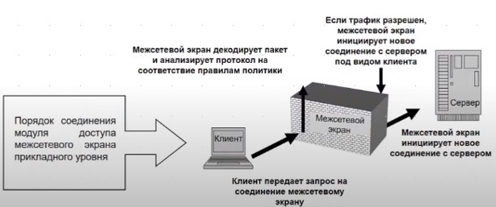
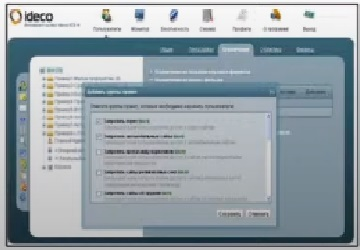
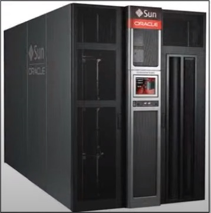

# Программно-аппаратное обеспечение системы обеспечения информационной безопасности. Цель, задачи, структура, содержание, средства.

Современная информационная система представляет собой сложную систему, состоящую из большого числа компонентов различной
степени автономности, которые связаны между собой и обмениваются данными. Каждый компонент может быть выведен из строя/
подвергнут внешнему воздействию.

Компоненты информационной системы могут стать угрозой для конфиденциальной информации организации в результате
умышленного или неумышленного нарушения их функционирования.

С целью предотвращения воздействия угроз со стороны компонентов информационной системы и внешних факторов воздействующих
на эти компоненты, организуется программно-аппаратное обеспечение системы информационной безопасности.

Компоненты информационной системы можно разбить на следующие группы:

- Аппаратные средства операционной системы и системные программы
- Программное обеспечение
- Данные различной категории
- Обслуживающий персонал
- Пользователи.

Данные группы могут стать угрозой информационной безопасности в результате умышленных/ не умышленных действий.

## Организационные ограничения для технических средств обработки конфиденциальной информации.

- Недопущение подключения и установки соединения специализированного компьютера или локальной (изолированной)
  компьютерной сети с сетью Интернет. Или с любыми техническими средствами, имеющими возможность неконтролируемого
  подключения к сети Интернет. (Мобильный телефон, ноутбук, роутер)
- Недопущение пользования и даже поноса в категоризованное помещение, персональных и незащищенных средств мобильной
  связи, а так же средств фотографирования и аудиозаписи, в там числе встроенных.
- Рассмотрение вопроса аппаратной защиты данных происходит из расчета использования сертифицированных устройств.

==Программно-аппаратное обеспечение СИБ== - совокупность возможностей системного, прикладного и специального
программного компьютерного обеспечения, а также специальных технических устройств, выполняющих функции защиты
компьютерной информации в информационный системе объекта.

==Цель программно-аппаратного обеспечения СИБ== - обеспечение конфиденциальности, доступности и целостности компьютерной
информации при воздействии угроз на информационную систему.

## Задачи программно-аппаратного обеспечения СИБ

1. Обеспечение контроля доступа к информационной системе
2. Предупреждение появления угроз в информационной системе
3. Обнаружение воздействия угроз на информационную систему и локализация этого воздействия
4. Ликвидация последствия угроз на информационную систему

Подсистема Программно-аппаратного обеспечения СИБ

## Программная защита информации

==Программная защита информации== - это направление связанное с обеспечением программной защиты информации в
информационной системе организации которая заключается в установке, настройке, управлении. С использованием достаточно
обширного перечня программной продукции обладающей средствами защиты информации от несанкционированного доступа и
модификации

==Программная защита информации== - это совокупность возможностей системного, прикладного и специального программного
компьютерного обеспечения современных информационных и автоматизированных систем по защите хранящейся и обрабатывающейся
в них конфиденциальной информации

## Задачи программной защиты информации

1. Контроль доступа к компьютерным ресурсам
2. Предупреждение воздействия вредоносных программ на компьютерные ресурсы
3. Предотвращение воздействия вредоносных программ на информационные ресурсы
4. Защита конфиденциальной информации от шпионских программ.
5. Восстановление компьютерных ресурсов и информационной системы.

## Средства программной защиты информации

1. Средства защиты информации, встроенное в системное ПО (Сис ПО)
2. Средства защиты информации, встроенное в прикладное программное обеспечение (приложения) (ППО)
3. Антивирусное программное обеспечение
4. Программное обеспечение для защиты от спама
5. Программное обеспечение для защиты от шпионских программ
6. Программное обеспечение для защиты от шифрования и кодирования информации
7. Программные сканеры безопасности

## Средства защиты информации, встроенные в ППО

1. Программы аутентификации и авторизации
2. Программные межсетевые экраны
3. Программы создания виртуальных защищенных сетей
4. Программы защиты файловой системы
5. Программы архивирования информации
6. Программы восстановления операционной системы и данных.

### 1. Средства защиты информации, встроенные в Сис ПО

1. Средства аутентификации и идентификации (системные, сетевые)
2. Средства авторизации (администрирование)
3. Средства системного аудита

#### 1.1. Средства идентификации и аутентификации (системные, сетевые):

==ГОСТ Р 58833-2020== «Защита информации. Идентификация и аутентификация. Общие положения»

==Доступ== - получения одной стороной информационного взаимодействия возможности использования ресурсов другой стороны
информационного взаимодействия.

==Доверенный объект== - объект, который будет действовать в полном соответствии с ожиданиями и субъекта доступа, и
объекта доступа или любого из них , при этом выполняя то, что он должен делать, и не выполняя то, что он не должен
делать.

==Верификация== - процесс проверки информации путем сопоставления предоставленной информации с ранее предоставленной
информацией.

==Доверенная третья сторона== — участник процесса аутентификации предоставляющий один или более сервисов в области
защиты информации, которому доверяют другие участники процесса аутентификации как поставщику данных услуг

==Управление доступом== — предоставление санкционированного и предотвращение несанкционированного доступа

==Целью идентификации и аутентификации== при доступе субъекта доступа к объекту доступа является опознание субъекта
доступа с необходимой уверенностью в том, что он является именно тем, за кого себя выдает

==Многошаговая идентификация и аутентификация== - идентификация и аутентификация, осуществляемая при доступе субъекта
доступа к объекту доступа состоящая последовательности процессов («шагов») идентификации и аутентификации

В рамках последовательности процессов («шагов») идентификации и аутентификации осуществляется ==вторичная
идентификация== субъекта доступа

В рамках последовательности процессов («шагов»)идентификации и аутентификации могут использоваться различные или
одинаковые виды аутентификации: ==простая, усиленная, строгая==

При доступе участники процессов Идентификации и аутентификации имеют следующее функциональное назначение.
(функциональные роли)

- ==Сторона, инициирующая доступ==. Основной задачей стороны, инициирующей доступ, является запрос доступа и последующее
  предоставление информации, необходимой другим сторонам
- ==Регистрирующая сторона.== Основной задачей регистрирующей стороны является присвоение субъекту (объекту) доступа
  идентификатора доступа и, при необходимости, аутентификационной информации, их регистрация и поддержание в актуальном
  состоянии (обновлении), а также фиксация связи идентификатора и аутентификационной информации с конкретным субъектом
  (объектом) доступа
- ==Доверяющая сторона.== Основной задачей доверяющей стороны опознавание субъекта доступа по предъявленномуявляется
  идентификатору и проверки его подлинности
- ==Проверяющая сторона.== Основной задачей проверяющей стороны является проверка принадлежности субъекту доступа
  идентификатора доступа и аутентификационной информации, которые зафиксированы за ним регистрирующей стороной

##### Процесс идентификации включает действия:

по подготовке, формированию идентификационной информации субъекта (объекта) доступа, присвоению субъекту (объекту)
доступа идентификатора и их последующей регистрации, а при доступе субъекта доступа к объекту доступа - действия по
проверке существования (наличия) идентификатора, предъявленного субъектом доступа, в перечне присвоенных идентификаторов
доступа

==Идентификация== - действия по присвоению субъектам и объектам идентификаторов и/или по сравнению предъявляемого
идентификатора с перечнем присвоенных идентификаторов

==Идентификатор доступа== (субъекта (объекта) доступа), (идентификатор) - признак субъекта доступа или объекта доступа в
виде строки знаков (символов), который используется при идентификации и однозначно определяет (указывает) соотнесенную
сими идентификационную информацию

==Идентификационная информация== совокупность значений идентификационных атрибутов, которая связана с конкретным
субъектом доступа или конкретным объектом доступа

==Идентификационные данные== - совокупность идентификационных атрибутов и их значений, которая связана с конкретным
субъектом доступа или конкретным объектом доступа

==Идентификационный атрибут== - атрибут, который характеризует субъект доступа или объект доступа и может быть
использован для его распознавания

##### Виды идентификации:

==Первичная идентификация==, осуществляемая при регистрации регистрирующей стороной нового субъекта (объекта) доступа
вторичная идентификация, регулярно повторяющаяся при каждом запросе субъекта доступа на доступ

==Первичная идентификация== действия по формированию и регистрации информации о субъекте доступа или объекте доступа, а
также действия по присвоению идентификатора доступа субъекту доступа или объекту доступа и его регистрации перечне
присвоенных идентификаторов доступа

==Вторичная идентификация== - действия по проверке существования (наличия) идентификатора, предъявленного субъектом
доступа при доступе, в перечне идентификаторов доступа, которые были присвоены субъектам доступа и объектам доступа при
первичной идентификации

##### Для поддержания актуального состояния (обновления)идентификационной информации зарегистрированного субъекта (объекта) доступа

- ==Первичная идентификация== может повторяться с установленной периодичностью или по мере необходимости, а также
  выполняться по запросу субъекта (объекта) доступа
- ==Вторичная идентификация== субъекта доступа может выполняться однократно или, при необходимости, с установленной
  периодичностью в течение всего информационного взаимодействия между субъектом доступа и объектом доступа

==Верификатор идентификации== - доверенный объект, выполняющий вторичную идентификацию субъекта доступа при доступе.
==Цель первичной идентификации== - распознавание субъекта (объекта) доступа путем установления (подтверждения)
соответствия между субъектом (объектом) доступа и заявленными им идентификационными данными. ==По результатам первичной
идентификации== субъекту (объекту) доступа должен присваиваться уникальный идентификатор доступа, определяющий
соотнесенную с ним идентификационную информацию субъекта (объекта) доступа. Уникальность идентификатора доступа должна
обеспечиваться в области действия единых правил управления доступом. ==Первичная идентификация== субъекта (объекта)
доступа ==должна== информации ==завершаться== регистрацией идентификационной и присвоенного субъекту (объекту) доступа
уникального идентификатора доступа или обоснованным отказом. ==Основанием для отказа в регистрации== может быть
несоответствие заявленных идентификационных данных требованиям к первичной идентификации или невозможность их
подтверждения в установленном порядке. ==Первичная идентификация должна являться неотъемлемой частью== как процесса
идентификации, не предусматривающего последующий доступ субъекта доступа, так и частью процесса идентификации,
предполагающего последующий доступ субъекта доступа и, соответственно, его аутентификацию. ==Цель вторичной
идентификации== - опознавание субъекта доступа, запросившего доступ к объекту доступа

##### Процесс идентификации, не предусматривающий последующий доступ, должен включать

- Представление физическим лицом или получение от ресурса данных, необходимых для первичной идентификации
- Оценку возможности регистрации идентификационной информации регистрирующей стороной и подтверждение соответствия между
  физическим лицом (ресурсом) и его идентификационными данными
- Принятие регистрирующей стороной решения о результате первичной идентификации, в том числе регистрация
  идентификационной информации и присвоенного физическому лицу (ресурсу) идентификатора, или обоснованный отказ в
  регистрации
- Хранение и поддержание идентификационной информации в актуальном состоянии (обновление) регистрирующей стороной и, при
  необходимости, предоставление ее по запросам

##### Процесс идентификации, предусматривающий последующие аутентификацию, авторизацию и доступ, должен включать

- Формирование запроса на регистрацию субъекта (объекта) доступа и последующее представление идентификационных данных,
  необходимых для первичной идентификации
- Оценку регистрирующей стороной возможности регистрации идентификационной информации и подтверждение соответствия между
  субъектом (объектом) доступа и его идентификационными данными
- Принятие регистрирующей стороной решения в результате первичной идентификации, в том числе регистрация
  идентификационной информации и присвоенного субъекту (объекту) доступа идентификатора доступа или обоснованный отказ в
  регистрации
- Хранение и поддержание в актуальном состоянии (обновление) идентификатора доступа и идентификационной информации
  регистрирующей стороной
- Предъявление доверяющей стороне субъектом доступа идентификатора для вторичной идентификации при запросе доступа к
  объекту доступа
- Проверку доверяющей стороной существования (наличия) идентификатора, предъявленного субъектом доступа, в перечне
  присвоенных идентификаторов
- Контроль проверяющей стороной принадлежности субъекту доступа идентификатора доступа, включая проверку актуальности
  (действительности) и проверку связи идентификатора доступа с субъектом доступа
- Принятие решения доверяющей стороной о результате вторичной идентификации и проведении аутентификации

==Аутентификация== - действия по проверке подлинности субъекта доступа и/или объекта доступа, а также по проверке
принадлежности субъекту доступа и/или объекту доступа предъявленного идентификатора доступа и аутентификационной
информации

==Цель аутентификации== - формирование необходимой уверенности в том, что субъект (объект) доступа действительно
является тем зарегистрированным субъектом (объектом) доступа, за кого себя выдает предъявленным идентификатором доступа

==Верификатор аутентификации== - доверенный объект, выполняющий аутентификацию субъекта доступа при доступе

==Метод аутентификаций== - реализуемое при аутентификации предопределенное сочетание факторов, организации обмена и
обработки аутентификационной информации, а также соответствующих данному сочетанию протоколов аутентификации

==Протокол аутентификации== - протокол, позволяющий участникам процесса аутентификации осуществлять аутентификацию

##### В процессе аутентификации применяются следующие факторы

==Фактор знания== - субъект доступа должен знать определенную информацию

==Фактор владения== - субъект доступа должен обладать определенным предметом, содержащим аутентификационную информацию

==Биометрический фактор== - субъекту доступа должен быть свойственен определенный признак (характеристика), информация о
котором (которой) используется при аутентификации

==Фактор== - вид (форма) существования информации, используемой при идентификации и аутентификации.

##### При доступе к объекту доступа для аутентификации субъекта доступа

==Необходимо использовать:==

==Однофакторная аутентификация== - аутентификация, при выполнении которой используется один фактор аутентификации

==Многофакторная аутентификация== - аутентификация, при выполнении которой используется не мєчее двух различных факторов
аутентификации

==Биометрический фактор== должен использоваться только совместно с другими факторами, в том числе для подтверждения
фактора владения. При этом применение биометрического фактора в качестве единственного фактора при однофакторной
аутентификации не допускается

##### Типы аутентификации в зависимости от организации обмена аутентификационной информацией и используемых при этом протоколов аутентификации:

- Односторонняя аутентификация
- Взаимная аутентификация

==Односторонняя аутентификация== - аутентификация, обеспечивающая только лишь для одного из участников процесса
аутентификации (объекта доступа) уверенность в том что другой участник процесса аутентификации (субъект доступа)
является тем, за кого себя выдает предъявленным идентификатором доступа

==Взаимная аутентификация== - обоюдная аутентификация, обеспечивающая для каждого из участников процесса аутентификации,
и субъекту доступа, и объекту доступа, уверенность в том, что другой участник процесса аутентификации является тем, за
кого себя выдает

##### Процесс аутентификации должен включать:

- Формирование и регистрацию аутентификационной информации субъекта (объекта) доступа при первичной идентификации. При
  этом аутентификационная информация может назначаться регистрирующей стороной или самостоятельно формироваться
  субъектом доступа в соответствии с установленными правилами
- Хранение и поддержание в актуальном состоянии (обновление) аутентификационной информации регистрирующей стороной и
  субъектом доступа
- Предъявление субъектом доступа доверяющей стороне идентификатора и аутентификационной информации при запросе доступа к
  объекту доступа
- Проверку подлинности субъекта доступа доверяющей стороной в рамках обмена аутентификационной информацией и другими
  данными, необходимыми для аутентификации
- Проверку принадлежности субъекту доступа предъявленных идентификатора и аутентификационной информации проверяющей
  стороной, включая проверку актуальности (действительности) аутентификационной информации и проверку связи
  идентификатора и аутентификационной информации с субъектом доступа
- Принятие доверяющей стороной решения о результате аутентификации и последующем проведении авторизации

##### ==Виды аутентификации:== простая, усиленная или строгая

==Простая аутентификация== - аутентификация с применением метода однофакторной односторонней аутентификации и
соответствующих данному методу протоколов аутентификации.

==Усиленная аутентификация== - аутентификация с применением метода многофакторной односторонней аутентификации и
соответствующих данному методу протоколов аутентификации

==Строгая аутентификация== - аутентификация с применением только метода многофакторной взаимной аутентификации и
использованием криптографических протоколов аутентификации

При ==простой аутентификации== должна применяться однофакторная односторонняя аутентификация организацией передачи
аутентификационной информации от субъекта доступа к объекту доступа. В процессе простой аутентификации необходимо
использовать протоколы аутентификации, соответствующие данной организации передачи аутентификационной информации, в том
числе и криптографические

При ==усиленной аутентификации== должна применяться многофакторная аутентификация организацией передачи односторонняя
аутентификационной информации от субъекта доступа к объекту доступа или многофакторная взаимная аутентификация с
организацией обмена аутентификационной информацией между субъектом доступа и объектом доступа

При ==строгой аутентификации== должна применяться многофакторная взаимная аутентификация с организацией двухстороннего,
между субъектом доступа и объектом доступа, или многостороннего (при использовании третьей доверенной стороны) обмена
аутентификационной информацией. В процессе строгой аутентификации должны использоваться криптографические протоколы
аутентификации, соответствующие данной организации обмена и включающие различные последовательности обмена сообщениями (
двух- и многопроходные) между участниками процесса аутентификации

При ==усиленной аутентификации== должна применяться многофакторная односторонняя аутентификация организацией передачи
аутентификационной информации от субъекта доступа к объекту доступа или многофакторная взаимная аутентификация с
организацией обмена аутентификационной информацией между субъектом доступа и объектом доступа

При ==строгой аутентификации== должна применяться многофакторная взаимная аутентификация с организацией двухстороннего,
между субъектом доступа и объектом доступа, или многостороннего (при использовании третьей доверенной стороны) обмена
аутентификационной информацией. B процессе строгой аутентификации должны использоваться криптографические протоколы
аутентификации, соответствующие данной организации обмена и включающие различные последовательности обмена сообщениями (
двух- и многопроходные) между участниками процесса аутентификации

##### Уровни доверия к результатам идентификации

1. ==Низкий уровень доверия.== На низком уровне доверия к результатам идентификации имеется некоторая уверенность в том,
   что субъект доступа, зарегистрированный в процессе первичной идентификации и успешно прошедший вторичную
   идентификацию, действительно соответствует идентификационной информации, которая однозначно определяется
   предъявленным идентификатором доступа
2. ==Средний уровень доверия.== На среднем уровне доверия к результатам идентификации появляется умеренная уверенность в
   том, что субъект доступа, зарегистрированный процессе первичной идентификации и успешно прошедший вторичную
   идентификацию, действительно соответствует идентификационной информации, которая однозначно определяется
   предъявленным идентификатором доступа
3. ==Высокий уровень доверия.== На высоком уровне доверия к результатам идентификации существует значительная
   уверенность в том, ам, что субъект доступа, зарегистрированный в процессе первичной идентификации и успешно прошедший
   вторичную идентификацию, действительно соответствует идентификационной информации, которая однозначно определяется
   предъявленным идентификатором доступа

==Пароль== - конфиденциальная аутентификационная информация, обычно состоящая из строки знаков

==Одноразовый пароль== - однократно используемый пароль

==Приемы доказательства аутентичности:==

- Aутентифицируемый может продемонстрировать знание некоего общего для обеих сторон секрета - как правило, слова -
  пароля
- Aутентифицируемый может продемонстрировать, что он владеет неким уникальным предметом (физическим ключом), в качестве
  которого может выступать, например, электронная магнитная карта (смарт-карта), устройства, типа Touch-memory, брелоки
  и др.
- Aутентифицируемый может доказать свою идентичность, используя собственные уникальные биохарактеристики: рисунок
  радужной оболочки глаза или отпечатки пальцев, которые предварительно были занесены в базу данных аутентификатора

###### Сетевая аутентификация

Для ==снижения уровня угрозы от раскрытия паролей== администраторы сети, как правило, применяют встроенные программные
средства для формирования политики назначения и использования паролей: задание максимального и минимального сроков
действия пароля, хранение списка уже использованных паролей, управление поведением системы после нескольких неудачных
попыток логического входа и т. п.

==Перехват паролей по сети предупреждается== путем их шифрования перед передачей в сеть

###### Сетевая аутентификация на основе многоразового пароля

Централизованная служба аутентификации поддерживается одним из серверов сети и использует для своей работы базу данных,
в которой хранятся учетные данные (иногда называемые бюджетами) пользователях сети

В централизованной базе данных, хранящейся на сервере, по идентификатору пользователя находится соответствующая запись,
из нее извлекается пароль и сравнивается с тем, который ввел пользователь. Если они совпадают, то аутентификация
считается успешной, пользователь получает легальный статус и те права, которые определены для него системой авторизации

Алгоритмы аутентификации, основанные на одноразовых паролях, являются более надежными

Системы аутентификации на основе одноразовых паролей рассчитаны на проверку только удаленных, a не локальных
пользователей

Генерация одноразовых паролей может выполняться либо программно, либо аппаратно. Некоторые реализации аппаратных
устройств доступа на основе одноразовых паролей представляют собой миниатюрные устройства со встроенным микропроцессором

###### Сетевая аутентификация на основе программного ключа

Программные ключи размещаются на сменном магнитном диске в виде обычной программы, важной частью которой является
генератор одноразовых паролей

Аналогично системе аутентификации с использованием многоразовых паролей пользователь выбирает одноразовый пароль, и
сообщает системе свой идентификатор

Вместо постоянного ввода одного и того же пароля, пользователь указывает последовательность цифр, сообщаемую ему
аппаратным или программным ключом. Через определенный небольшой период времени генерируется другая последовательность -
новый пароль Аутентификационный сервер проверяет введенную последовательность и разрешает пользователю осуществить
логический вход

#### 1.2. Средства авторизации (администрирование)

==Авторизация== - процесс определения достоверности полномочий предъявителя на доступ к ресурсу или использованию услуг

==Источников требований к авторизации в корпоративной информационной системе==, как правило, два - это информационная
безопасность и бизнес

==Цель авторизации== - предоставление каждому легальному пользователю именно тех видов доступа и к тем ресурсам, которые
были для него определены администратором системы

==Формы предоставления доступа==

==(ГОСТ Р 51241-2008 «Средства и системы контроля и управления доступом. Классификация. Общие технические требования.
Методы испытаний»):==

- Дискреционный принцип доступа
- Мандатный принцип доступа

==Дискреционный принцип== доступа реализуется в том, что индивидуальный пользователь или программа, работающая от имени
пользователя, имеет возможность явно определить типы доступа, которые могут осуществить другие пользователи (или
программы, выполняемые от их имени) к информации, находящейся в ведении данного пользователя

Дискреционный принцип доступа отличается от мандатного принципа доступа тем, что оно реализует решения по управлению
доступом, принятые пользователем

==Мандатный принцип== доступа заключается в том, что вся информация делится на уровни в зависимости от степени
секретности, а все пользователи системы также делятся на группы, образующие иерархию в соответствии с уровнем допуска к
этой информации

Мандатный принцип доступа реализуется на основе результатов сравнения уровня допуска пользователя и степени
конфиденциальности информации

##### Степень детализации управления доступом осуществляется на уровне категорий:

- Владелец информации
- Заданная группа пользователей
- Все другие авторизованные пользователи.

==В операционной системе Windows различаются типы доступа:==

- Специальные
- Стандартные (общие)
- Родовые права доступа к объектам

==Специальные права доступа== определяют возможность обращения к объекту по свойственному только данной категории
объектов методу - чтение данных из объекта, запись данных в объект, чтение атрибутов объекта, выполнение программного
файла и т. д. ==Стандартные права== доступа определяют возможность доступа к объекту по методу, применимому к любому
объекту, - изменение владельца объекта, изменение списка DACL объекта, удаление объекта и т. д. ==Родовые права
доступа== представляют собой комбинацию специальных и стандартных прав и предоставляет возможность обращения к объекту с
помощью некоторого набора методов доступа

##### Родовые права доступа

###### 1. Для файлов и папок

- ==Полный доступ== (включает в себя все специальные и стандартные разрешения)
- ==Изменение== (все разрешения, кроме «Удаление подпапок и файлов», «Смена разрешений» и «Смена владельца»)
- ==Чтение и выполнение== (включает разрешения на «Обзор папок (выполнение файлов)», «Содержание папки (чтение данных)»,
  «Чтение атрибутов», «Чтение дополнительных атрибутов», «Чтение разрешений», «Синхронизация»)
- ==Список содержимого папки== (только для папок) включает в себя те же разрешения, что и «Чтение и выполнение», но они
  наследуются по-разному. Разрешение «Список содержимого папки" наследуется только папками, но не файлами, и
  отображается только при просмотре разрешений на доступ к папкам. Разрешение «Чтение и выполнение» наследуется как
  файлами, так и папками, и всегда отображается при просмотре разрешений на доступ к файлам или папкам
- ==Чтение== (включает в себя право на «Содержание папки (чтение данных)», «Чтение атрибутов», «Чтение дополнительных
  атрибутов», «Чтение разрешений»,«Синхронизацию»)
- ==Запись== (включает в себя разрешения «Создание файлов (запись данных)», «Создание папок (дозапись данных)», «Запись
  атрибутов», «Запись дополнительных атрибутов», «Чтение разрешений», «Синхронизацию»)

###### 2. Для принтеров (родовые права доступа):

- ==Печать== (включает разрешения на «Печать» и «Чтение разрешений»)
- ==Управление документами== (включает в себя права на «Управление документами», «Чтение разрешений», «Смену
  разрешений», «Смену владельца»)
- ==Управление принтерами== (включает в себя все специальные и стандартные права доступа, кроме «Управления
  документами»).

###### 3. Для реестра Windows (родовые права доступа)

- ==Полный доступ== (включает в себя все специальные и стандартные разрешения)
- ==Чтение== (включает раздражения на «Запрос значения», «Перечисление подразделов», «Уведомление», «Чтение разрешений»)

==Специальное право на «Обзор папок»== предполагает возможность перемещения по структуре папок в поисках других файлов
или папок, даже если пользователь не обладает разрешением на доступ к просматриваемым папкам

==Право на «Содержание папки»== дает возможность просмотра имен файлов и подпапок, содержащихся в папке. Это разрешение
относится только к содержимому данной папки и не означает, что имя самой этой папки также должно включаться в список

==Специальное право «Выполнение файлов»== разрешает или запрещает запуск программ

==Разрешение «Обзор папок»== для папки не означает автоматическую установку разрешения «Выполнение файлов» для всех
файлов в этой папке

==Право на «Запись данных»== разрешает или запрещает внесение изменений в файл и запись поверх имеющегося содержимого

==Право на «Дозапись данных»== разрешает или запрещает внесение данных в конец файла, но не изменение, удаление или
замену имеющихся данных

==Стандартное право для разделов реестра== на смену разрешений для него именуется «Запись ОАС»

==Общее право "Синхронизация"== (для разделов реестра именуется «Уведомление») разрешает или запрещает ожидание
различными потоками объектов и синхронизацию их с другими потоками, которые могут занимать их. Это разрешение применимо
только к программам, выполняемым в многопоточном режиме с несколькими процессами

==Стандартное право на «Удаление»== разрешает или запрещает удаление объекта

==Стандартным правом «Смена владельца»== обладают только члены администраторов

##### Управление доступом пользователя

- На уровне каталогов
- На уровне файлов

Управление доступом на уровне каталога приводит к тому, что права доступа для всех файлов в каталоге становятся
одинаковыми

Права доступа к каталогу могут также обеспечить явный запрет доступа, который предотвращает любой доступ пользователя к
файлам в каталоге

##### Управление типами обращений к файлу

- Разделяемый файл
- Заблокированный (монопольно используемый) файл

==Разделяемые== файлы позволяют осуществлять параллельный доступ к файлу нескольких пользователей одновременно

==Заблокированный== файл будет разрешать доступ к себе только одному пользователю в данный момент

Если файл доступен только по чтению, назначение его к разделяемым файлам, позволяет группе пользователей параллельно
читать его

==Механизмы привилегий== позволяют авторизованным пользователям игнорировать ограничения на доступ и легально обходить
управление доступом, чтобы выполнить какую-либо функцию, получить доступ к файлу, и т.д.

Механизм привилегий должен включать ==принцип минимальных привилегий== - принцип, согласно которому каждому субъекту в
системе предоставляется наиболее ограниченное множество привилегий, необходимых для выполнения задачи

Например, при выполнении функции резервного копирования. Пользователь, который авторизован выполнять функцию резервного
копирования, должен иметь доступ по чтению ко всем файлам, чтобы копировать их на резервные носители информации. Однако
пользователю нельзя предоставлять доступ по чтению ко всем файлам через механизм управления доступом

- Редактор реестра
- Редактор локальной групповой политики
- Управление дисками (виртуальные диски и машины)
- Защитник Windows
- Брандмауэр Windows и брандмауэр Windows в режиме повышенной безопасности
- Учетные записи пользователей
- ODBC Data Sources (32 или 64-bit) (утилита доступа к базам данных)

В зависимости от решаемых задач применяются и другие утилиты «Администрирования»

==Редактор реестра== - иерархически построенная база данных параметров и настроек для аппаратного обеспечения,
программного обеспечения, профилей пользователей, предустановки

##### Корневые разделы реестра:

`HKEY_CLASSES_ROOT` - данный раздел используются для хранения и управления ассоциациями файлов. Фактически, данный
раздел является ссылкой на `HKEY_LOCAL_MACHINE/Software/Classes`

`HKEY_CURRENT_USER` - содержит параметры для пользователя, под именем которого был осуществлен вход в систему. Здесь же
хранятся большинство параметров установленных программ. Является ссылкой на раздел пользователя в `HKEY_USERS`

`HKEY_LOCAL_MACHINE` - в данном разделе хранятся настройки операционной системы и программ в целом, для всех
пользователей

`HKEY USERS` - хранит настройки для всех пользователей системы

`HKEY_CURRENT_CONFIG` содержит параметры всего установленного оборудования

==Редактор локальной групповой политики== - позволяет контролировать все параметры операционной системы из одной точки

Применяется администратором сети, когда нужно установить одинаковые правила для нескольких компьютеров или пользователей
в одной и той же области системы

##### Возможности по настройке параметров операционной системы

- Разрешение пользователям использовать определенные приложения на Вашем компьютере
- Блокировка доступа к внешним устройствам (например, карты памяти USB), подключенных к компьютеру
- Блокировка доступа пользователей к панели управления или настройкам приложений
- Скрытие некоторых элементов панели управления
- Задать фон, для рабочего стола и блокировать способность пользователей его изменить
- Блокировка включения или отключения сетевых соединений и доступа к их свойствам
- Запрет пользователям считывать или записывать данные на CD, DVD, внешних накопителях памяти и т.д.
- Отключение всех комбинаций клавиш, которые начинаются с кнопки Win. Например, Win+R (открывает «Выполнить»)

==Управление дисками== - это встроенная в Windows утилита, которая позволяет управлять запоминающими устройствами
компьютера без использования стороннего софта

Позволяет создавать и удалять разделы, форматировать тома с созданием файловых систем FAT, FAT32 и NTFS, преобразовывать
базовые диски в динамически и наоборот, а также создавать отказоустойчивые системы дисков

##### Диски поддерживают технологии:

- MBR в BIOS
- GPT в UEFI

==Отличия GPT MBR (главной загрузочной записи):==

- В MBR boot-записи находятся у начала диска, а GPT способен найти имеющиеся таблицы EFI и прогрузить их сразу в нужное
  место для сохранения
- MBR дает возможность пользоваться разделами с объемом до 2,2 Тб, а появление GPT позволило снять практически все
  ограничение с данного параметра
- C MBR стандартом можно разделять диск максимум на четыре раздела, при этом с GPT - до ста двадцати восьми разделов

==Виртуальные машины== - используют для тестирования программного обеспечения и основных операционных систем,
безопасного запуска подозрительных приложений, запуска программ подключения несовместимого оборудования, а также, не
поддерживающихся основной операционной системой

==Виртуальный компьютер== имеет свой процессор, память, диск, сетевой адаптер и другое оборудование. Всё это эмулируется
силами реального компьютера, который делится своими ресурсами с виртуальным

##### Программы для создания виртуальных машин

==Hyper-V== предназначена только для 64-битных версий Windows 8, 10 Pro и ==Enterprise==, и для серверных ерационных
систем

==VirtualBox== - полностью бесплатный инструмент с поддержкой многих гостевых операционных систем, которые можно
запустить на Windows,

##### macOS и Linux.

==VMware Fusion и Workstation== - продвинутые виртуальные машины для всех платформ. Позволяют запускать любые
операционные системы и поддерживают расширенную эмуляцию 3D-графики

==Parallels Desktop== - лучшее коммерческое решение для виртуализации на Мас, Обеспечивает высокую производительность и
тесную интеграцию составной операционной системы с фирменными функциями macOS

==Защитник Windows== - сканер системы, содержащий ряд модулей безопасности, отслеживающих подозрительные изменения в
определённых сегментах системы в режиме реального времени

Программа позволяет быстро удалять установленные приложения ActiveX. С помощью доступа к сети Microsoft SpyNet есть
возможность отправлять сообщения о подозрительных объектах в Microsoft для определения его возможной принадлежности к
spyware

##### Некоторые недостатки «Защитника Windows»

- Защитник нагружает процессор, замедляя быстродействие
- Невозможность использования операционной системы во время сканирования. Сама проверка может занимать 1-2 часа времени
- Defender не в состоянии конкурировать известными брендами качественных антивирусных программ, например с Kaspersky lab
  или Dr.Web
- Взломанные программы блокируются стандартным защитником, и не запускаются до полного его отключения
- Стандартный антивирус иногда «паникует» без весомой причины, не давая корректно работать безвредным приложениям от
  сторонних разработчиков
- Низкий уровень защиты при активном использовании компьютера

==Брандмауэр Windows== - защита сегментов сети или отдельных хостов от несанкционированного доступа с использованием
уязвимых мест в протоколах сетевой модели OSI или в программном обеспечении, установленном на компьютерах сети

Запрещает установленным на компьютер программам обращаться к Сети без полученного на то разрешения от администратора или
при отсутствии сертификатов безопасности, проверяет запущенные службы и останавливает их при обнаружении опасной
активности

##### Предоставляет наибольшие возможности по настройке:

- Изменение параметров уведомлений
- Разрешение запуска программы через брандмауэр
- Разрешение типов сетевых размещений

==Брандмауэр Windows в режиме повышенной безопасности== - брандмауэр, регистрирующий состояние сети, для рабочих
станций, фильтрующий входящие и исходящие соединения в соответствии с заданными настройками

##### Предоставляет расширенные возможности по настройке правил:

- Отдельно настраивать правила как для входящего, так и для исходящего трафика
- Создавать правила Брандмауэра на основе различных протоколов и портов -настраивать правила обмена данными с сетью для
  служб
- Созданные правила могут относиться только к определенным IP-адресам в сети
- Есть возможность пропуска только авторизованного трафика
- Настраивать правила безопасности соединения

##### Настройка четырех типов правил:

- Для программы - блокировать или разрешать подключения определенной программе
- Для порта - блокировать или разрешить порт, диапазон портов или протокол
- Предопределенные - можно использовать заранее определенные правила, включенные в брандмауэр Windows
- Настраиваемые - указать комбинацию программ, портов и IP-адресов для блокировки или разрешения, настраивать правила
  только для приложений

==Учетные записи пользователей== - перечень сведений, определяющих персональные настройки компьютера, права доступа к
файлам и директориям в файловой системе, права пользователя на изменение работы компьютера (глобальные настройки
Windows, установка и удаление программ и тому подобное)

Для идентификации пользователя в системе используется имя его учетной записи (логин) и пароль

##### Типы учетных записей:

- Учетная запись «Админйстраторы»
- Учетная запись «Пользователи»
- Учетная запись «Гости»

##### Группы пользователей в Windows и их права доступа:

==«Администраторы»== - неограниченный доступ

==«Операторы архива»== - члены данной группы имеют права создания резервной копии даже тех объектов, к которым не имеют
доступа

==«Опытные пользователи»== - группа включена только для совместимости с предыдущими версиями

==«Пользователи системного монитора»== - группа дает доступ к «Системному монитору», с помощью которого можно отследить
использование различных ресурсов компьютером, но «поверхностный» доступ

==«Операторы настройки сети»== - члены группы могут изменять параметры TCP/IP

==«Пользователи удаленного рабочего стола»== - пользователи этой группы смогут входить в систему через удаленный рабочий
стол

==Пользователи журналов производительности»== - данная группа дает более полные права к «Системному монитору», чем
группа «Пользователи системного монитора»

==«Пользователи DCOM»== - пользователи группы могут манипулировать объектами распределенной модели DCOM

==«Криптографические операторы»== - пользователи данной группы могут выполнять криптографические операции

==«Читатели журнала событий»== - пользователи данной группы имеют доступ к журналу событий

B Windows возможно разграничение доступа к следующим объектам:

- Файлам и папкам на дисках под управлением файловой системы NTFS
- Разделам реестра
- Принтерам
- Соединениям
- Процессам и потокам
- Файлам, отображенным в память
- Маркерам доступа
- Службам
- Объектам состояния окна (буферу обмена, объектам рабочего стола)
- Рабочим столам
- Объектам синхронизации (событиям)
- Объектам задач

Выполняются команды «Общий доступ и безопасность» или «Свойства» контекстного меню папки либо команда «Свойства»
контекстного меню файла

Кнопки «Добавить» и «Удалить» позволяют изменять количество элементов АСЕ в списке DACL, а в окне «Разрешения для …»
можно устанавливать родовые права доступа к объекту конкретным пользователям и группам

Нажатие кнопки «Дополнительно» позволяет отобразить окно настроек дополнительных параметров безопасности для объекта. На
вкладке «Разрешения» можно просмотреть и при необходимости изменить любые (в том числе специальные и стандартные) права
доступа к объекту

На вкладке «Владелец» можно просмотреть и (при наличии соответствующей привилегии) изменить информацию о владельце
объекта (записать в SID владельца в дескрипторе безопасности объекта SID нового владельца)

На вкладке «Действующие разрешения» можно проверить, какие права доступа к объекту установлены для конкретного
пользователя или группы, выбирающиеся с помощью кнопки «Выбрать». Действующие разрешения определяются с учетом членства
субъекта доступа в различных группах

==ODBC Data Sources (32 или 64-bit)== - эта утилита позволяет управлять подключениями к базам данных, отслеживать
подключения, настраивать драйверы систем управления базами данных (СУБД) и проверять доступ к тем или иным источникам.

==Пользовательский DSN== - пользовательский источник данных ODBC сохраняет сведения о том, как подключиться к указанному
поставщику данных. Пользовательский источник данных является видимым только для вас и может использоваться только на
текущем компьютере

==Трассировка ODBC== - позволяет создавать журналы вызовов драйверов ODBC для использования службой поддержки или для
оказания помощи при отладке приложений

==Системный DSN== - системный источник данных ODBC сохраняет сведения о том, как подключиться к указанному поставщику
данных. Системный источник данных является видимым для всех пользователей на этом компьютере, включая службы NT

==Пул соединений== - позволяет приложению повторно использовать открытые дескрипторы соединений, что позволяет уменьшить
число обменов данными с сервером

==Файловый DSN== - файловый источник данных ODBC позволяет установить связь с этим источником. Пользователи, у которых
установлены одинаковы драйверы, могут применять их совместно.

==Драйверы ODBC== - позволяют программам ODBC получать сведения из источника данных ODBC. Драйверы устанавливаются с
помощью программы установки

==Системный аудит== - фиксация в системном журнале событий, связанных с доступом к защищаемым системным ресурсам

Аудит используется и для того, чтобы контролировать даже неудачные попытки проникновения в систему

Система аудита рассматривается в качестве последнего рубежа в борьбе с нарушениями

#### 1.3 Средства системного аудита

- Просмотр событий
- Монитор стабильности системы
- Системный монитор
- Монитор ресурсов (диспетчер задач)

==Просмотр событий== - системная утилита, регистрирующая все основные события, происходящие в системе с последующей их
записью в журнале. Записываются ошибки, предупреждения и просто различные уведомления. На основе этих записей можно
подкорректировать работу системы и устранить ошибки

==Монитор стабильности== системная утилита, регистрирующая аппаратные и программные проблемы, а также другие изменения в
работе компьютера и предоставляет этот обзор в удобном графическом виде - дает возможность увидеть, какое приложение и
когда вызвало ошибку или зависло, отследить появление «синего экрана смерти» Windows, а также увидеть, связано ли это с
очередным обновлением Windows или установкой очередной программы

==Системный монитор== - это утилита, предназначенная для отслеживания процессов запущенных на компьютере в режиме
реального времени, и представления этих данных в графическом виде

==Монитор ресурсов== - утилита, позволяющая оценить использование процессора, оперативной памяти, сети и дисков в
Windows

### 2. Средства защиты информации, встроенные в ПО

#### 2.1. Программы аутентификации и авторизации

Программные системы аутентификации и авторизации на базе двух схем - централизованная схема аутентификации и
авторизации, базирующаяся на сервере:

- Kerberos с ее сервером безопасности и архитектурой клиент-сервер
- Системы ==Tacacs== и ==Radius== В централизованной схеме сервер управляет процессом предоставления ресурсов
  пользователю. Главная цель таких систем заключается в реализации «принципа единого входа». В соответствии с
  централизованной схемой пользователь один раз логически входит в сеть и получает на все время работы некоторый набор
  разрешений по доступу к ресурсам сети
- ==Децентрализованная схема аутентификации и авторизации, базирующаяся на рабочих станциях:==
- средства защиты, работающие на каждой машине, и сервер не требуется. Доступ к каждому приложению контролируется
  средствами безопасности самого приложения (==практически все лицензионные программы==)

Теоретически доступ к каждому приложению должен контролироваться средствами безопасности самого приложения или же
средствами, существующими в той операционной среде, в которой оно работает. В корпоративной сети администратору придется
отслеживать работу механизмов безопасности, используемых всеми типами приложений: электронной почтой, службой каталогов
локальной сети, базами данных хостов и т. п.

==Комбинированный подход предоставления пользователю прав доступа к ресурсам сети:==

Сервер удаленного доступа ограничивает доступ пользователя к подсетям или серверам корпоративной сети, а каждый
отдельный сервер сети сам по себе ограничивает доступ пользователя к своим внутренним ресурсам: разделяемым каталогам,
принтерам или приложениям

Сервер удаленного доступа предоставляет доступ на основании имеющегося у него списка прав доступа пользователя (Access
Control List, ACL), а каждый отдельный сервер сети предоставляет доступ к своим ресурсам на основании хранящегося у него
списка прав доступа, например, ACL файловой системы

#### 2.2 ==Программные межсетевые экраны.==

==Программные межсетевые экраны== устанавливаются на конечных хостах (любой компьютер, сервер, подключённый к локальной
или глобальной сети).

==Программный межсетевой экран== - это совокупность последовательно соединенных фильтров, каждый из которых реализует
подмножество правил контроля для заданного уровня стека ТСР/IP, и комплекта дополнительных автономных функциональных
модулей, необходимых для повышения уровня защиты сети.

==Основная функция любого межсетевого экрана== - это фильтрация пакетов на основании определенного набора правил.

==Основные задачи программных межсетевых экранов:==

- Обеспечение безопасности входящего и исходящего трафика
- Значительное увеличение безопасности сети и уменьшение риска для хостов подсети при фильтрации заведомо незащищенных
  служб
- Возможность контроля доступа к системам сети
- Уведомление о событиях с помощью соответствующих сигналов тревоги, которые срабатывают при возникновении какой-либо
  подозрительной деятельности (попытки зондирования или атаки)
- Обеспечение недорогого, простого в реализации и управлении решения безопасности
- Контролировать запуск приложений на том хосте, где установлены
- Защищать объект от проникновения через "люки" (back doors)
- Обеспечивать защиту от внутренних угроз.

==Дополнительные задачи межсетевых экранов:==

- Осуществление идентификации пользователей, хостов и, возможно, маршрутов. Идентификация должна предотвратить угрозу
  так называемого «маскарада» (spoofing), при котором нападающий с помощью подстановки чужих адресов пытается скрыть
  источник проникновения
- Гарантия целостности данных при их передаче через межсетевой экран. Контроль целостности позволяет обеспечить защиту
  от прослушивания трафика и манипуляции данными пользователей. Для этого в межсетевых экранах широко используются
  различные криптографические методы
- Активная проверка позволяет постоянно контролировать точное выполнение правил безопасности и на их основе своевременно
  обнаруживать и пресекать попытки вторжения.

==В надежном межсетевом экране должны быть реализованы== ==в какой-либо форме все три функции,== ==или, по крайней мере,
обеспечена их поддержка== ==в операционной системе, либо== ==специализированных продуктах!==

Обеспечение ==целостности и конфиденциальности передаваемых данных== все межсетевые экраны поддерживают различные методы
шифрования трафика на транспортном уровне. Наиболее известны протоколы ==SSL== и ==SSH==. Средство SOCKS позволяет
приложениям клиент/сервер в доменах ==ТСР== и ==UDP== безопасно обращаться к услугам межсетевого экрана.

==Целостность и конфиденциальность данных на сетевом уровне== обеспечивает протокол IPSec. Для поддержки структуры
безопасности на основе цифрового сертификата и приема/передачи общих ключей PKI межсетевые экраны должны соответствовать
требованиям стандарта X.509.

##### Средства активного аудита межсетевых экранов

- Обнаружение вторжений
- Обнаружение брешей путем активного тестирования сети

Безопасность у всех межсетевых экранов примерно одинаковая, иначе у них бы не было сертификата.

##### Типы межсетевых экранов

1. Пакетные фильтры
2. Фильтры с контекстной проверкой
3. Шлюзы уровня соединения
4. Шлюзы прикладного уровня
5. Гибридные межсетевые экраны

==Межсетевые экраны с пакетными фильтрами== принимают решение о пропуске очередного IP-пакета на основе информации из
его заголовка, состояния флагов или номера портов ТСР. Фильтры этого типа отслеживают информацию сетевого и
транспортного уровней, но использование для анализа номеров портов, обычно ассоциируемых с конкретными сервисами,
позволяет устанавливать правила контроля и на прикладном уровне.

Фильтр пакетов просматривают только некоторые поля IP-пакетов поэтому их нельзя признать достаточным средством защиты.

==Межсетевые экраны с контекстной проверкой== анализируют пакеты на сетевом уровне и принимают решение на основе
высокоуровневой информации о данных в пакете.

==Все пакеты делятся на три категории:==

1. «хорошие», беспрепятственно пропускаемые, в соответствии с правилами безопасности
2. «плохие», не удовлетворяющие правилам безопасности и просто отбрасываемые
3. «неизвестные» - для них не определены конкретные правила безопасности. Неизвестные пакеты фильтруются через
   межсетевой экран, как через обычный фильтр пакетов.

==Шлюзы уровня соединения== работают как транслятор соединения ТСР. Пользователь связывается с конкретным портом на
межсетевом экране, а тот в свою очередь устанавливает соединение с адресатом за пределами «контролируемой зоны». После
открытия сеанса все пакеты передаются в обоих направлениях без дополнительного анализа.

==Преимущества шлюзов уровня соединения:==

- Простые правила фильтрации
- Возможность организации большого числа проверок. Защита на уровне приложений позволяет осуществлять большое количество
  дополнительных проверок, что снижает вероятность взлома с использованием «дыр» в программном обеспечении
- Способность анализировать данные приложений.

==Недостатки шлюзов уровня соединения:==

- Относительно низкая производительность по сравнению с фильтрацией пакетов
- Proxy-служба должна понимать свой протокол (невозможность использования неизвестных протоколов)
- как правило, работает под управлением операционных систем.

==Шлюзы прикладного уровня== обеспечивают контроль за работой конкретных сервисов - telnet, ftp, http и др. Запускаются
непосредственно под управлением межсетевого экрана и обрабатывают весь предназначенный им трафик.

==Достоинства шлюзов прикладного уровня:==

- Удается решить важную задачу - полностью скрыть от внешнего мира структуру внутренней сети предприятия, включая
  информацию о заголовках почтовых пакетов или службы доменных имен
- Имеется возможность централизованной аутентификации пользователей
- В создаваемые правила доступа можно включать следующие параметры: имя пользователя
- Разрешенный период времени доступа к определенному сервису
- Компьютер, с которого указанный пользователь имеет право обращаться к сервису
- Схемы аутентификации

==Достоинства шлюзов прикладного уровня:==

- Системы подобного типа наиболее дороги, а их производительность ниже, чем у простых фильтров пакетов
- Задержки на обработку трафика могут существенно замедлить скорость доступа к сети
- Требуется отдельный подключаемый модуль для каждого сетевого сервиса.

==Гибридные межсетевые экраны - это устройства двух вариантного исполнения:==

В первом случае это межсетевой экран прикладного уровня который в дополнение к своему функционалу реализует метод
поддержки протоколов необходимых системе безопасности при работе сетевых администраторов, для которых не существует
определенных модулей доступа

Во втором случае это межсетевые экраны с пакетной фильтрацией в которые добавили некоторые модули доступа, использование
которых позволяет обеспечить более высокий уровень безопасности некоторых широко распространенных протоколов

##### Организационные принципы построения защищенной сети:

- Система защиты должна строиться комплексно. Нельзя просто купить межсетевой экран и установить его с параметрами по
  умолчанию
- Система должна быть распределенной. Сколь бы надежным ни был используемый межсетевой экран, защищенная сеть не может
  держаться на единственной точке контроля
- Система должна быть избыточна за счет применения компонентов разных изготовителей.

==Главным инструментом при организации защищенной сети должен стать документ «Политика безопасности предприятия».==

#### 2.3 Программы создания виртуальных защищенных сетей (VPN).

==VPN== (Virtual Private Network) - виртуальная частная сеть, представляет собой логическую сеть, создаваемая поверх
другой сети, например корпоративной (интранет).

==VPN состоит из двух частей:== внутренняя (подконтрольная) сеть, которых может быть несколько, и внешняя сеть, по
которой проходит инкапсулированное соединение.

Под ==инкапсуляцией== в компьютерных сетях понимают метод их согласования, применимый только для согласования
транспортных протоколов.

Инкапсуляция (туннель) может быть использована, когда две сети с одной транспортной технологией необходимо соединить
через сеть, использующую другую транспортную технологию.

##### Основные функциональные возможности VPN:

1. Кодирование межсетевых потоков
2. Создание периметра безопасности
3. Выборочное кодирование трафика
4. Управление ключевой системой
5. Регистрация событий, мониторинг и управление межсетевыми потоками
6. Защита соединений с мобильными клиентами.

#### 2.4 Программы защиты файловой системы.

==Базы данных== - огромные массивы данных, организованных в табличные структуры

==Основные функции СУБД:==

- Создание пустой (незаполненной) структуры базы данных - предоставление средств ее заполнения импорта данных из таблицы
  другой базы
- Обеспечение возможности доступа к данным, а также предоставление средств поиска и фильтрации

##### ==Встроенные механизмы защиты СУБД Microsoft Access==

1. Защита файлов баз данных, которая заключается в реализации следующих возможностей:

- Задать пароль, который в последующем позволит выполнить какие-либо действия над файлом базы данных только после его
  ввода
- Задать разрешения на работу над базой данных в целом или на ее элемент (таблицу, запрос, отчет и др.) конкретному
  пользователю или группе пользователей
- Закодировать файл базы данных под другим именем и, в последующем, раскодировать его.

2. Наличие служебных программ, выполняющих следующие дополнительные защитные функции:

- Создание резервной копии базы данных
- Сжатие и восстановление базы данных.

##### Концепция обеспечения безопасности СУБД базируется на двух принципах:

1. Проверка полномочий
2. Проверка подлинности (аутентификация)

==Проверка полномочий== основана на том, что каждому пользователю или процессу информационной системы соответствует
набор действий, которые он может выполнять по отношению к определенным объектам.

==Проверка подлинности== означает достоверное подтверждение того, что пользователь или процесс, пытающийся
санкционированное действие, действительно тот, за кого он себя выдает выполнить.

==Схема предоставления полномочий== строится по следующему принципу. Каждый объект в базе данных имеет владельца -
пользователя, который создал данный объект. Владелец объекта обладает всеми правами-полномочиями на данный объект, в том
числе он имеет право предоставлять другим пользователям полномочия по работе с данным объектом или забирать у
пользователей ранее предоставленные полномочия.

##### Средства защиты текстового редактора Microsoft Word, позволяют реализовать следующие функции

- Ввести ограничение на форматирование, путем уменьшения перечня разрешенных стилей форматирования текстового документа
- Ввести ограничение на редактирование, путем разрешения указанного способа или нескольких способов редактирования (
  только чтение, запись исправлений, ввод данных и др.) текстового документа или его части
- Установить перечень пользователей или групп пользователей, для которых установлены разрешения на выполнение некоторых
  операций над документом.

##### Средства защиты табличного редактора Microsoft Excel

- «Защитить лист», при этом можно указать перечень разрешенных действий над рабочим листом и задать пароль
- «Разрешить изменение диапазонов», в этом случае можно защитить от изменений некоторый, определенный пользователем,
  диапазон ячеек
- «Защитить книгу», при этом можно защитить от изменений структуру рабочей книги, а также интерфейс рабочего окна
- «Защитить книгу и дать общий доступ». Эта команда предоставляет об общий доступ к рабочей книге с запретом на отмену
  режима ее модификации.

##### Средства защиты презентаций в PowerPoint

- Преобразование слайдов в изображения
- Преобразование презентации в формат PDF
- Преобразование презентации в видеоролик
- Защита паролем от редактирования
- Установка пароля на презентацию
- Добавление цифровой подписи
- Пометить как «Окончательный»

###### Парольная защита архивов

Архиватор позволяет устанавливать парольную защиту только перед началом процесса сжатия файлов. Если есть готовый архив,
который необходимо защитить его паролем, то сначала нужно его разархивировать, и затем заново упаковать, но уже с
паролем.

##### 2.5 Программы архивирования информации

==Архиваторы== - это программы (комплекс программ) выполняющие сжатие и восстановление сжатых файлов в первоначальном
виде с использованием методов шифрования.

==Архивирование информации== - это процесс сжатия данных путем специальных программ-упаковщиков, которые с помощью
удаления незначительных данных из файлов существенно уменьшают их размер.

==Разархивирование информации== - процесс восстановления сжатых файлов.

##### Типы сжатия информации

1. Уплотнение (архивация) файлов
2. Уплотнение (архивация) папок
3. Уплотнение дисков.

##### Форматы сжатия без потери информации

1. `.gif`, `.tif`, `.pcx` и др. для графических данных
2. `.avi` для видеоданных
3. `.zip`, `.arj`, `.rar`, `.Izh`, `.Ih`, `.cab` и др. для любых типов данных

==Синтетические алгоритмы==, реализованные современных программах-архиваторах:

- ZIP-кодирование
- AES Rijndael
- Blowfish
- IDEA
- Triple DES.

Архиваторы имеют три размера ключа: 128, 192 и 256 бит.

##### Современные архиваторы

WinZIP, WinRAR, WinAce, PowerArchiver, ZipitFast, UltimateZip, TurboZIP, PowerZip, FilZip.

#### 2.6 Программы восстановления операционной системы и данных

При необходимости прочесть файл компьютер прежде всего обращается к информации о файлах и папках и ищет запись о данном
файле. Далее ищется адрес файла и осуществляется переход к конкретному месту на диске, и затем уже читаются данные файла

При удалении файла не происходит мгновенного разрушения его данных. Вместо этого вносятся некоторые изменения в
информацию о файлах и папках, показывающие, что файл был удален. В некоторых операционных системах файл просто
помечается как удаленный, при этом сохраняются все метаданные о файле до тех пор, пока они не будут перезаписаны
метаданными о новом файле

В том месте диска, где хранится информация о данных файла, также содержится резервная копия информации о файлах и
папках. При этом там может находиться и некоторая дополнительная информация о структуре файлов и папок, расположенных в
различных местах диска

##### Методы восстановления файлов

Метод 1: Восстановление файлов посредством анализа информации о файлах и папках.

Метод 2: Восстановление файлов при помощи сканирования известных типов (поиска файлов по сигнатурам).

Программная защита информации

1. Антивирусное программное обеспечение
1. Программное обеспечение для защиты от спама
1. Программное обеспечение для защиты от шпионских программ
1. Программное обеспечение для шифрования и кодирования информации
1. Программные сканеры безопасности

### 3. Антивирусное программное обеспечение

==Компьютерный вирус== - это программа, способная создавать свои копии (необязательно совпадающие с оригиналом) и
внедрять их в файлы, системные области компьютера, компьютерных сетей, а также осуществлять иные деструктивные действия
=(ГОСТ P 51188-98 «Защита информации. Испытания программных средств на наличие компьютерных вирусов. Типовое
руководство»)=.

##### Классификация программных вирусов:

- По среде обитания (сетевые, файловые, загрузочные, файлово-загрузочные)
- По способу заражения (Резидентные вирусы - вирусы, которые при инфицировании компьютера оставляют свою резидентную
  часть в памяти.

==Нерезидентные вирусы== - вирусы, не оставляющие своих резидентных частей в оперативной памяти компьютера)

- По воздействию (Безвредные вирусы - это вирусы никак не влияющие на работу компьютера за исключение, быть может,
  уменьшения свободного места на диске и объема оперативной памяти. Неопасные вирусы - вирусы, которые проявляют себя в
  выводе различных графических, звуковых эффектов и прочих безвредных действий. Опасные вирусы - это вирусы, которые
  могут привести к различным сбоям в работе компьютеров, а также их систем и сетей. Очень опасные вирусы - это вирусы,
  приводящие к потере, уничтожению информации, потере работоспособности программ и системы в целом)
- По особенностям алгоритма:

==Вирусы спутники== - EXE-файлы путем создания COM-файла двойника, и поэтому при запуске программы запустится, сначала
СОМ-файл с вирусом, после выполнения своей работы вирус запустит EXE-файл. При таком способе заражения «инфицированная»
программа не изменяется

==Вирусы «черви»=== (Worms) - вирусы, которые распространяются в компьютерных сетях, вычисляют адреса других компьютеров
и пересылают на эти адреса свои копии

==«Паразитические»== - вирусы, которые модифицируют содержимое файлов или секторов на диске. Все вирусы кроме
вирусов-спутников и червей

==«Стелс-вирусы»== (вирусы-невидимки, stealth) - совершенные программы, которые перехватывают обращения DOS к пораженным
файлам или секторам дисков подставляют вместо себя незараженные участки информации. Кроме этого, такие вирусы при
обращении к файлам используют алгоритмы, позволяющие «обманывать» резидентные антивирусные мониторы

==«Полиморфные»== (самошифрующиеся или вирусы-призраки, polymorphic) - вирусы, не имеющие сигнатур, т.е. не содержащие
ни одного постоянного участка кода. В большинстве случаев два образца одного и того же полиморфного вируса не будут
иметь ни одного совпадения. Это достигается шифрованием основного тела вируса и модификациями программы-расшифровщика.

==«Макро-вирусы»== - вирусы этого семейства используют возможности макроязыков, встроенных в системы обработки данных (
текстовые редакторы, электронные таблицы и т.д.). В настоящее время наиболее распространены макро-вирусы, заражающие
текстовые документы редактора Microsoft Word)

==Антивирусная программа (антивирус)== –специализированная программа для обнаружения компьютерных вирусов, а также
вредоносных программ и восстановления заражённых (модифицированных) файлов, а также для профилактики - предотвращения
заражения (модификации) файлов или операционной системы вредоносным кодом

##### Задачи антивирусных средств:

1. Обнаружение вредоносного ПО в информационных системах блокирование работы вредоносного ПО
2. Устранение последствий воздействия вредоносного ПО

##### Программные методы обнаружения компьютерных вирусов:

- Сканирование
- Обнаружение изменений
- Эвристический анализ
- Резидентные «сторожа»
- Вакцинирование компьютеров
- Проактивные методы.

##### Уровни антивирусной защиты:

1. Поиск и уничтожение известных вирусов
2. Поиск и уничтожение неизвестных вирусов
3. Блокировка проявления вирусов.

##### Требования к антивирусным программам:

1. Стабильность и надежность работы антивирусной программы
2. Размеры вирусной базы программы (количество вирусов, которые правильно определяются программой) должны быть актуальны
3. Возможность программы определять разнообразные типы вирусов, и умение работать с файлами различных типов (архивы,
   документы)
4. Наличие резидентного монитора, осуществляющего проверку всех новых файлов «на лету»
5. Скорость работы программы должна обеспечивать своевременное обнаружение вирусов
6. Наличие дополнительных возможностей типа алгоритмов определения даже неизвестных программе вирусов (эвристическое
   сканирование)
7. Возможность восстанавливать зараженные файлы, не стирая их с жесткого диска, а только удалив из них вирусы
8. Много-платформенность (наличие версий программы под различные операционные системы)
9. Наличие серверных функций, предназначенных для административной работы, а также возможность работы с различными
   видами серверов.

### 4. Программное обеспечение для защиты от спама

==Программное обеспечение для защиты от спама== предназначено для предотвращения попадания нежелательной информации (
спама) на компьютер или в компьютерную систему.

Антиспам применяется в работе браузера и электронной почты. При этом происходит фильтрация нежелательной информации на
сайтах и в полученных письмах.

##### Спам делится на:

==«Коммерческий»== (аббревиатуры UCE - «unsolicited commercial e-mail»): санкционированный и несанкционированный, на
которые вы соглашались или не соглашались ==«Некоммерческий, или анонимная массовая рассылка»== (аббревиатуры UBE -
«unsolicited bulk e-mail»): политический спам, «благотворительный» спам, мошеннический спам, цепочный спам («письма
счастья», задача цепочного спама - пересылка сообщения всем родственникам и знакомым адресата), вирусный спам (самый
проблемный вид спама. Одно такое письмо может повредить один компьютер или целую сеть, уничтожить или похитить
информацию, остановить работу организации, причем достаточно крупной).

!!! danger
    Надежность антиспам-систем обеспечивается использованием нескольких методов в комплексе

#### Методы защиты от спама и фишинга

==Автоматическая фильтрация спама.== Используются спам-фильтры, устанавливаемые на пользовательских компьютерах или на
серверах.

Принципиально различаются два способа работы таких фильтров. В одном случае спам-фильтр не открывая само сообщение
опознает отправителя письма как спамера на основе рейтинга сервера, через который спамер шлет письма. При этом данное ПО
должно быть установлено на сервере, на который приходит нежелательная корреспонденция. Другим способом является анализ
«тела» письма. Если оно оценено как нежелательное, то отправляется в отдельную папку или удаляется. Спам-фильтр,
работающий данным способом, может находиться как на сервере, так и на пользовательском компьютере.

==Неавтоматическая фильтрация.== Спам-фильтры задаются пользователем и, как правило, состоят из стоп-слов или выражений.
Следовательно, пользователь точно будет знать, почему отсеяны письма и какие из них были отправлены в папку «Спам». Для
эффективности данной антиспам-проверки нужно постоянно следить за последними тенденциями в поведении спамеров и
дополнять фильтр новыми установками.

==Черные списки== В черные списки обычно вносятся: IP-адреса тех компьютеров, с которых ведется или велась рассылка
нежелательной корреспонденции открытые релеи локальные списки спамеров черные списки, составленные службой DNS (
компьютерной распределенной системой для получения информации о доменах).

==Серые списки== Программное обеспечение, отвечающее за рассылку спама, отличается от «поведения» стандартных почтовых
серверов. Спамерское ПО, обходя защиту спам-фильтра, использует разные релеи и другие обратные адреса, данные действия
«принимающая сторона» расценивает это как попытку отправлять спам-письма и включает работу серого списка Анализ
заголовков. Для генерации своих писем спамеры применяют специальное программное обеспечение, которое автоматически
создает и распространяет сообщение. У таких программ есть серьезный недостаток: они допускают ошибки при оформлении
заголовка, поэтому спам- сообщение не соответствует почтовому стандарту RFC. Благодаря этому антиспам-фильтры и
обнаруживают нежелательную просчету корреспонденцию.

==Анализ вложений== Антиспам-проверка проводится по всему сообщению, даже по вложенным картинкам, что обеспечивает
глубокий анализ сообщения и надежную защиту от спама.

==Защита от сбора адресов== Несколько путей защиты от спам-ботов:

1. Создание «левого» адреса. Регистрируется дубликат электронной почты, который выставляется на сайте организации
2. Преобразование адреса в картинку. Скриншот электронного адреса выставляется в раздел «Контакты» на сайте вместо
   «словесного» пользователь без проблем прочитает адрес, а вот эквивалента спамерская программа не сможет его
   распознать
3. «Маскировка» адреса. Например, вместо ivan. ivanov@com становится ivan(dot)ivanov(at)com, - в таких случаях
   спамерские программы тоже бессильны. Недостатком подходов является то, что они усложняют доступ к почтовому адресу
   реальным пользователям.

==Определение признаков массовости.== Принцип обнаружения спама: в огромном потоке писем выявляются абсолютно идентичные
или незначительно различающиеся сообщения, которые удаляются.

### 5. Программное обеспечение для защиты от шпионских программ

==Программное обеспечение для защиты от шпионских программ== - специализированный софт для блокировки и удаления
шпионских программ (Spyware), вредоносных рекламных программ и дополнений к браузерам, мошеннических программ и
некоторых других категорий вредоносного ПО, которые собирают информацию о пользователе и ПК.

#### Категории программ-шпионов:

- Adware, которые отображают рекламные сообщения с использованием шпионской деятельности
- Программы отслеживания, распознаваемые как надстройки и функции, которые собирают данные о деятельности пользователя
- Сетевые черви
- Cookies, которые можно использовать для шпионажа. В cookies хранится почти полная информация об устройстве, с которого
  пользователь входил на сайт, и параметрах этого входа
- Отслеживание переписок пользователей
- Программы для интеграции в браузеры

#### Методы защиты от шпионских программ

- Применение программ антишпионажа на шлюзах или хост-компьютерах
- Применение шлюзов прикладного уровня с функцией антишпионажа на периметре сети, защищающих корпоративную сеть,
  фильтруя шпионские программы, прежде чем они достигнут серверов или настольных компьютеров.
- Встраивание функций борьбы со шпионажем в существующее ПО всеобщим качестве дополнительных служб или автономных
  продуктов.
- Построение централизованной многоуровневой защиты с шлюзовым, серверным и настольным антишпионным ПО Наличие
  децентрализованных персональных компьютерах программ антишпионажа на персональных компьютерах

### 6. Программное обеспечение для шифрования и кодирования информации

==Криптография== - наиболее мощное средство обеспечения конфиденциальности и контроля целостности информации, занимающая
центральное место среди программно-технических регуляторов безопасности, являясь основой реализации многих из них, и, в
то же время, последним (а подчас и единственным) защитным рубежом. ==Криптографическая защита== - кодировани шифрование
данных. ==Кодирование информации== - процесс преобразования сигнала из формы, удобной для непосредственного
использования информации, в форму, удобную для передачи, хранения или автоматической переработки. ==Алфавит== - конечное
множество используемых для кодирования информации знаков. ==Текст== - упорядоченный набор из элементов алфавита.

#### Примеры алфавитов

- Алфавит Z33 - 32 буквы русского алфавита и пробел
- Алфавит Z256 - символы, входящие в стандартные коды ASCII и КОИ-8
- Бинарный алфавит - Z2 = `{O, 1}` - восьмеричный алфавит или шестнадцатеричный алфавит

==Ключ== - информация, необходимая для беспрепятственного шифрования и дешифрования текстов

==Криптографическая система== представляет собой семейство `Т [T1, T2,… ,Tk]` преобразований открытого текста.

#### Криптографические методы защиты информации

1. Кодирование (ликвидация избыточности текста)
2. Кодирование двоичным кодом
3. Кодирование целых и действительных чисел
4. Кодирование текстовых данных
5. Универсальная система кодирования текстовых данных
6. Кодирование графических данных
7. Кодирование звуковой информации
8. Шифрование

#### Разделы криптографии:

1. Симметричные криптосистемы
2. Асимметричные криптосистемы
3. Системы электронной подписи
4. Системы управление ключами

==Симметричные криптосистемы== использует один и тот же ключ и для шифрования, и для расшифровывания. Алгоритм и ключ
выбирается заранее и известен обеим сторонам. Сохранение ключа в секретности является важной задачей для установления и
поддержки защищённого канала связи.

==Асимметричные криптосистемы== использует два разных ключа: один для шифрования (который также называется открытым),
другой для расшифровывания (называется закрытым). Данные ключи связанны друг с другом определенным математическим
образом. Открытый ключ передаётся по открытому (то есть незащищённому, доступному для наблюдения) каналу и используется
для шифрования сообщения и для проверки электронной (цифровой) подписи. Для расшифровки сообщения и для генерации
электронной (цифровой) подписи используется секретный ключ, передаваемый по закрытому каналу.

==Системы электронной подписи== - это присоединяемое к тексту его криптографическое преобразование, которое позволяет
при получении текста другим пользователем проверить авторство и подлинность сообщения.

==Системы управления ключами== - это информационные системы, целью которых является составление и распределение ключей
между пользователями информационной системы.

==Шифром== называется пара алгоритмов, реализующих каждое из указанных преобразований.

==Шифрование== - обратимое преобразование информации в целях сокрытия от неавторизованных лиц, с предоставлением, в это
же время, авторизованным пользователям доступа к ней.

### 7. Программные сканеры безопасности

==Сканеры безопасности== - это программные или аппаратные средства, служащие для осуществления диагностики и мониторинга
сетевых компьютеров, позволяющие сканировать сети, компьютеры и приложения на предмет обнаружения возможных проблем в
системе безопасности, оценивать и устранять уязвимости.

#### Этапы работы сканера уязвимостей

1. Обнаружение активных IP-адресов, открытых портов, запущенную операционную систему и приложения
2. Составление отчета о безопасности (необязательный этап)
3. Попытка определить уровень возможного вмешательства в операционную систему или приложения, что может повлечь сбой в
   системе
4. На заключительном этапе сканер сам может воспользоваться уязвимостью, вызвав сбой операционной системы или приложения

Сканеры могут быть вредоносными или «дружественными». Последние обычно останавливаются в своих действиях на шаге 2 или
3, но никогда не доходят до шага 4.

#### Типы сканеров уязвимостей

1. Сканер портов
2. Сканеры, исследующие топологию компьютерной сети
3. Сканеры, исследующие уязвимости сетевых сервисов
4. CGI-сканеры («дружественные» - помогают найти уязвимые скрипты).

Программа-шпион может встраивать сообщение в композитный сигнал монитора, при этом пользователь, работая в текстовом
редакторе Word, даже не подозревает, что в этот момент, с помощью специального приемного устройства, может
обеспечиваться перехват паразитного излучения монитора и выделение требуемого полезного сигнала. Проведенные
экспериментальные исследования подтвердили такую возможность добывания конфиденциальной информации

Основная опасность технологии передачи конфиденциальной информации с использованием ПЭМИН заключается в скрытности
работы программы-вируса. Такая программа, в отличие от большинства вирусов, не «портит» данные, не нарушает работу
компьютера, не производит несанкционированную рассылку данных по сети, а значит, долгое время не обнаруживается
пользователем и администратором сети

==Программно-аппаратная защита информации== - это совокупность возможностей программно-аппаратных и аппаратных устройств
современных информационных и автоматизированных систем, а также установленного на них, или взаимодействующего с ними
программного обеспечения по защите информации, хранящейся и обрабатывающейся в данных системах ==Цель
программно-аппаратной защиты информации== - обеспечение защиты конфиденциальной информации в информационной системе от
несанкционированного доступа, обеспечение ее целостности и конфиденциальности информации, а также обеспечение
целостности и защищенности ресурсов информационной системы, в которой хранится и обрабатывается конфиденциальная
информация

### Задачи программно-аппаратной защиты информации:

- Обеспечение санкционированного совместного доступа к ресурсам информационной системы
- Контроль целостности ресурсов информационной системы
- Блокирование опасных последствий, вызванных неправильными или (ошибочными преднамеренными) действиями отдельных
  пользователей информационной системы
- Обеспечение защиты информации в информационной системе и расширение функциональных возможностей программно-аппаратного
  комплекса защиты информации
- В обеспечение контроля достоверности работы и соответствия заданным алгоритмами работы информационной системы
  пользователей и программных средств

## Средства программно-аппаратной защиты информации:

1. Средства управления сетевого действия
2. Системы резервного копирования
3. Средства криптографической защиты
4. Средства управления периферийными устройствами
5. Программно-аппаратные и аппаратные межсетевые экраны

### 1. Средства управления сетевого действия

==Средства управления сетевого действия== - средства, имеющие целью ограничение и регистрация входа-выхода объектов на
заданной территории через «точки прохода», протоколирование, сбор и накопление информации о событиях, происходящих в
информационной системе

==Средства управления сетевого действия включают:==

- Персональное автоматизированное рабочее место службы безопасности информации (АРМ СБИ)
- Специальное программное обеспечение (СПО)
- Защиту сетевых проводных и беспроводных соединений
- Ррганизационные мероприятия (==изучены на предыдущих занятиях==)

В качестве АРМ СБИ в больших локальных сетях используется специально выделенный сертифицированный компьютер, введенный в
состав сети и размещенный в отдельном помещении, оборудованном средствами охранной сигнализации

==Устройство контроля вскрытия аппаратуры== применяется в целях контроля доступа к внутреннему монтажу, линиям связи и
технологическим органам управления. Внутренний монтаж аппаратуры и технологические органы и пульты управления закрыты
крышками, дверцами или кожухами, на которые установлены датчики. Датчики срабатывают при вскрытии аппаратуры и выдают
электрические сигналы, которые по цепям сбора поступают на централизованное устройство контроля

==Основная задача систем контроля вскрытия аппаратуры== - перекрытие на период эксплуатации всех нештатных и
технологических подходов к аппаратуре

#### Контроль вскрытия аппаратуры защищает от следующих действий:

- Изменения и разрушения принципиальной схемы вычислительной системы и аппаратуры
- Подключения постороннего устройства
- Изменения алгоритма работы вычислительной системы путем использования технологических пультов и органов управления
- Загрузки вредоносных программ в систему
- Использования компьютеров посторонними лицами и т.п.

==HASP== - это аппаратно-программная инструментальная система, предназначенная для защиты программ и данных от
несанкционированного доступа к данным, а также для аутентификации пользователей при доступе к защищенным ресурсам

Принцип защиты состоит в том, что в процессе выполнения защищенная программа опрашивает подключенный к компьютеру ключ
HASP. Если HASP возвращает правильный ответ и работает по требуемому алгоритму, то программа выполняется нормально

У каждого ключа HASP c памятью имеется уникальный опознавательный номер, или идентификатор, доступный для считывания
защищенными программами и позволяющий различать пользователей. Идентификатор присваивается электронному ключу в процессе
изготовления, что делает невозможным его замену, но гарантирует надежную защиту от повтора. С использованием
идентификатора можно шифровать содержимое памяти и использовать возможность ее дистанционного перепрограммирования

#### Система распределения ключей-паролей:

- Двухуровневая (ключи шифрования ключей и ключи шифрования данных)
- Трехуровневая (главный или мастер-ключ, ключи шифрования ключей и ключи шифрования данных)

#### Принципы защиты мастер-ключа:

- Мастер-ключ хранится в защищенном от считывания, записи и разрушающих воздействий модуле системы защиты
- Мастер-ключ распространяется неэлектронным способом, исключающим его компрометацию
- В системе должен существовать способ проверки аутентичности мастер-ключа

==Длительность использования ключей зависит от:==

- Частоты использования ключей
- Величины ущерба от компрометации ключа, которая зависит, в частности, от ценности защищаемой информации
- Объема и характера защищаемой информации

==Принципы определения времени жизни ключа:==

- Чем дольше используется ключ, тем больше вероятность его компрометации
- Чем дольше используется ключ, тем больший потенциальный ущерб может нанести его компрометация
- Чем больший объем информации, зашифрованной на одном ключе, перехватывает злоумышленник, тем легче проводить атаку на
  него
- При длительном использовании ключа у злоумышленника появляется дополнительный стимул потратить на его вскрытие
  значительные ресурсы, так как выгода в случае успеха оправдает все затраты

==Программатор== — аппаратно-программное устройство, предназначенное для записи информации в постоянное запоминающее
устройство (однократно записываемое, флеш-память, ПЗУ, внутреннюю память микроконтроллеров)

При помощи специализированного программного обеспечения создаются ключи, пароли и другая аутентификационная информация,
которая передается с компьютера на программатор, а тот в свою очередь записывает сформированные данные в память
микросхемы

Программаторы широко используются для выпуска новых бесконтактных карт пользователей СКУД с сохранением изначальной
нумерации взамен вышедших из строя или утерянных, а также для изготовления карт доступа с последовательной нумерацией в
партии, либо относящихся к необходимому семейству

#### Состав специального программного обеспечения средств централизованного контроля и управления безопасностью информации:

- СПО ввода списков идентификаторов пользователей сети
- СПО генерации и ввода кодов ключей-паролей
- СПО ввода и контроля полномочий пользователей
- СПО регистрации и отображения сообщений о фактах несанкционированного доступа: несовпадений кодов ключей-паролей,
  нарушений полномочий с указанием времени, места и даты события
- СПО регистрации обращений к информации, хранимой в файл-сервере и рабочих станциях с указанием автора обращения,
  времени и даты выдачи информации
- СПО ведения журнала учета и регистрации доступа к информации
- СПО формирования и выдачи необходимых справок по несанкционированному доступу
- СПО контроля целостности программного обеспечения локальной сети
- СПО контроля конфигурации локальной сети
- СПО управления шифрованием информации
- СПО периодического тестирования и контроля функционирования перечисленных функций
- СПО документирования перечисленных работ
- СПО ведения статистики несанкционированного доступа

#### Угрозы проводных сетей:

- Каждое устройство в сети является потенциальным источником электромагнитного излучения (за исключением оптоволокна)
- Система заземления вместе с кабельной системой и сетью электропитания может служить каналом доступа к информации в
  сети, в том числе на участках, находящихся вне зоны контролируемого доступа
- Бесконтактное электромагнитное воздействие на кабельную систему
- В случае использования проводных соединений типа коаксиальных кабелей или витых пар возможно и непосредственное
  физическое подключение к кабельной системе

==Для установки причины и места поврежденного кабеля== используют специальные сканеры, функционирование которых основано
на подаче электрических импульсов с последующим контролем отраженного сигнала:

- Простые кабельные тестеры
- Простые кабельные тестеры с дополнительными функциями
- Кабельные тестеры с расширенным функционалом
- Сетевые тестеры
- Сетевые анализаторы

==Простые кабельные тестеры== - это приборы для проверки витой пары и коаксиального кабеля на целостность, правильность
установки коннекторов и наличие повреждений

Имеют входы для стандартных сетевых коннекторов - RJ45 либо коаксиальных. Некоторые модели также оснащаются входом для
телефонного коннектора RJ11/12

==Простые кабельные тестеры с дополнительными функциями== являются более эффективными. В комплект тестера может входить
набор идентификаторов для поиска соответствия розеток и гнезд патч-панели

==Кабельные тестеры с расширенным функционалом== - предназначены для обнаружения обрывов проводов, отсутствие контакта
или перепутанные провода в паре. Имеют больше данных для анализа проблемы, в том числе определение длины линии

==Сетевые тестеры== - это приборы профессионального уровня и более высокого ценового диапазона, обладающие максимальным
функционалом для квалификации не только кабельной системы, но и сети. С помощью таких приборов можно протестировать
скорость подключения, параметры питания PoE, опросить активное оборудование по протоколам CDP, LLDP, EDP, для
определения имени коммутатора и конкретного интерфейса/порта, к которому подключен тестируемый кабель. Приборы этого
класса могут работать как с медными линиями соединений компьютерных систем, так и с оптическими

==Сетевые анализаторы== - предназначены для сетевого инженера, так как обычный системный администратор не обладает
навыками глубокого тестирования сетевых протоколов. В сетевых анализаторах реализованы такие дополнительные функции, как
захват трафика, сетевой анализ, тестирование пропускной способности сети, тестирование производительности сети и
приложений, анализ VoIP, тестовая генерация трафика, инвентаризация сетевых устройств

##### Методы защиты беспроводных сегментов компьютерной сети:

Аутентификация, поддержания целостности данных и активная проверка

Под ==аутентификацией== подразумевается аутентификация пользователя или конечного устройства (хост клиента, сервер,
коммутатор, маршрутизатор, межсетевой экран и т.д.) и его местоположения с последующей авторизацией пользователей и
конечных устройств

==Целостность данных== включает такие области, как безопасность сетевой инфраструктуры, безопасность периметра и
конфиденциальность данных

==Активная проверка== помогает удостовериться в том, что установленная политика в области безопасности выдерживается на
практике, и отследить все аномальные случаи и попытки несанкционированного доступа

Стандарт IEEE 802. 11 с традиционной безопасностью (Tradition Security Network, TSN) предусматривает два механизма
аутентификации беспроводных клиентов: ==открытую аутентификацию== (Open Authentication) и ==аутентификацию с общим
ключом== (Shared Key Authentication)

Стандарт IEEE 802. 11i, представляющий из себя комплексную систему обеспечения безопасности. Эта система включает в себя
системы: аутентификации, создания новых ключей для каждой сессии, управления ключами (на базе технологии Remote Access
Dial-In User Service, RADIUS), проверки подлинности пакетов и т.д.

#### Комплексная система обеспечения безопасности беспроводных сетей

Стандарт шифрования данных IEEE 802.1х в беспроводных сетях WPA(WPA2) (Wi-Fi Protected Access, защищенный доступ Wi-Fi)

==WPA(WPA2) = IEEE 802. 1X + TKIP(CCMP) + WPA + MIC==

==Стандарт IEEE 802. 1х== определяет протокол контроля доступа и аутентификации, который ограничивает неавторизованных
компьютеров, подключенных к коммутатору

==Протокол TKIP== (Temporal Key Integrity Protocol), использует метод шифрования RC4. Между тем WPA2 задействует новый
метод шифрования CCMP (Counter-Mode with CBC-MAC Protocol), основанный на алгоритме шифрования AES (Advanced Encryption
Standard). CCMP является обязательной частью стандарта WPA2 и необязательной частью стандарта WPA

==Протокол EAP== (Extensible Authentication Protocol) — расширяемый протокол аутентификации

==Протокол MIC== (Message Integrity Check) - проверка целостности сообщений

### 2. Системы резервного копирования

==Система резервного копирования== - совокупность программного и аппаратного обеспечения, выполняющее задачу создания
копии данных на носителе, предназначенном для восстановления информации в оригинальном месте их расположения в случае их
повреждения или разрушения

Резервному копированию подлежат все производственные базы данных организации. Машинным носителям информации, содержащим
резервную копию, присваивается гриф конфиденциальности по наивысшему грифу содержащихся на них сведений

==Цель резервного копирования== - понижение затрат от незапланированного уничтожения данных в нештатных ситуациях

#### Задачи резервного копирования

- Выделение целевых данных
- Сохранение указанных данных для последующего восстановления
- Восстановление сохранённых данных
- Обеспечение устойчивости хранимых данных к изменению и уничтожению
- Разграничение доступа к хранимым данным
- Обеспечение контроля системы и процесса резервного копирования

#### Требования к системе резервного копирования

- Резервное копирование должно выполняться: по расписанию, по запросу, при пропуске предыдущего
- Должно быть обеспечено резервирование данных, как минимум 1 раз в сутки на глубину 1 месяц
- Время восстановления данных не должно превышать 2 минуты на 1 GB (ограничение пропускной способности сети - 81 с. на 1
  GB)
- Все каналы должны быть зашифрованы
- Должна иметься возможность шифровать пользовательские резервные копии секретным ключом на машине пользователя, без
  возможности расшифровки на сервере
- Неполное копирование не должно занимать много времени, например, более 30 минут
- Должна быть потенциальная возможность репликации копий в облако (возможность гибко настроить копирование для
  конкретного облачного хранилища) с шифрованием полной или частичной резервной копии каких-либо данных
- Минимум доработок и сложной настройки на сервере

#### Категории систем резервного копирования данных:

==Целевые системы==. Данные комплексы выступают только в качестве целевого устройства для резервного копирования.

==Интегрированные системы==. Это полностью законченные решения, не требующее дополнительных составляющих для полноценной
работы. Они включают в себя сервера, дисковые массивы и программное обеспечение для осуществления резервного
копирования. Данные системы имеют большую интеграцию между аппаратурой и программным обеспечением и могут включать
дополнительные инструменты для работы с сетью (например, балансировку нагрузки)

#### К «базовым» функциям относится:

- Работа по расписанию
- Сжатие и шифрование резервных копий

#### К «расширенным» функциям относится:

- Дублирование
- Дедупликация
- Балансировка нагрузки.
- Различные инструменты для удаленного администрирования
- Работа с виртуальными устройствами
- Работа с «облачными» хранилищами
- Алгоритмы восстановления данных

==Полное резервное копирование== затрагивает всю файловую систему информационной системы организации

==Дифференциальное резервное копирование==, при котором каждый файл, который был изменен c момента последнего полного
резервирования, копируется каждый раз заново

==Добавочное резервное копирование==, при котором происходит копирование только тех файлов, которые были изменены с тех
пор, как в последний раз выполнялось полное или добавочное резервное копирование

==Пофайловое резервное копирование==, запрашивающее каждый индивидуальный файл и записывающее его на носитель. Всегда
следует использовать предлагаемую опцию верификации. При верификации, все копируемые с диска данные перечитываются с
источника и проверяются или побайтно сравниваются с данными на носителе

==Метод отображающего дублирования диска==, при котором делается своеобразный «снимок» диска и копируется на носитель в
режиме «сектор за сектором». Процесс резервирующему производительностью устройству почти беспрерывный, работать
позволяющий максимальной производительностью

Модульная библиотека StorageTek SL8500 отличное решение для резервирования и архивирования данных. Платформа хранилища
рассчитана на работу с софтом Oracle Secure Backup и Oracle Recovery Manager 11g. Предусмотрена дополнительная
возможность интегрирования платформы для развертывания системы резервирования данных при работе с устройствами баз
данных из семейства Oracle Exadata

Использованная в StorageTek SL8500 технология обеспечивает возможным объединение в единый кластер до десяти ленточных
библиотек, администрирование и управление которыми будет выполняться как единым объектом, включившим в свой состав 100
тысяч устройств хранения информации. Новые ленточные накопители, с объемом хранимых данных в несжатом виде на 5 ТБ, по
своей производительности в три раза превосходят схожие системы хранения

Fujitsu ETERNUS CS8000 - это устройство унифицированной защиты данных, предназначенное для полной консолидации
инфраструктур резервного копирования и архивирования данных. Благодаря унифицированному управлению накопителями на базе
дисков, дисков c поддержкой дедупликации и магнитных лент обеспечивается требуемый уровень обслуживания по параметрам
емкости, скорости затрат. Модульная распределенная архитектура обеспечивает исключительную масштабируемость параметров
емкости и производительности. Встроенные функции зеркалирования и репликации данных позволяют использовать концепции
комплексного аварийного восстановления. Гибкие возможности для подключения к сети SAN, а также поддержка накопителей
VTL, NAS и WORM позволяют использовать единую систему для резервного копирования и архивации

### 3. Аппаратно-программные средства криптографической защиты информации

==Аппаратно-программные средства криптографической защиты информации== сочетают гибкость программного решения с
надежностью аппаратного решения Использование аппаратных средств снимает проблему обеспечения целостности системы. В
большинстве современных систем защиты от НСД применяется зашивка программного обеспечения в ПЗУ или в аналогичную
микросхему

#### Типовые функции криптографического преобразования информации:

- «Прозрачное», т.е. незаметное для пользователя шифрование(криптографическое преобразование) информации, передаваемой
  между хост-контроллером на системной плате компьютера и жёстким магнитным диском
- Шифрование данных в соответствии с международными и национальными стандартами
- Защиту программно-аппаратных ресурсов компьютера от несанкционированного доступа (НСД)
- Идентификацию и аутентификацию пользователя при запуске компьютера до запуска BIOS
- Контроль целостности загружаемой операционной системы - блокировку запуска компьютера при НСД
- Регистрацию событий НСД
- Аппаратную блокировку от несанкционированной загрузки операционной системы с CD-ROM диска, DVD-диска и с USB
  Flash-диска

==Сетевые адаптеры и криптографическиемаршрутизаторы== предназначены для шифрования информации на аппаратном уровне и
обеспечивают совместимость со всеми типами активного сетевого оборудования

Криптографический маршрутизатор может использоваться как в паре с межсетевым экраном, так и отдельно

Как правило, в комплекте с подобным устройством поставляется специальное программное обеспечение (VPN ControlCenter),
которое обеспечивает обработку конфигурационной информации, a также генерацию ключей для каждого устройства VPN в
корпоративной сети и подготовку смарт-карт для них

#### Возможности программно-аппаратных средств криптографической защиты информации блокирования:

- Попыток получения НСД к информации или операции
- Попыток модификации программного обеспечения автоматизированных рабочих мест (АРМ) системы, наносящих ущерб клиенту
  или системе
- Попыток корректировки (искажения) информации, хранящейся в файлах АРМ или передаваемой по каналам связи
- Попыток выдачи себя за другого клиента путем похищения и использования его карты с целью использования его ресурса
- Попыток выдачи себя за другого оператора для снятия с себя ответственности или использования чужих, превосходящих
  полномочий
- Попыток изменения своих полномочий или других операторов, в том числе попытка внесения «незаконных» операторов
- Повторной передачи ранее сформированного штатным образом текста, приводящей к ущербу для клиента или системы (попытка
  навязывания)
- Попыток отказа от факта передачи или получения информации, которая на самом деле была получена, ложные сведения о
  времени её получения, а также ложное утверждение о передаче информации, которая на самом деле не передавалась
- Попыток подделки SMART-card с целью одновременного доступа в систему нескольких клиентов и незаконного получения
  ресурсов
- Попыток несанкционированного получения конфиденциальных или служебных данных (криптографических ключей или паролей)
  методами анализа паразитных электромагнитных излучений
- Попыток несанкционированного получения конфиденциальных или служебных данных путем установки специальных
  программно-аппаратных устройств в средства системы

Криптон-замок - комплекс аппаратно-программных средств, который предназначен для обеспечения разграничения и контроля
доступа пользователей к техническим средствам вычислительной сети (сервера и рабочие станции), на которых будет
обрабатываться информация, в том числе и с высоким грифом секретности, разграничения доступа к аппаратным ресурсам
компьютеров, а также контроля целостности установленной на компьютере программной среды под любые операционные системы

Комплекс аппаратно-программных средств Аккорд-АМДЗ представляет собой аппаратный модуль «доверенной загрузки» для
хост-компьютеров и рабочих станций локальной сети, обеспечивающий защиту устройств и информационных ресурсов от
несанкционированного доступа

«Доверенная загрузка» - это загрузка различных операционных систем только с заранее определенных постоянных носителей (
например, только с жесткого диска) после успешного завершения специальных процедур: проверки целостности технических и
программных средств ПК (с использованием механизма пошагового контроля целостности) и идентификации/аутентификации
пользователя

### 4. Средства управления периферийными устройствами

==Периферийными устройствами== называются все внешние дополнительные устройства, подключаемые к системному блоку
компьютера через специальные разъёмы.

По назначению периферийные устройства можно подразделить на:

- Устройства ввода данных
- Устройства вывода данных
- Устройства хранения данных
- Устройства обмена данными

Типы управления периферийными устройствами - прямое и косвенное

Прямое управление реализует непосредственную связь между процессором и периферийным устройством. Управление
осуществляется с помощью последовательности специальных команд. При этом центральный процессор реализует полный
алгоритм: инициализацию, проверку готовности, остановку

При косвенном управлении между процессором и периферийным устройством помещается специальный процессор, называемый
каналом. Он осуществляет управление операциями ввода/вывода

#### Виды управления для ввода/вывода:

- Байт-ориентированный (интерфейс применяется для доступа к печатающим устройствам, каналам связи и реализуется без
  буферизации)
- Блок-ориентированный (интерфейс адресуется к периферийным устройствам как к последовательным блокам по 512 байт)

Средства защиты периферийных устройств:

- Системы аудита, аутентификации и управления доступом
- Специализированное ПО для контроля за съемными устройствами, устройствами ввода/вывода и портами
- Механизмы шифрования внешних носителей
- DLP-системы (Data Leak Prevention - «Предотвращение утечек данных»)
- Информирование и обучение сотрудников хотя бы простейшим способам защиты информации и противодействия методам
  социальной инженерии

### 5. Программно-аппаратные и аппаратные межсетевые экраны

К аппаратным и программно-аппаратным межсетевым экранам относятся устройства защиты информации, установленные на границе
сети

#### Дополнительно к программным межсетевым экранам, аппаратные и программно-аппаратные межсетевые экраны поддерживают функционал, который позволяет:

- Препятствовать получению из защищенной подсети или внедрению в защищенную подсеть информации с помощью любых уязвимых
  служб
- Регистрировать попытки доступа и предоставлять необходимую статистику об использовании Интернет
- Предоставлять средства регламентирования порядка доступа к сети обеспечивать централизованное управление трафиком
- Поддержка антивирусной защиты и систем обнаружения вторжений, обеспечивающих защиту от вредоносного ПО и атак

##### Аппаратно-программная антивирусная защита

==Аппаратный уровень контроля за дисковой подсистемой компьютера== не позволяет компьютерному вирусу замаскировать себя.
Как только компьютерный вирус проявит себя, он сразу будет обнаружен. При этом совершенно безразлично, как именно
«работает» компьютерный вирус и какие средства он использует для доступа к дискам и дискетам

==Аппаратно-программные средства защиты== позволяют не только защитить компьютер от компьютерных вирусов, но также
вовремя пресечь выполнение программ, нацеленных на разрушение файловой системы компьютера. Кроме того,
аппаратно-программные средства позволяют защитить компьютер от неквалифицированного пользователя, не давая ему удалить
важную информацию, переформатировать диск, изменить файлы конфигурации

==Недостатком аппаратно-программных методов== является принципиальная возможность пропустить компьютерные вирусы, если
они не пытаются изменять защищенные файлы и системные области

#### Способы защиты информации при применении программно-аппаратных и аппаратных межсетевых экранов

==Контроль доступа, фильтрация портов==, если необходимо ограничить круг пользователей, имеющих доступ к сервисам сети

Реализуется данная функция следующим образом: задаются группы пользователей (т.е. это группы IP-адресов). Затем для
каждой группы указываются сервисы (используемые ими порты), которые разрешается использовать данной группе.

==Ограничение/фильтрация содержания.== Данная функция предназначена для ограничения доступа пользователей локальной сети
к ресурсам Интернета. Некоторые модели маршрутизаторов позволяют лишь указать URL или IP-адреса и запретить или
разрешить доступ только к ним, другие поддерживают использование списков фильтрации и позволяют использовать такие
списки от третьих фирм. Некоторые модели также позволяют настроить этот фильтр на работу по расписанию

==Защищенные VPN сети==. Многие организации позволяют подключаться к своей сети лишь с использованием технологий VPN.
Производители маршрутизаторов ответили на спрос решений для VPN поддержкой их в своих устройствах за счет использования
технологии туннелирования.

==Журналирование== - это функция маршрутизатора сообщить о действиях, которые он выполнял и, что более важно, чем
занимались пользователи. Большинство моделей потребительского уровня обладают достаточно скромными возможностями
журналирования и предоставляют лишь поверхностные возможности для просмотра активности определённого пользователя

==Аппаратные межсетевые экраны D-Link серии DFL== (800/860/860E/1600/1660/2500/2560) обладающие функцией проверки
трафика на наличие вредоносных программ поддерживают специальную функцию - ZoneDefense, представляющую собой механизм,
позволяющий им работать с коммутаторами локальных сетей D-Link и обеспечивающий активную сетевую безопасность. Функция
ZoneDefense автоматически изолирует инфицированные компьютеры локальной сети И предотвращает распространение ими
вредоносного трафика

