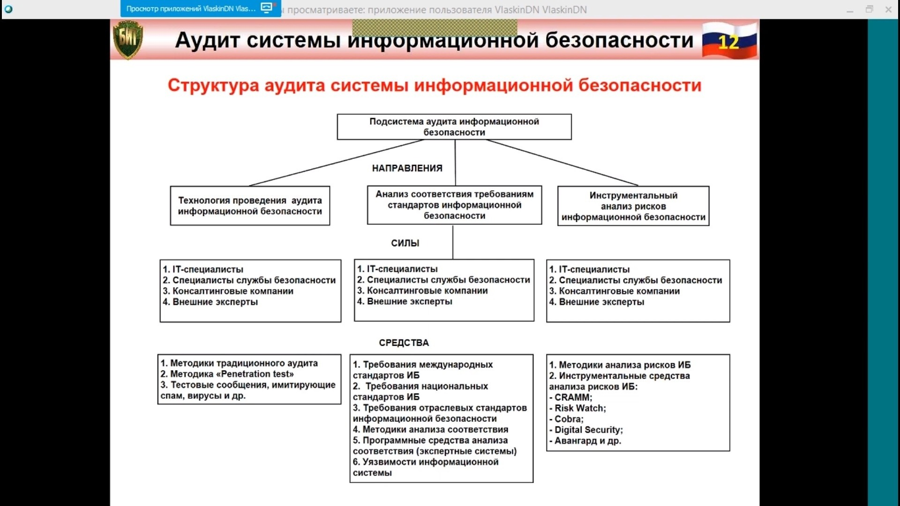

# Аудит системы обеспечения информационной безопасности

Основная задача аудита — объективно оценивать текущее состояние информационной безопасности компании, а так же её
адекватность поставленным целям и задачам бизнеса с целью увеличения эффективности и рентабельности экономической
деятельности компании.

**Подсистема аудита ИБ** предназначена для обеспечения контроля и проверок качества функционирования всех подсистем и
элементов СОИБ применением методик анализа рисков информационной безопасности, а также различных форм проведения
проверок

## Нормативные документы аудита

1. ГОСТ Р 19011-2012 "Руководящие указания по аудиту систем менеджмента"
2. ГОСТ Р 27006-2008 "Требование к органам осуществляющим аудит и сертификацию систем менеджмента информационной
   безопасности"
3. ГОСТ Р ИСО/МЭК 27007-2014 "Руководство по аудиту систем менеджмента информационной безопасности"
4. ГОСТ Р 27008 (56045-2014) "Рекомендации для аудиторов в отношении мер и средств контроля и управления информационной
   безопасностью"

**Аудит системы информационной безопасности** - системный процесс получения объективных качественных и количественных
оценок о текущем состоянии информационной безопасности автоматизированной системы в соответствии с определёнными
критериями и показателями безопасности.

**Цели аудита системы информационной безопасности:**

- Анализ рисков, связанных с возможностью осуществления угроз безопасности в отношении ресурсов информационных систем
- Оценка текущего уровня защищённости информационных систем
- Локализация узких мест в системе защиты информационных систем
- Оценка соответствия информационных систем существующим стандартам в области информационной безопасности
- Выработка рекомендаций по внедрению новых и повышению эффективности существующих механизмов безопасности
  информационных систем

**Задачи аудита системы информационной безопасности:**

- Объективная оценка текущего состояния системы информационной безопасности компании, а также её адекватность
  поставленным целям и задачам бизнеса с целью увеличения эффективности и рентабельности экономической деятельности
  компании
- Разработка политик безопасности и других организационно-распорядительных документов по защите информации и участие в
  их внедрении в работу организации
- Постановка задач для IT-персонала, касающихся обеспечения защиты информации
- Участие в обучении пользователей и обслуживающего персонала информационных систем вопросам обеспечения информационной
  безопасности
- Участие в разборе инцидентов, связанных с нарушением информационной безопасности

## Основные направления деятельности в области аудита информационной безопасности

**1. Аттестация объектов информатизации по требованиям безопасности информации:**

- Аттестация автоматизированных систем, средств связи, обработки и передачи информации
- Аттестация помещений, предназначенных для ведения конфиденциальных переговоров
- Аттестация технический средств, установленных в выделенных помещениях

**2. Контроль защищенности информации ограниченного доступа:**

- Выявление технических каналов утечки информации и способов несанкционированного доступа к ней
- Контроль эффективности применяемых средств защиты информации

**3. Специальные исследования технических средств на наличие побочных электромагнитных излучений и наводок(ПЭМИН):**

- Персональные ЭВМ, средства связи и обработки информации
- Локальные вычислительные системы
- Оформления результатов исследований в соответствии с требованиями ФСБ и ФСТЭК

**4. Проектирование объектов в защищенном исполнении:**

- Разработка концепции информационной безопасности
- Проектирование автоматизированных систем, средств связи, обработки и передачи информации в защищенном исполнении
- Проектирование помещений, предназначенных для ведения конфиденциальных переговоров

**Внешний аудит** - это, как правило, разовое мероприятие, проводимое по инициативе руководства организации или
акционеров. Проведение внешнего аудита рекомендуется, а для ряда финансовых учреждений и акционерных обществ является
обязательным мероприятием, которое требуется проводить регулярно.

**Внутренний аудит** - представляет собой непрерывную деятельность, которая осуществляется на основании документов:

- "Положение о внутреннем аудите"
- "Плана проведения внутреннего аудита"
  > Разработка указанных документов осуществляется подразделением внутреннего аудита и утверждается руководством организации

## Структура аудита системы информационной безопасности

**Основные этапы аудита системы информационной безопасности:**

- Инициирование процедуры аудита
- Сбор информации аудита
- Анализ данных аудита
- Выработку рекомендаций
- Подготовку аудиторского отчёта

## Технология проведения аудита системы информационной безопасности

**При инициировании процедуры аудита информационной безопасности должны быть решены следующие организационные вопросы:**

- Права и обязанности аудитора должны быть четко определены и документально закреплены в его должностных инструкциях, а
  также в положении о внутреннем (внешнем) аудите
- Аудитором должен быть подготовлен и согласован с руководством план проведения аудита
- В положении о внутреннем аудите должно быть закреплено, в частности, что сотрудники компании обязаны оказывать
  содействие аудитору и предоставлять всю необходимую для проведения аудита информацию
- Должны быть определены границы проведения обследования

**Сбор информации аудита информационной безопасности:**

- Документация на информационную систему
- Информация об организационной структуре пользователей информационной системы и обслуживающих подразделений
- Существующие риски и требования безопасности, предъявляемые к информационной системе
- Распределение механизмов безопасности по структурным элементам и уровням функционирования информационной системы

**Проводится в два этапа:**

- 1 этап — анализ документов по информационной безопасности
- 2 этап — опрос должностных лиц, ответственных за данную работу, о реальном состоянии дел в области обеспечения
  информационной безопасности

**Анализ данных аудита информационной безопасности**

- ***Первый подход*** - самый сложный, базируется на анализе рисков
- ***Второй подход*** - самый практичный, опирается на использовании стандартов информационной безопасности
- ***Третий подход*** - наиболее эффективный, предполагает комбинирование первых двух подходов

**Выработка рекомендаций информационной безопасности** - рекомендации аудитора должны быть конкретными и применимыми к
данной ИС, экономически обоснованными, аргументированными(подкреплёнными результатами анализа) и отсортированными по
степени важности.

**Подготовка аудиторского отчёта**(отчёт должен содержать следующие пункты):

1. Описание целей проведения аудита
2. Характеристику обследуемой информационной системы
3. Границы проведения аудита и используемых методов
4. Результаты анализа данных аудита
5. Выводы
6. Рекомендации по устранению существующих недостатков и совершенствованию системы защиты

**Применение технологии активного аудита**
***Активный аудит*** является сочетанием так называемого "теста на проникновение или penetration test" и аудита
информационной безопасности в традиционном понимании
***Тест на проникновение*** представляет собой предварительно разработанную и используемую в период проведения аудита
информационной безопасности показательную демонстрацию действий потенциального нарушителя режима информационной
безопасности на объекте

## Анализ соответствия требованиям стандартов информационной безопасности

**Отчёт по периоду:**

- Количество выполненных и невыполненных требований в целом за информационную систему
- Уровень риска невыполнения требований стандарта в целом за информационную систему
- Затраты на контрмеры в целом за информационную систему
- Количество выполненных и невыполненных требований по каждому разделу стандарта
- Текстовое описание выполненных требований по каждому разделу стандарта
- Текстовое описание невыполненных требований по каждому разделу стандарта, сортированных по уровню риска
- Введенные контрмеры для каждого невыполненного требования стандарта
- Комментарии эксперта для невыполненных требований

**Отчёт по проекту:**

- Изменения количества выполненных требований в целом за информационную систему в выбранных периодах аудита
- Изменения уровня риска в целом за информационную систему в выбранных периодах аудита
- Изменения затрат на контрмеры в целом за информационную систему в выбранных периодах аудита
- Изменения количества выполненных требований по всем разделам стандарта в выбранных периодах аудита
- Изменения уровня риска по всем разделам в выбранных периодах аудита
- Изменения затрат на контрмеры по всем разделам в выбранных периодах аудита
- Изменения количества выполненных требований для каждого раздела в выбранных периодах аудита
- Изменения уровня риска для каждого раздела в выбранных периодах аудита
- Изменения затрат на контрмеры для каждого раздела в выбранных периодах аудита

### Инструментальный анализ рисков информационной безопасности

**Общая схема алгоритма проведения оценки рисков информационной безопасности**

- Этап 1 - Идентификация активов
- Этап 2 - Определение рисков несоответствия законодательству
- Этап 3 - Разработка модели угроз
- Этап 4 - Процедура количественного определения рисков
- Этап 5 - Определение допустимого уровня рисков

**Методы управления рисками:**

***CRAMM***. Текущая версия СВАММ 5, соответствует стандарту BS 7799 (ISO 17799). Методика анализа и управления рисками
полностью применима и в российских условиях ПО анализа рисков существенно снижает трудоемкость выполнения всех этапов
анализа рисков. Применение ПО целесообразно при проведении внешнего и внутреннего аудита информационной безопасности.
При этом использование ПО требует высокой квалификация аналитика, достаточно длительно периода обучения и опыта
применения.

***FRAP***. Данный метод предлагает рассматривать «Управление рисками в сфере ИБ» как процесс, позволяющий компаниям
найти баланс между затратами средств и сил на средства защиты и получаемым эффектом. Однако при использовании требует
специфических знаний аналитиков.

***Risk Watch***. Средство позволяет оценить не только те риски, которые сейчас существуют у предприятия, но и ту
выгоду, которую может принести внедрение физических, технических, программных и прочих средств и механизмов защиты.
Подготовленные отчеты и графики дают материал, достаточный для принятия решений об изменении системы обеспечения
безопасности предприятия.

***OCTAVE***. Предлагает при описании профиля использовать "деревья вариантов", пример подобного дерева для угроз
класса. При создании профиля угроз рекомендуется избегать обилия технических деталей — это задача второго этапа
исследования. OCTAVE не предполагает привлечения для исследования безопасности ИС сторонних экспертов, а вся
документация по OCTAVE общедоступна и бесплатна, что делает методику особенно привлекательной для предприятий с жестко
ограниченным бюджетом, выделяемым на цепи обеспечения ИБ.

### Сертификация систем менеджмента информационной безопасности

- **Первый этап аудита СИБ**
  **Цель** - обеспечить концентрацию на планировании аудита второго этапа путем ознакомления со СИБ организации в
  контексте её политики и целей и, в особенности, состояния готовности организации к аудиту. Первый этап аудита включает
  проверку документации (но не должен ограничиваться ею). Орган сертификации должен договориться с организацией о месте
  и времени проведения проверки документов
- **Второй этап аудита СИБ**
  **Цель** - подтверждение, что организация придерживается собственных политик, целей и процедур; подтверждение
  соответствия СМИБ всем требованиям стандарта ИСО/МЭК 27001:2005 и целям политики организации

**Органы сертификации должны:**

- Требовать от организации-клиента свидетельства, что анализ угроз, связанных с информационной безопасностью является
  значимым и соответствующим работе организации
- Установить, согласуются ли процедуры организации по идентификации, излучению и оценке угроз, связанных с
  информационной безопасностью активов, уязвимости и воздействий, и результаты их применения с политикой, целями и
  планами организации 

