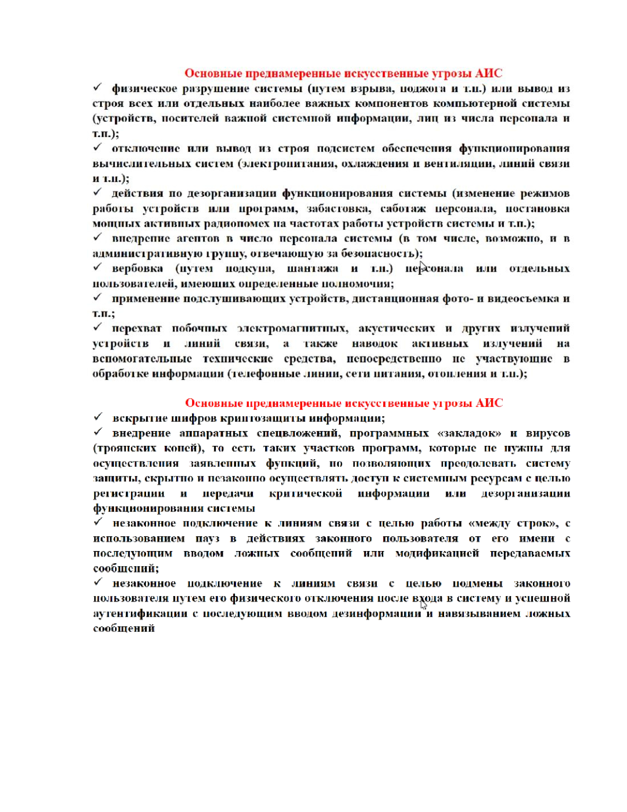

*[ИС]: Информационная система
*[ИБ]: Информационная безопасность
*[СИБ]: Система информационной безопасности
*[СОИБ]: Система обеспечения информационной безопасности

# Понятие угрозы, классификация угроз информационной безопасности и их содержание.

## Угрозы ИБ

**Угрозы информационной безопасности** - потенциально возможное событие, действие, процесс или явление, которое может
нанести ущерб чьим-либо интересам

## Угрозы информации

## Учебные вопросы

## АИС — автоматизированная информационная система

## Каналы утечки информации

!!! quote "Жак Фреско"
    Если один человек построил, то другой всегда разобрать может

## Понятие "Концепции" и "Политики" ИБ

## Цель и задачи СИБ

## Применение системного подхода к созданию СИБ

