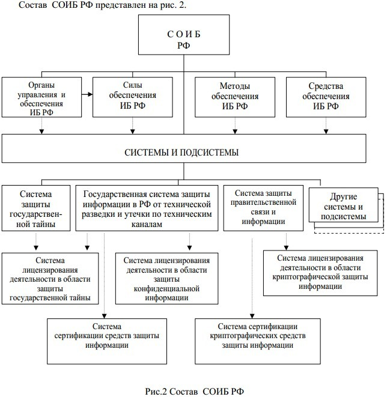
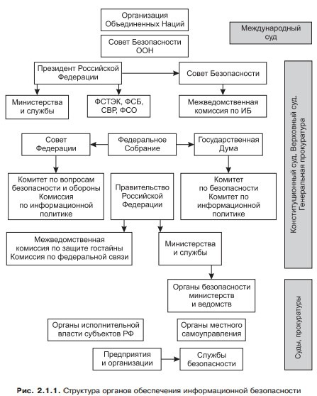

*[РФ]: Российская Федерация
*[ИБ]: Информационная безопасность
*[СОИБ]: Система обеспечения информационной безопасности

# Понятие информационной безопасности. Система обеспечения ИБ, ее цель, задачи, силы и средства.

## Определение

**Информационная безопасность** – это сохранение и защита информации, а также ее важнейших элементов, в том числе
системы и оборудование, предназначенные для использования, сбережения и передачи этой информации. Другими словами, это
набор технологий, стандартов и методов управления, которые необходимы для защиты информационной безопасности.

## Система обеспечения информационной безопасности в РФ

Понятие «система обеспечения информационной безопасности».

- Система обеспечения информационной безопасности (СОИБ) состоит как из системы организационных и технических мер
  обеспечения ИБ, так и системы менеджмента информационной безопасности, обеспечивающей непрерывное функционирование
  СОИБ как системы управления ИБ.
- Целью создания системы обеспечения безопасности информационных технологий является предотвращение или минимизация
  ущерба (прямого или косвенного, материального, морального или иного), наносимого субъектам информационных отношений
  посредством нежелательного воздействия на информацию, ее носители и процессы обработки.
- Государственная система обеспечения информационной безопасности РФ и ее структура.
- Система обеспечения информационной безопасности Российской Федерации предназначена для реализации государственной
  политики в данной сфере.

## Основные функции

- Разработка нормативной правовой базы в области обеспечения информационной безопасности РФ
- Создание условий для реализации прав граждан и общественных объединений на разрешенную законом деятельность в
  Информационной сфере
- Определение и поддержание баланса между потребностью граждан, общества и государства в свободном обмене информацией и
  необходимыми ограничениями на распространение информации

## Основными направлениями совершенствования системы обеспечения ИБ РФ являются:

1. Систематическое выявление угроз и их источников, структуризация целей обеспечения информационной безопасности и
   определение соответствующих практических задач
2. Проведение сертификации общего и специального программного обеспечения, пакетов прикладных программ и средств защиты
   информации в существующих и создаваемых автоматизированных системах управления и связи, имеющих в своем составе
   элементы вычислительной техники
3. Постоянное совершенствование средств защиты информации, развитие защищенных систем связи и управления, повышение
   надежности специального программного обеспечения
4. Совершенствование структуры функциональных органов системы, координация их взаимодействия.

