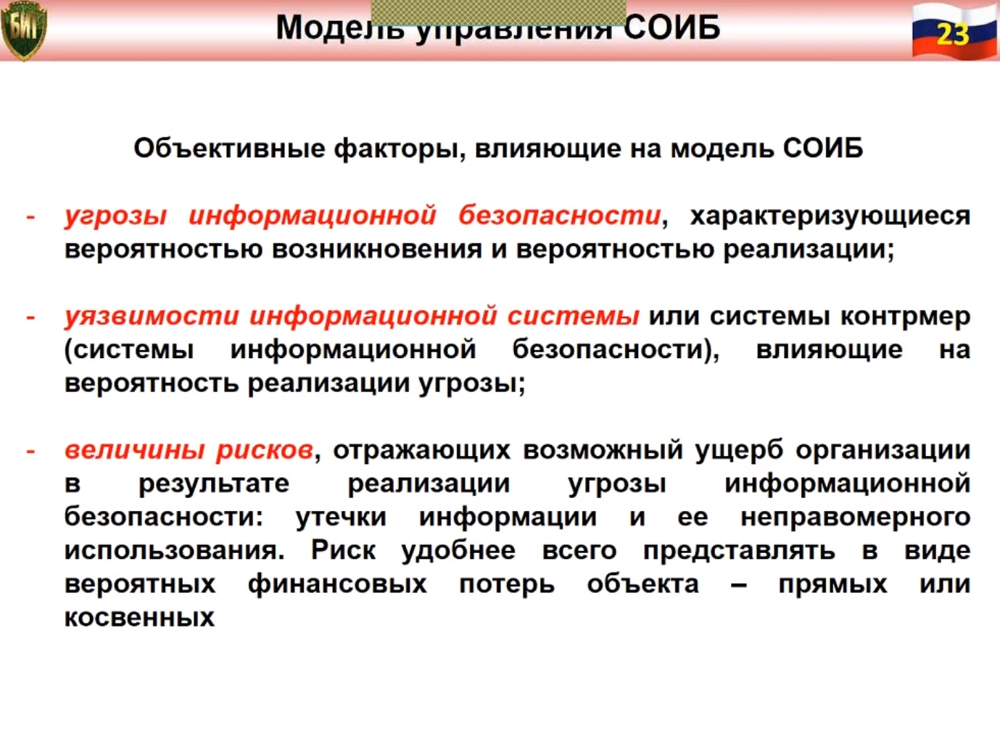
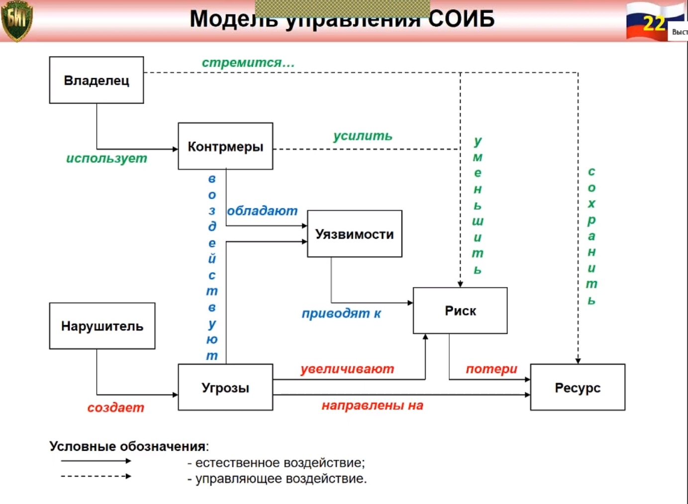

*[ИС]: Информационная система
*[ИБ]: Информационная безопасность
*[СИБ]: Система информационной безопасности
*[СОИБ]: Состав системы обеспечения информационной безопасности
*[PDCA]: Plan-Do-Check-Act

# Управление системой обеспечения информационной безопасности

Управление ИБ (англ. Information security management, ISM) — это циклический процесс, включающий:

- Осознание степени необходимости защиты информации и постановку задач
- Сбор и анализ данных о состоянии информационной безопасности в организации
- Оценку информационных рисков
- Планирование мер по обработке рисков реализацию и внедрение соответствующих механизмов контроля, распределение ролей и
  ответственности, обучение и мотивацию персонала, оперативную работу по осуществлению защитных мероприятий
- Мониторинг функционирования механизмов контроля, оценку их эффективности и соответствующие корректирующие воздействия

Управление информационной безопасностью выходит далеко за рамки централизованного удаленного управления антивирусами и
другими решениями, обеспечивающими защиту информации. Менеджмент ИБ — это не просто централизованный контроль над
своевременным обновлением антивирусных баз, регулярным антивирусным сканированием и выполнением на клиентской стороне
других задач, связанных с информационной безопасностью. Это важная часть менеджмента всей организации, обеспечивающая
эффективность процессов и решающая не только тактические, но и стратегические задачи. Основные функции систем управления
информационной безопасностью (СУИБ) — это:

- Выявление и анализ рисков информационной безопасности
- Планирование и практическая реализация процессов, направленных на минимизацию рисков ИБ
- Контролирование этих процессов
- Внесение в процессы минимизации информационных рисков необходимых корректировок

Качественное управление информационной безопасностью базируется на следующих принципах:

- Комплексный подход — управление ИБ должно быть всеобъемлющим, охватывать все компоненты ИС и учитывать все актуальные
  рискообразующие факторы, действующие в информационной системе предприятия или госучреждения и за их пределами
- Согласованность с задачами и стратегией организации
- Высокий уровень управляемости
- Адекватность используемой и генерируемой информации
- Эффективность — оптимальный баланс между возможностями, производительностью и издержками СУИБ
- Непрерывность управления
- Процессный подход — связывание процессов управления в замкнутый цикл планирования, внедрения, проверки, аудита и
  корректировки, и поддержание неразрывной связи между этапами цикла, что позволяет сохранять и постоянно повышать
  качество СУИБ

Значение ISM Практики управления информационной безопасностью имеют большое значение в самых различных сферах:
коммерческой, банковской, государственной, врачебной и т.д, поскольку в данных областях люди работают с тайной Для
социума грамотное использование технологий управления информационной безопасностью означает должное обеспечение
приватности и защиты идентичности каждого его члена

## ГОСТ 53114

**Управление** заключается в целенаправленном воздействии на объект управления с целью достижения им цели своего
функционирования

**Объект управления** – совокупность подсистем и элементов СОИБ, целенаправленное воздействие на которые обеспечит
выполнение задач информационной безопасности

**Управление информационной безопасностью организации** – скоординированные действия по руководству и управлению
организацией в части обеспечения её информационной безопасности в соответствии с изменяющимися условиями внутренней и
внешней среды организации

**Система управления информационной безопасностью** – часть общей системы менеджмента организации (предприятия),
основанная на использовании методов оценки бизнес-рисков для разработки, внедрения, функционирования, мониторинга,
анализа, поддержки и улучшения информационной безопасности.

## Процессы и подход для СОИБ

### Процесс PDCA

> План — Осуществление — Проверка — Действие

### План

Постановка целей и разработка планов (провести анализ ситуации в организации, наметить общие цели, поставить задачи и
разработать планы для их достижения)

### Осуществление

Реализация планов (выполнить то, что было запланировано)

### Проверка

Проверка результатов (измерение/контроль степени соответствия достигнутых результатов плану)

### Действие

Коррекция и улучшение работы (учиться на ошибках, чтобы улучшить работу и достичь лучших результатов)

## Задачи управления СОИБ

1. Количественная оценка текущего уровня информационной безопасности компании. Выполнение этой задачи основано на оценке
   рисков ИБ на организационно-правовом, экономическом, инженерно-техническом и других уровнях обеспечения защиты
   информации.
1. Разработка и реализация комплексного плана совершенствования СОИБ хозяйствующего субъекта для достижения приемлемого
   уровня защищенности его информационных активов. Для решения этой задачи необходимо:
    - Обосновать и произвести расчёт финансовых вложений в обеспечение безопасности на основе технологий анализа рисков,
      соотнести расходы на обеспечение безопасности с потенциальным ущербом и вероятностью его возникновения
    - Выявить и провести первоочередное блокирование наиболее опасных уязвимостей до осуществления атак на уязвимые
      ресурсы
    - Определить функциональное отношения и зоны ответственности при взаимодействии подразделений и лиц по обеспечению
      информационной безопасности компании
    - Создать необходимый пакет организационно-распорядительной документации
    - Разработать и согласовать со службами организации, надзорными органами проект внедрения необходимых комплексов
      защиты, учитывающий современный уровень и тенденции развития информационных технологий
    - Обеспечить поддержание внедренного комплекса защиты в соответствии с изменяющимися условиями работы организации,
      регулярными доработками организационно-распорядительной документации, модификацией технологических процессов и
      модернизацией технических средств защиты

## Объективные факторы, влияющие на модель СОИБ

Угрозы информационной безопасности характеризующиеся вероятностью возникновения и вероятностью реализации

### Угроза ИБ

Потенциально возможное событие, действие, процесс или явление, которое может привести к нанесению ущерба чьим-либо
интересам

#### Атака

> Попытка реализации угрозы

#### Классификация угроз ИБ

Можно выполнить по нескольким критериям:

- По аспекту ИБ (доступность, целостность, конфиденциальность)
- По компонентам ИС, на которые угрозы нацелены (данные, программа, аппаратура, поддерживающая инфраструктура)
- По способу осуществления (случайные или преднамеренные действия природного или техногенного характера)
- По расположению источника угроз (внутри или вне рассматриваемой ИС)

### Уязвимости ИС

Уязвимости информационной системы или системы контрмер (СИБ), влияющие на вероятность реализации угрозы

Уязвимость [ИБ], брешь — свойство информационной системы, обусловливающее возможность реализации угроз безопасности
обрабатываемой в ней информации

!!! info "Примечания"

- Условием реализации угрозы безопасности обрабатываемой в системе информации может быть недостаток или слабое место в
  информационной системе - Если уязвимость соответствует угрозе, то существует риск

**ИС** — система, предназначенная для хранения, поиска и обработки информации, и соответствующие организационные
ресурсы (человеческие, технические, финансовые и т. д.), которые обеспечивают и распространяют информацию (ISO/IEC 2382:

2015)

### Величины рисков

Величины рисков‚ отражающих возможный ущерб организации в результате реализации угрозы информационной безопасности:
утечки информации и ее неправомерного использования. Риск удобнее всего представлять в виде вероятных финансовых потерь
объекта — прямых или косвенных

## Модель управления СОИБ

Объективные факторы, влияющие на модель СОИБ

- Угрозы информационной безопасности, характеризующиеся вероятностью возникновения и вероятностью реализации
- Уязвимости информационной системы или системы контрмер (СИБ), влияющие на вероятность реализации угрозы
- Величины рисков, отражающих возможный ущерб организации в результате реализации угрозы ИБ: утечки информации и её
  неправомерного использования. Риск удобнее всего представлять в виде вероятных финансовых потерь объекта – прямых и
  косвенных

## Последовательность моделирования СОИБ

- Для основных информационных ресурсов объекта определяется их ценность, как с точки зрения ассоциированных с ними
  возможных финансовых потерь, так и с точки зрения ущерба репутации, дезорганизации деятельности организации и
  нематериального ущерба от разглашения конфиденциальной информации и др.
- Описываются взаимосвязи ресурсов
- Определяются угрозы информационной безопасности и оцениваются вероятности их реализации
- На основе построенной модели проводится выбор системы контрмер, снижающих риски до допустимых уровней и обладающих
  наибольшей ценовой эффективностью