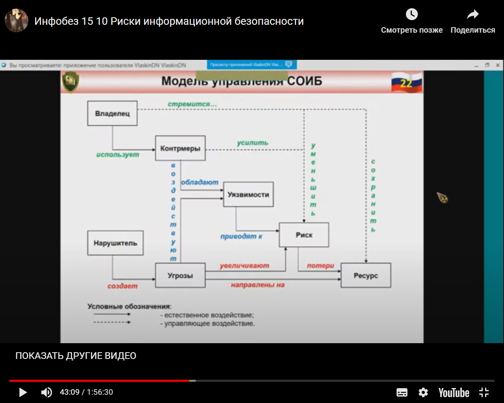
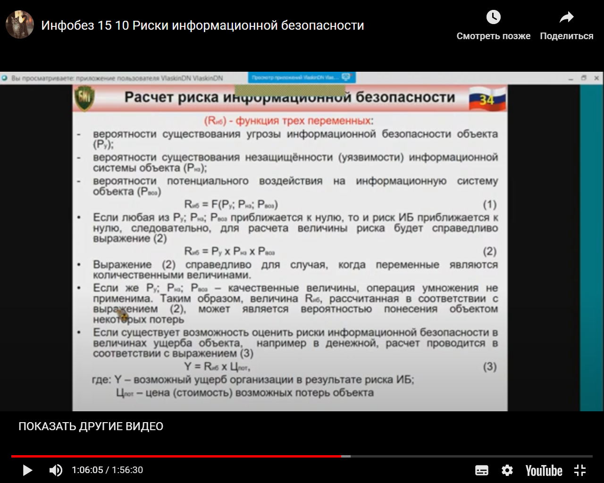

*[ИС]: Информационная система
*[ИБ]: Информационная безопасность
*[СИБ]: Система информационной безопасности
*[СОИБ]: Состав системы обеспечения информационной безопасности
*[PDCA]: Plan-Do-Check-Act

# Модель системы обеспечения информационной безопасности, объективные факторы, влияющие на модель системы обеспечения информационной безопасности

> Состав системы обеспечения информационной безопасности определяется Президентом Российской Федерации

## Организационную основу СОИБ составляют

- Совет Федерации Федерального Собрания Российской Федерации
- Государственная Дума Федерального Собрания Российской Федерации
- Правительство Российской Федерации
- Совет Безопасности Российской Федерации
- Федеральные органы исполнительной власти
- Центральный банк Российской Федерации
- Военно-промышленная комиссия Российской Федерации
- Межведомственные органы
- Создаваемые Президентом Российской Федерации и Правительством Российской Федерации
- Органы исполнительной власти субъектов Российской Федерации
- Органы местного самоуправления
- Органы судебной власти
- Принимающие в соответствии с законодательством Российской Федерации участие в решении задач по обеспечению
  информационной безопасности

## Участники СОИБ

- Собственники объектов критической информационной инфраструктуры и организации, эксплуатирующие такие объекты, средства
  массовой информации и массовых коммуникаций
- Организации денежно-кредитной, валютной, банковской и иных сфер финансового рынка
- Операторы связи, операторы информационных систем
- Организации, осуществляющие деятельность по созданию и эксплуатации информационных систем и сетей связи, по
  разработке, производству и эксплуатации средств обеспечения информационной безопасности, по оказанию услуг в области
  обеспечения информационной безопасности, организации, осуществляющие образовательную деятельность в данной области;
- Общественные объединения, иные организации и граждане, которые в соответствии с законодательством Российской Федерации
  участвуют в решении задач по обеспечению информационной безопасности

## ГОСТ 53114

**Обеспечение информационной безопасности организации** — это деятельность, направленная на устранение (нейтрализацию,
парирование) внутренних и внешних угроз информационной безопасности организации или на минимизацию ущерба от возможной
реализации таких угроз

**Мера обеспечения безопасности** - это сложившаяся практика, процедура или механизм обработки риска

**Мероприятия обеспечения информационной безопасности**  - это совокупность действий, направленных на разработку и (или)
практическое применение способов и средств обеспечения информационной безопасности

**Организационные мероприятия обеспечения информационной безопасности** - мероприятия обеспечения информационной
безопасности, предусматривающие установление временных, территориальных, пространственных, правовых, методических и иных
ограничений на условия использования и режимы работы объекта информатизации

**Техническое средство обеспечения информационной безопасности** — оборудование, используемое для обеспечения
информационной безопасности организации не криптографическими методами

**Управление** заключается в целенаправленном воздействии на объект управления с целью достижения им цели своего
функционирования

**Объект управления** — совокупность подсистем и элементов СОИБ, целенаправленное воздействие на которые обеспечит
выполнение задач информационной безопасности

**Управление информационной безопасностью организации** - скоординированные действия по руководству и управлению
организацией в части обеспечения ее информационной безопасности в соответствии с изменяющимися условиями внутренней и
внешней среды организации

**Система управления информационной безопасностью** — часть общей системы менеджмента организации (предприятия),
основанная на использовании методов оценки бизнес-рисков для разработки, внедрения, функционирования, мониторинга,
анализа, поддержки и улучшения информационной безопасности

## Основы СОИБ

### Определение

**Система обеспечения информационной безопасности** - совокупность правовых, организационных и технических мероприятий,
органов, сил, средств и норм, направленных на предотвращение или существенное затруднение нанесения ущерба —
собственнику информации

### Цель

Заключается в обеспечении устойчивого функционирования организации (предприятия) для достижения им своих целей, которое
достигается выполнением требований по конфиденциальности, доступности и целостности принадлежащих ему активов

### Задачи

1. Предотвращение угроз безопасности организации (предприятия), защите законных интересов владельца информации от
   противоправных посягательств, в том числе уголовно наказуемых деяний в рассматриваемой сфере отношений,
   предусмотренных Уголовным кодексом РФ, обеспечении нормальной производственной деятельности всех подразделений
   объекта

1. Повышение качества предоставляемых услуг и гарантий безопасности

### Мероприятия

- Отнести информацию к категории ограниченного доступа;
- Прогнозировать и своевременно выявлять угрозы безопасности информационным ресурсам, причины и условия, способствующие
  нанесению финансового, материального и морального ущерба, нарушению нормального функционирования и развития
  организации
- Создать условия функционирования с наименьшей вероятностью реализации угроз безопасности информационным ресурсам и №
  нанесения различных видов ущерба
- Создать механизм и условия оперативного реагирования на угрозы информационной безопасности и проявления негативных
  тенденций в функционировании, эффективное пресечение посягательств на ресурсы на основе правовых, организационных и
  технических и прочих мер, и средств обеспечения безопасности
- Создать условия для максимально возможного возмещения и (или) локализации ущерба, наносимого неправомерными действиями
  физических и юридических лиц, и тем самым ослабить возможное негативное влияние последствий нарушения информационной
  безопасности

### Перечень режимных мероприятий

- Физическая защита сотрудников, являющихся потенциальными носителями конфиденциальной информации
- Постоянный контроль и проверка персонала с целью устранения возможностей для совершения мошенничества, предотвращения
  возможного сговора между сотрудниками и, например, клиентами;
- Ограничение прав доступа сотрудников к информации, которое должно — регламентироваться только характером выполняемых
  ими должностных обязанностей
- Налаженная и постоянно действующая система внутреннего контроля, включающая проведение плановых, внезапных и скрытых
  контрольных проверок
- Проведение предупредительной активной политики аудита информационной безопасности

### В основу СОИБ включены следующие положения

- Под СОИБ рассматриваем сложную организационно-иерархическую систему с видами обеспечения
- каждый вид обеспечения является сложной темой и рассматривается в качестве подсистемы СОИБ
- В каждой подсистеме СОИБ выделяются направления деятельности по обеспечению информационной безопасности в интересах
  объекта
- Каждое направление деятельности по обеспечению информационной безопасности реализуется определенными силами
  (организации, подразделения, должностные лица)
- Конкретные задачи обеспечения информационной безопасности в интересах объекта решаются применением конкретных
  средств (методики, документы, компьютерные программы и др.)

## Процессы и подход для СОИБ

### Процесс PDCA

> План — Осуществление — Проверка — Действие

### План

Постановка целей и разработка планов (провести анализ ситуации в организации, наметить общие цели, поставить задачи и
разработать планы для их достижения);

### Осуществление

Реализация планов (выполнить то, что было запланировано);

### Проверка

Проверка результатов (измерение/контроль степени соответствия достигнутых результатов плану);

### Действие

Коррекция и улучшение работы (учиться на ошибках, чтобы улучшить работу и достичь лучших результатов)

## Модель управления СОИБ

## Объективные факторы, влияющие на модель СОИБ

Угрозы информационной безопасности характеризующиеся вероятностью возникновения и вероятностью реализации

### Угроза ИБ

Потенциально возможное событие, действие, процесс или явление, которое может привести к нанесению ущерба Связанные
картинки чьим-либо интересам.

#### Атака

> Попытка реализации угрозы

#### Классификация угроз ИБ

Можно выполнить по нескольким критериям:

- По аспекту ИБ (доступность, целостность, конфиденциальность)
- По компонентам ИС, на которые угрозы нацелены (данные, программа, аппаратура, поддерживающая инфраструктура)
- По способу осуществления (случайные или преднамеренные действия природного или техногенного характера)
- По расположению источника угроз (внутри или вне рассматриваемой ИС)

### Уязвимости ИС

Уязвимости информационной системы или системы контрмер (СИБ), влияющие на вероятность реализации угрозы

Уязвимость [ИБ], брешь — свойство информационной системы, обусловливающее возможность реализации угроз безопасности
обрабатываемой в ней информации

#### Примечания

- Условием реализации угрозы безопасности обрабатываемой в системе информации может быть недостаток или слабое место в
  информационной системе.

- Если уязвимость соответствует угрозе, то существует риск

**ИС** — система, предназначенная для хранения, поиска и обработки информации, и соответствующие организационные
ресурсы (человеческие, технические, финансовые и т. д.), которые обеспечивают и распространяют информацию (ISO/IEC 2382:
2015).

### Величины рисков

Величины рисков‚ отражающих возможный ущерб организации в результате реализации угрозы информационной безопасности:
утечки информации и ее неправомерного использования. Риск удобнее всего представлять в виде вероятных финансовых потерь
объекта — прямых или косвенных

### Понятие риска

**Риск в общем смысле** - характеристика ситуации, имеющей неопределенность исхода, при обязательном наличии
неблагоприятных последствий

Риск предполагает неуверенность, либо невозможность получения достоверного знания о благоприятном исходе в заданных
внешних обстоятельствах

**Риск в узком смысле** - измеряемая или рассчитываемая вероятность неблагоприятного исхода

## Управление рисками

**Управление рисками** — скоординированные действия по руководству и управлению организацией в отношении риска
информационной безопасности с целью его минимизации

**Система управления рисками** является обязательным компонентом общей системы обеспечения информационной безопасности
на всех этапах жизненного цикла создания и функционирования информационной системы

### Стратегия управления рисками

- Уменьшение риска
- Уклонение от риска
- Изменение характера риска
- Принятие риска

### Процессы управления рисками

- Установление контекста
- Оценка риска
- Обработка и принятие риска
- Мониторинг и пересмотр риска

