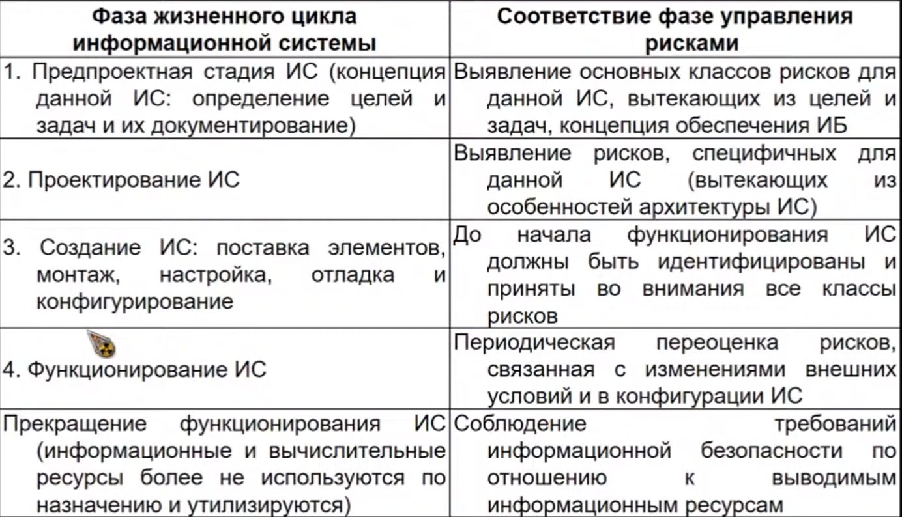
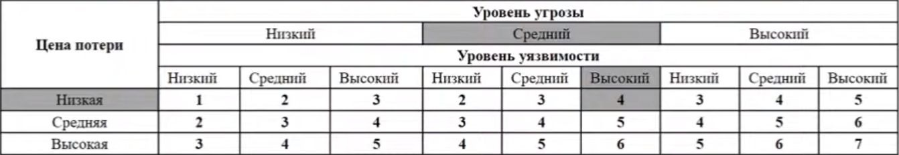

*[ИС]: Информационная система
*[ИБ]: Информационная безопасность

# Риски. Анализ и управление рисками информационной безопасности.

**Во-первых**, любую систему безопасности можно преодолеть, имея достаточно ресурсов и времени. Поэтому **риски могут
быть идентифицированы и уменьшены, но никогда не "уничтожены" полностью**

**Во-вторых**, все объекты разные, поэтому процесс минимизации рисков для каждого имеет свои уникальные черты

**Риск в общем смысле** - характеристика ситуации, имеющей неопределённость исхода, при обязательном наличии
неблагоприятных последствий. Риск предполагает неуверенность, либо невозможность получения достоверного знания о
благоприятном исходе в заданных внешних обстоятельствах.

**Риск в узком смысле** - измеряемая или рассчитываемая вероятность неблагоприятного исхода.

## Управление рисками

**Управление рисками** - скоординированные действия по руководству и управлению организацией в отношении риска
информационной безопасности с целью его минимизации

**Система управления рисками** является обязательным компонентом общей системы обеспечения информационной безопасности
на всех этапах жизненного цикла создания и функционирования информационной системы

**Стратегия управления рисками:**

- Уменьшение риска
- Уклонение от риска
- Изменение характера риска
- Принятие риска

**Процессы управления рисками:**

- Установление контекста
- Оценка риска
- Обработка и принятие риска
- Мониторинг и пересмотр риска

**Создание условий для выполнения организацией своей миссии или миссий за счёт:**

- Повышения безопасности ИТ-систем, которые хранят, обрабатывают или передают информацию в пределах или вне объекта
- Повышение информативности и осведомлённости руководства относительно принятых решений по управлению риском для
  Получения обоснованных объёмов затрат, которые должны стать неотъемлемой частью общего бюджета ИТ
- Оказания помощи руководству в авторизации (или в аккредитации) своих ИТ-систем на базе документированной поддержки
  результатами, вытекающими из выполнения процессов управления риском

## Концепция управления информационными рисками

- Концепция Британского стандарта BS 7799
- Концепция Германского стандарта BSI
- Концепция национального института стандартов США NIST 800-30
- Концепция MITRE

### Стандарт NIST 800-30

Управление рисками на различных стадиях жизненного цикла информационной технологии

### Расчёт риска информационной безопасности

**(R~иб~) - функция трёх переменных**

1. P~у~ - Вероятности существования угрозы информационной безопасности объекта
2. P~нз~ - Вероятности существования незащищённости (уязвимости) информационной системы объекта
3. P~воз~ - Вероятности потенциального воздействия на информационную систему объекта

**R~иб~=F(P~у~,P~нз~,P~воз~)**
**R~иб~=P~у~ * P~нз~ * P~воз~**

- Если любая из P~у~,P~нз~,P~воз~ приближается к нулю, то риск ИБ приближается к нулю, следовательно, для расчёта
  величины риска будет справедливо выражение(2).
- Выражение(2) справедливо для случая, когда переменные являются количественными величинами.
- Если же P~у~,P~нз~,P~воз~ - качественные величины, операция умножения не применима. Таким образом, величина R~иб~,
  рассчитанная в соответствии с выражением(2), может являться вероятностью понесения объектом некоторых потерь
- Если существует возможность оценить риски информационной безопасности в величинах ущерба объекта, например в денежной,
  расчёт проводится в соответствии с выражением(3)

**Y=R~иб~ * Ц~пот~**, где Y - возможный ущерб организации в результате риска ИБ

**Ц~пот~** — цена(стоимость) возможных потерь объекта

### Оценки показателей риска

1. **Риск практически отсутствует**. Возможность наступления события имеет чисто теоретическое обоснование
2. **Риск очень мал**. Наступление события маловероятно и последствия незначительны
3. **Риск мал**. Наступления события невелика и последствия сравнительно невелики
4. **Риск средний**. Вероятность наступления события примерно 0,5 и средняя тяжесть последствий
5. **Риск значительный**. Значительная вероятность наступления события и последствия будут серьёзными
6. **Риск велик**. Большая вероятность наступления события и последствия будут тяжёлыми
7. **Риск очень велик**. Событие, скорее всего, наступит, и негативные последствия будут критическими.

При использовании подобной шкалы разрабатывается матрица для определения рисков информационной безопасности объекта, для
чего по одной оси показывается уровень угроз ИЮ объекта, на другой уровень уязвимости СОИБ и вероятность воздействия на
неё.

### Матрица рисков информационной безопасности объекта "X"

### Методы оценивания уязвимостей ИБ

- Экспертные оценки
- Анализ статистических данных
- Учет факторов, влияющих на уровни угроз и уязвимостей

**В качестве примера рассмотрим класс рисков "Использование чужого идентификатора сотрудниками организации"**

Для **оценки угроз** выбраны следующие косвенные факторы:

- Статистика по зарегистрированным инцидентам
- Тенденции в статистике по подобным нарушениям
- Наличие в системе информации, представляющей интерес для внутренних или внешних нарушителей
- Морально-этнические качества персонала
- Возможность извлечь выгоду из изменения обрабатываемой в системе информации
- Наличие альтернативных способов доступа к информации
- Статистика по подобным нарушениям в других информационных системах организации.

Для **оценки уязвимостей** выбраны следующие косвенные факторы:

- Количество рабочих мест (пользователей) в системе
- Размер рабочих групп
- Осведомленность руководства о действиях сотрудников (в различных аспектах)
- Характер используемого на рабочих местах оборудования и программного обеспечения (ПО)
- Полномочия пользователей

Для использования косвенных факторов предложены тесты, предполагающими несколько вариантов ответов, которые в дальнейшем
оцениваются определённым количеством баллов.

Итоговая оценка угрозы и уязвимости данного класса определяется путем суммирования баллов. Сначала оцениваем границы
шкалы путём полярных ответов на вопросы, а затем оцениваем промежуточные её значения

При **оценке степени серьёзности угрозы**, шкала (по количеству баллов) будет следующая:

- До 9 - очень низкая
- от 10 до 19 — низкая
- от 20 до 29 — средняя
- от 30 до 39 — высокая
- от 40 и более — очень высокая

При **оценке степени уязвимости**, шкала (по количеству баллов) будет следующая:

- До 9 — низкая
- От 10 до 19 — средняя
- От 20 и более — высокая

