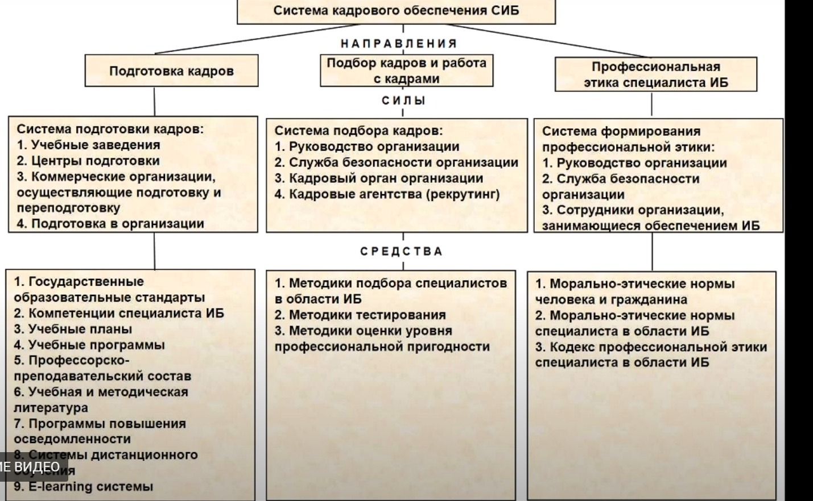

*[ИБ]: Информационная безопасность
*[СИБ]: Системы информационной безопасности

# Кадровое обеспечение системы обеспечения информационной безопасности. Цель, задачи, структура, содержание, средства

## Определение

**Кадровое обеспечение СИБ** — это процесс предотвращения нанесения ущерба предприятию, владельцам или пользователям
информации за счет рисков и угроз, связанных с персоналом, его интеллектуальным потенциалом и трудовыми отношениями в
целом.

**Подсистема кадрового обеспечения** должна базироваться на созданной системе подготовки специалистов в области
информационно безопасности, иметь систему подбора специалистов, а также, систему работы с сотрудниками

## Цель кадрового обеспечения СИБ

Полное обеспечение СИБ работниками соответствующей квалификации, отвечающими установленным требованиям и обеспечивающими
эффективное противодействие угрозам АИС на всех уровнях.

## Задачи кадрового обеспечения СИБ

- Определение, планирование и прогнозирование потребности в кадрах СИБ
- Выработка требований к кадрам и объективная оценка их личных и деловых качеств
- Подбор и расстановка кадров в СИБ
- Организация подготовки, переподготовки и повышения квалификации кадров
- Совершенствование материального и морального стимулирования кадров СИБ

## Система кадрового обеспечения СИБ

**Направления:**

1. Подготовка кадров

    *Силы/Система подготовки кадров:*
  
    - Учебные заведения
    - Центры подготовки
    - Коммерческие организации
    - Подготовка в организации

    *Средства:*

    - Государственные образовательные стандарты
    - Компетенции специалиста ИБ
    - Учебные планы
    - Учебные программы
    - Профессорско-преподавательский состав
    - Учебная и методическая литература
    - Программы повышения осведомленности
    - Системы дистанционного обучения
    - E-learning системы

1. Подбор кадров и работа с кадрами

    *Силы/Система подбора кадров:*

    - Руководство организации
    - Служба безопасности организации
    - Кадровый орган организации
    - Кадровые агентства (рекрутинг)

    *Средства:*

    - Методики подбора специалистов в области ИБ
    - Методики тестирования
    - Методики оценки уровня профессиональной пригодности

1. Профессиональная этика специалиста ИБ

    *Силы/Система формирования профессиональной этики:*

    - Руководство организации
    - Служба безопасности организации
    - Сотрудники организации занимающиеся обеспечением ИБ

    *Средства:*

    - Морально-этические нормы человека и гражданина
    - Морально-этические нормы специалиста в области ИБ
    - Кодекс профессиональной этики специалиста в области ИБ

## Основные принципы подготовки кадров

- Уровень теоретических знаний должен приближаться к международному
- Подготовку следует ориентировать на приобретение практических навыков ведения дела в отечественных кризисных условиях
- Существенное внимание должно быть уделено вопросам обеспечения безопасности и устойчивого развития субъекта
  хозяйствования и региона в целом

## Уровни подготовки кадров

- Подготовка молодых специалистов на базе школьного образования (срок обучения - 5 - 5, 5 лет)
- Подготовка специалистов на базе среднетехнического образования через колледж на базе 9 классов (срок обучения - 4-5
  лет) - Подготовка специалистов по информационной безопасности на базе высшего технического образования (срок обучения
  - 2 - 2, 5 года)
- Переподготовка кадров на краткосрочных курсах повышения квалификации специалистов и руководителей подразделений (срок
  обучения - 2 - 4 недели)
- Подготовка специалистов высшей квалификации через аспирантуру и защита диссертационных работ в специализированных
  советах

## Формы подготовки или повышения квалификации по вопросам ИБ

- Обучение без отрыва от производства (обучение с использованием внутренних ресурсов). **Методы обучения**: инструктаж,
  ротация, ученичество и наставничество
- Обучение с отрывом от работы в специализированных учебных заведениях, центрах подготовки кадров (обучение с
  использованием внешних ресурсов) **Методы обучения**: лекции, семинары, практические занятия, деловые игры, тренинги,
  самообучение

> **Основными формами повышения квалификации являются:** производственно-технические курсы, школы по изучению передовых методов труда, курсы по овладению вторыми и совмещаемыми профессиями и специальностями, институты и факультеты повышения квалификации и др.
>
> **Основными формами переподготовки являются:** семинары (вебинары); - краткосрочные учебные курсы продолжительностью до 1-2 месяцев; среднесрочные учебные курсы продолжительностью от 6 месяцев до 1-2 лет

## Группы требований к сотруднику

- **Универсальные**
    - Дисциплинированность
    - Ответственность
    - Высокий профессионализм
    - Нацеленность на результат
    - Готовность следовать общественным нормам морали и нравственности
    - Толерантность
- **Расширенные требования руководства предприятия к качеству персонала:**
    - Понимание необходимости ведения здорового образа жизни
    - Способность к самосовершенствованию
    - Готовность к самостоятельному обучению
    - Готовность к установлению коммуникаций с людьми
    - Лидерство
    - Владение навыками общения
    - Способность адекватно оценивать свое место и роль в обществе
- **Требования к сотруднику в области обеспечения ИБ:**
    - Готовность следовать этическим нормам в сфере информационной безопасности
    - Высокая требовательность к себе и всем сотрудникам в соблюдении требований режима ИБ, установленного на
      предприятии
    - Способность хранить служебную, коммерческую, технологическую и др. тайны

## Организация предприятия кадровой работы (типовой)

- Тестирование кандидатов
- Принятие на работу по рекомендациям
- Заключение с сотрудником договора о сохранении коммерческой тайны
- Формирование и поддержании оптимального социально-психологического климата в коллективе
- Повышение квалификации сотрудников
- Обязательное ознакомление сотрудников под роспись с правилами и процедурами работы с конфиденциальной информацией в
  организации
- Разработка и внедрение программы обучения сотрудников психологически правильным и грамотным действиям во внештатных
  ситуациях (пожар, стихийное бедствие и др.)
- Материальное и моральное стимулирование работы сотрудников
- Создание и поддержание в коллективе атмосферы персональной ответственности за совершенные поступки и неотвратимости
  наказания за нарушения режима и требований информационной безопасности
- Повышение правовой грамотности персонала 

