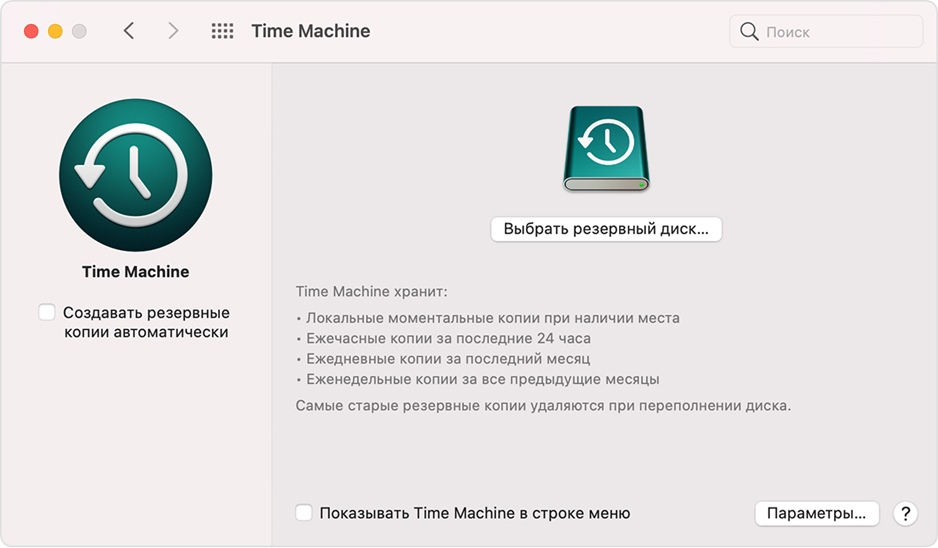
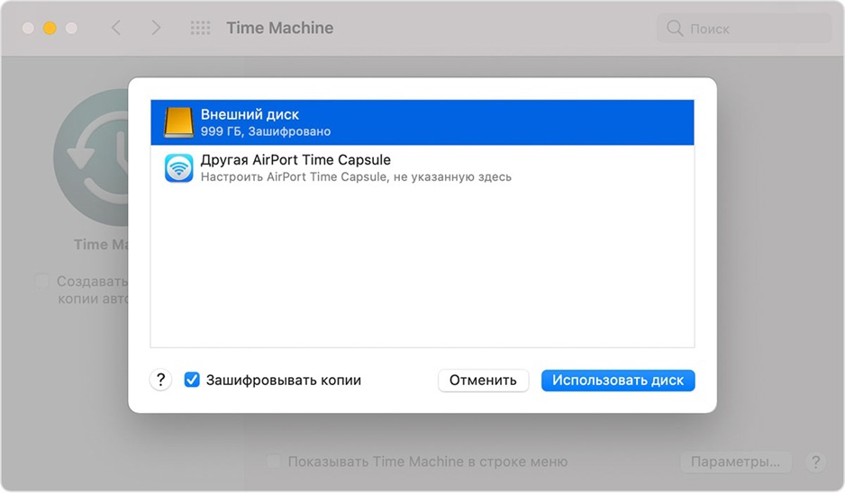

# Программы для резервного копирования для операционной системы Apple macOS

## Резервное копирование содержимого компьютера Mac с помощью Time Machine

Используйте `Time Machine` — **встроенную** функцию резервного копирования Mac — для автоматического резервного копирования своих личных данных,
включая приложения, музыку, фотографии, электронную почту и документы

Резервное копирование позволяет восстанавливать как удаленные файлы, так и файлы, которые были потеряны из-за необходимости очистки или замены
жесткого диска (или SSD) вашего компьютера Mac. Узнайте, как восстановить Mac из резервной копии

## Создание резервной копии Time Machines

Чтобы создавать резервные копии с помощью `Time Machine`, требуется лишь внешний накопитель. После подключения накопителя и выбора его в качестве
диска для резервного копирования `Time Machine` будет автоматически выполнять ежечасное резервное копирование за последние 24 часа, ежедневное
резервное копирование за последний месяц и еженедельное резервное копирование за все прошедшие месяцы. Самые старые резервные копии удаляются по мере
заполнения диска

### Подключение внешнего накопителя

Подключите один из указанных ниже внешних накопителей, которые продаются отдельно. Узнайте больше о дисках резервного копирования, которые можно
использовать с Time Machine.

- Внешний диск, подключенный к компьютеру Mac, например USB-накопитель, или привод `Thunderbolt`
- Подключенное через сеть устройство хранения (NAS), поддерживающее `Time Machine` через SMB
- Компьютер Mac с общим доступом в качестве хранилища резервных копий Time Machine
- `AirPort Time Capsule` либо внешний привод, подключенный к A`irPort Time Capsule` или к базовой станции `AirPort Extreme (802.11ac)`

### Выбор накопителя в качестве диска резервного копирования

1. Откройте настройки Time Machine в меню Time Machine в строке меню. Также можно перейти в меню `Apple` `>` `Системные настройки` и
   щелкнуть `Time Machine`
2. Выберите `Выбрать резервный диск`
   
3. Выберите резервный диск из списка имеющихся дисков. Чтобы сделать резервную копию доступной только для пользователей, у которых есть пароль на
   резервное копирование, можно выбрать `Шифровать резервные копии`. Затем нажмите `Использовать диск:`
   

Если выбранный диск не отформатирован надлежащим для `Time Machine` способом, вам сначала будет предложено стереть данные с него. Чтобы продолжить,
нажмите кнопку `Стереть`. При этом с диска резервного копирования будет удалена вся информация

### Преимущества автоматического резервного копирования

После того как вы выберите диск резервного копирования, `Time Machine` начнет периодически выполнять резервное копирование. Это делается автоматически
и не требует от вас никаких дальнейших действий. Первое резервное копирование может занять много времени, но в процессе можно продолжать использовать
компьютер Mac. `Time Machine `создает резервные копии только тех файлов, которые были изменены с момента последнего резервного копирования, поэтому
последующие сеансы будут занимать меньше времени

Чтобы начать резервное копирование вручную, выберите вариант `Создать резервную копию сейчас` в меню `Time Machine` из строки меню. В этом же меню
можно просмотреть состояние резервной копии или остановить текущее резервное копирование
