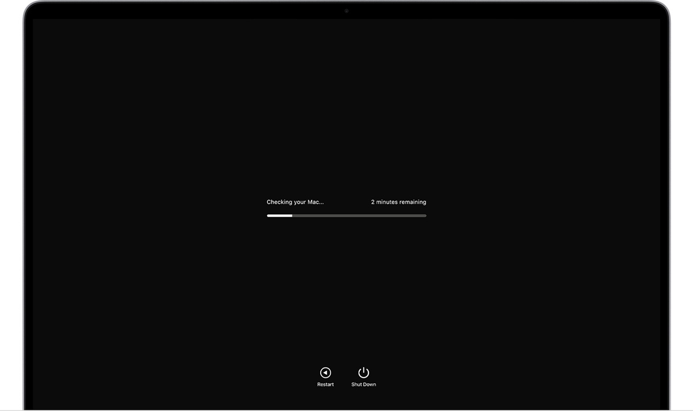
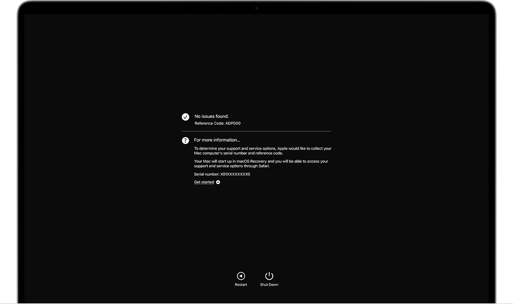

# Программы для тестирования аппаратных узлов компьютера для операционной системы Apple macOS

## Использование приложения «Диагностика Apple» для тестирования компьютера Mac

!!! warning
    Приложение `Диагностика Apple`, ранее известное как `Apple Hardware Test`, может проверить компьютер Mac на наличие проблем с оборудованием

Если вы считаете, что у вашего компьютера Mac может быть аппаратная проблема, с помощью приложения `Диагностика Apple` можно определить, какой
аппаратный компонент неисправен. Приложение `Диагностика Apple` также предлагает решения и помогает обратиться за помощью в службу поддержки Apple

### Подготовка компьютера Mac

1. Выключите компьютер Mac
2. Отключите все внешние устройства, кроме клавиатуры, мыши, монитора, соединения Ethernet (если применимо) и подключения к сети переменного тока
3. Убедитесь, что компьютер Mac находится на жесткой, ровной, устойчивой, хорошо вентилируемой рабочей поверхности

## Запуск приложения «Диагностика Apple»

Определите, используете ли вы компьютер Mac с процессором Apple, а затем выполните соответствующие действия

=== "Процессор Apple"
    1. Включите компьютер Mac и во время его запуска продолжайте удерживать нажатой кнопку питания
    1. Отпустите кнопку, когда появится окно параметров запуска со значком шестеренки и надписью `Параметры`
    1. На клавиатуре нажмите `Command (⌘)-D`

=== "Процессор Intel"
    1. Включите компьютер Mac, затем во время его запуска сразу на клавиатуре нажмите и удерживайте клавишу `D`
    1. Отпустите клавишу, когда появится индикатор выполнения или запрос выбора языка

## Просмотр результатов тестирования

Приложение `Диагностика Apple` показывает индикатор выполнения, пока проверяет компьютер Mac:

По завершении тестирования приложение `Диагностика Apple` отображает результаты, включая один или несколько справочных кодов. Узнайте о справочных
кодах приложения `Диагностика Apple`

Чтобы повторить тестирование, щелкните `Запустите проверку снова` или нажмите клавиши `Command-R`

Чтобы перезагрузить компьютер Mac, нажмите `Перезагрузить` или клавишу `R`

Чтобы выключить, нажмите `Выключить` или клавишу `S`

Чтобы получить информацию об обслуживании и вариантах поддержки, убедитесь, что компьютер Mac подключен к Интернету, а затем щелкните `Начало работы`
или нажмите `Command-G`. Компьютер Mac перезагрузится и откроет веб-страницу с дополнительной информацией. По завершении в меню Apple выберите пункт
`Перезагрузить` или `Выключить`
