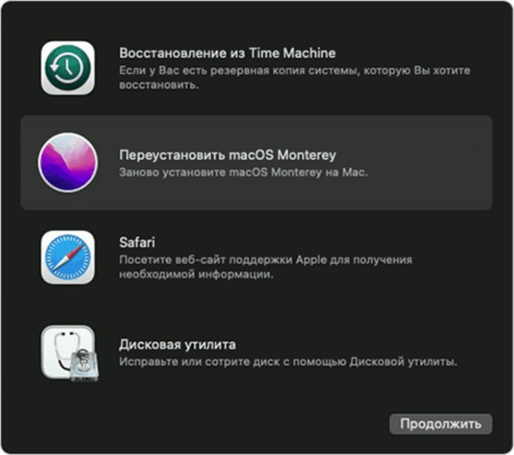

# Процесс ручной установки операционной системы Apple macOS

## Запуск из раздела восстановления macOS

Сначала убедитесь, что ваш компьютер Mac подключен к Интернету. Затем определите, используете ли вы компьютер Mac с процессором Apple и следуйте соответствующим инструкциям

=== "Процессор Apple"
     Нажмите кнопку питания, чтобы включить компьютер Mac, и продолжайте удерживать ее нажатой, пока не отобразится окно с параметрами запуска. Нажмите значок в виде шестеренки (меню `Параметры`), затем
     нажмите `Продолжить`

=== "Процессор Intel"
     Включите компьютер Mac и сразу же нажмите и удерживайте клавиши `Command (⌘)-R`, пока не увидите логотип Apple или другое изображение

Если вам предложат выбрать пользователя, пароль которого вы знаете, выберите его, нажмите `Далее` и введите пароль администратора

## Переустановка ОС macOS

Выберите `Переустановить macOS` в окне утилит в разделе восстановления macOS, а затем нажмите `Продолжить` и следуйте инструкциям на экране

Следуйте этим рекомендациям во время установки:

- Если установщик запрашивает разблокировку диска, введите пароль, используемый для входа в систему на компьютере Mac
- Если установщик не видит диск или сообщает о невозможности установки на данный компьютер или том, может потребоваться стереть диск
- Если установщик предлагает выбор между установкой на том `Macintosh HD` или `Macintosh HD - Data`, выберите `Macintosh HD`
- Дождитесь завершения установки, не переводя компьютер Mac в режим сна и не закрывая его крышку. Компьютер Mac может несколько раз перезагрузиться и выводить индикатор выполнения, а экран может
  оставаться пустым в течение нескольких минут

После завершения установки компьютер Mac может перезагрузиться с переходом к ассистенту установки. В случае продажи, обмена с доплатой или передачи компьютера Mac нажмите `Command-Q`, чтобы выйти из
ассистента, не завершая настройку. Затем нажмите `Выключить`. Когда новый владелец запустит компьютер Mac, он сможет ввести свою информацию при настройке

## Другие варианты установки macOS

При установке macOS из раздела восстановления вы получите текущую версию последней установленной macOS за некоторыми исключениями:

- Если при запуске компьютера Mac с процессором `Intel` были нажаты клавиши `Shift-Option-Command-R`, вам будет предложена macOS из комплекта поставки компьютера Mac или ближайшая доступная версия.
  Если при запуске нажаты клавиши `Option-Command-R`, в большинстве случаев вам будет предложена последняя версия macOS, совместимая с вашим компьютером Mac. В противном случае вам будет предложена
  версия macOS из комплекта поставки компьютера Mac или ближайшая доступная версия
- Если материнская плата Mac была только что заменена, вам может быть предложена только последняя версия macOS, совместимая с вашим компьютером Mac. Если вы только что полностью стерли загрузочный
  диск, вам может быть предложена только версия macOS из комплекта поставки компьютера Mac или ближайшая доступная версия

Возможны и другие варианты установки macOS, совместимой с вашим компьютером Mac:

- Выполните загрузку из ==App Store== и установите последнюю версию macOS
- Используйте ==App Store== или веб-браузер, чтобы загрузить и установить более раннюю версию macOS
- Используйте флеш-накопитель USB или другой дополнительный том, чтобы создать загружаемый установщик

