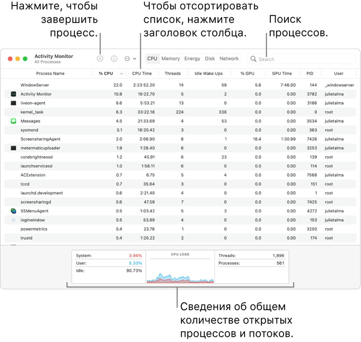

# Программы для просмотра и управления запущенными процессами в операционной системе Apple macOS

Процессы — это программы, которые выполняются на Mac. Процессы могут представлять собой приложения, системные приложения, используемые macOS, или невидимые фоновые процессы

С помощью Мониторинга системы можно получать информацию об этих процессах, в том числе о количестве используемой ими памяти и времени процессора

## Просмотр активности процесса

В приложении `Мониторинг системы` на Mac можно сделать следующее:

- ==Получение информации о процессе==. Выберите процесс, затем дважды нажмите на него или нажмите кнопку информации в окне `Мониторинга системы` (или используйте `Touch Bar`)
- ==Сортировка процессов==. Чтобы отсортировать список, нажмите заголовок столбца
- ==Сортировка элементов столбца в обратном порядке==. Нажмите стрелку в заголовке выбранного столбца
- ==Просмотр общей информации обо всех процессах==. Нажмите `ЦП` в окне `Мониторинга системы` (или воспользуйтесь панелью `Touch Bar`). Сведения, в том числе общее количество открытых процессов и
  потоков, появятся в нижней области окна
- ==Поиск процесса==. Введите название процесса или приложения в поле поиска

## Отображение других столбцов

Можно выбрать столбцы, которые будут отображаться в окне `Мониторинга системы`

В приложении `Мониторинг системы` на Mac выберите меню `Вид` `>` `Столбцы`, затем выберите столбцы для отображения (отображаемые столбцы отмечены галочкой)

## Группировка процессов для удобного просмотра

В приложении «Мониторинг системы» на Mac в меню «Вид» выполните одно из следующих действий.

- `Все процессы`. Показать все процессы, запущенные на Mac
- `Все процессы, иерархически`. Показать процессы, принадлежащие другим процессам, чтобы Вы могли видеть существующие между ними отношения «родитель-потомок»
- `Мои процессы`. Показать процессы, принадлежащие Вашей учетной записи
- `Процессы системы`. Показать процессы, принадлежащие macOS
- `Процессы других пользователей`. Показать процессы, не принадлежащие корневому или текущему пользователю
- `Активные процессы`. Показать запущенные процессы, не находящиеся в режиме ожидания
- `Неактивные процессы`. Показать запущенные процессы, находящиеся в режиме ожидания
- `Процессы ГП`. Показать запущенные процессы, которые обрабатывает ГП компьютера
- `Процессы в окнах`. Показать процессы, способные создавать окна. Такие процессы обычно являются приложениями
- `Выбранные процессы`. Показывает только процессы, выбранные в окне Мониторинга системы
- `Программы за последние 12 часов`. Показать только приложения, запускавшие процессы за последние 12 часов
- `Процессы, по ГП`. Показать запущенные процессы ГП, сгруппированные по ГП
