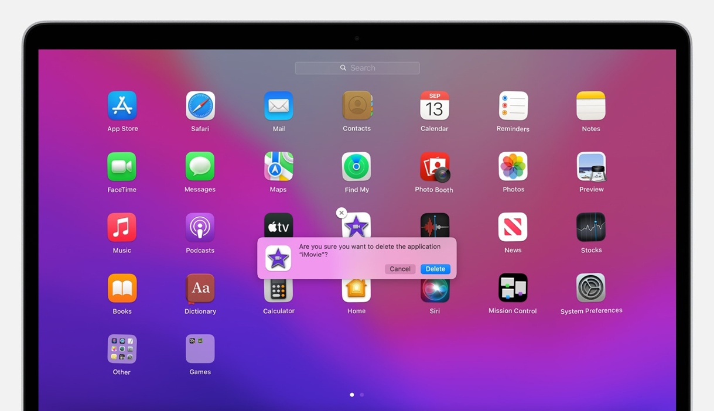
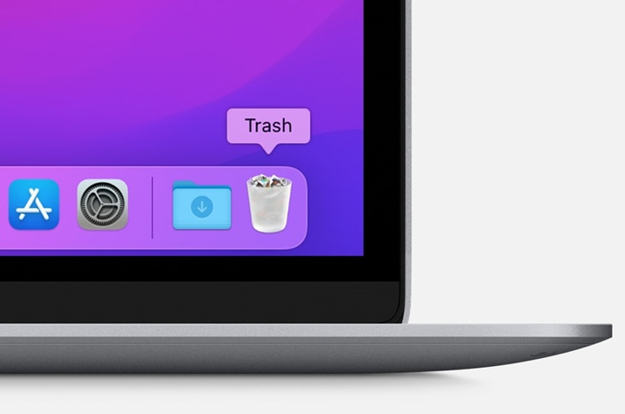

# Процесс удаления программ в операционной системе Apple macOS

!!! info
    Удаление приложения приводит к его удалению с компьютера Mac, а использовавшееся им пространство становится доступно для других объектов. Вы можете
    сделать это с помощью Launchpad или `Finder`

## Удаление с помощью Launchpad

Launchpad предоставляет удобный способ удаления приложений, которые были загружены из App Store

1. Чтобы открыть Launchpad, щелкните соответствующий значок на панели Dock или откройте соответствующий файл в папке `Приложения`. Также можно свести
   вместе большой и три других пальца на трекпаде
2. Если нужное приложение не отображается в Launchpad, введите его название в поле поиска вверху экрана. Либо смахните двумя пальцами вправо или влево
   на трекпаде, чтобы отобразить следующую или предыдущую страницу.
3. Нажмите и удерживайте клавишу `Option (⌥)` или щелкните и удерживайте значок любого приложения, пока значки не начнут дрожать
4. Щелкните кнопку удаления рядом с приложением, которое требуется удалить, затем нажмите кнопку «Удалить» для подтверждения. Приложение будет удалено
   незамедлительно. Приложения, в которых кнопка не отображается, либо были получены не из App Store, либо обязательны для компьютера Mac. Для
   удаления приложений, полученных не из App Store, используйте Finder

!!! warning
    Удаление приложения не приводит к отмене каких-либо подписок, которые могли быть приобретены с помощью этого приложения

## Удаление с помощью Finder

1. Найдите нужное приложение в Finder. Большинство приложений находится в папке `Приложения`, которую можно открыть, щелкнув `Приложения` на боковой
   панели любого окна Finder. Либо используйте `Spotlight` для поиска приложения, затем дважды щелкните это приложение в окне `Spotlight`, удерживая
   нажатой клавишу `Command (⌘)`
2. Перетащите приложение в корзину либо выделите его и выберите `Файл` `>` `Переместить в Корзину`
   

3. При запросе имени пользователя и пароля введите имя и пароль учетной записи администратора на компьютере Mac. Скорее всего, это имя и пароль,
   обычно используемые вами для входа в систему на компьютере Mac
4. Чтобы удалить приложение, выберите `Finder` `>` `Очистить Корзину`
