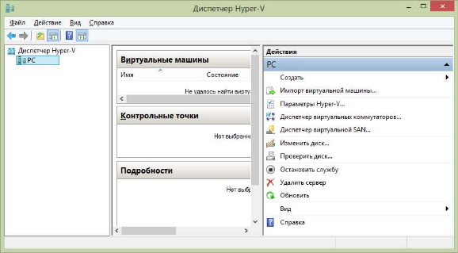
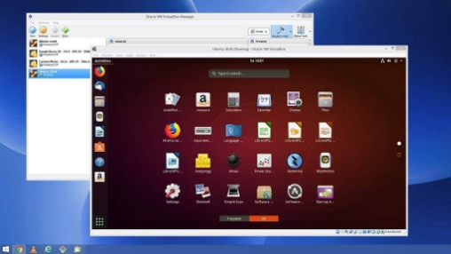
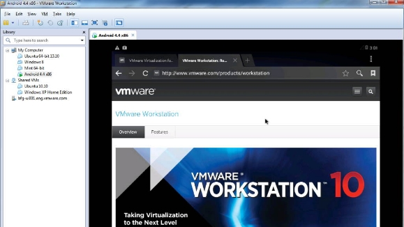

# Программы для создания виртуальных машин для ОС Microsoft Windows

`Виртуальная машина` — программа, позволяющая выделить часть ресурсов вашего ПК в отдельный виртуальный компьютер. Он эмулирует все элементы реального
компьютера, в том числе жёсткий диск, USB-порты и сетевую карту. На `виртуальный компьютер` можно установить собственную операционную систему и нужные
программы. Работать они будут также, как на реальном компьютере. Виртуальный компьютер даже можно подключить к локальной сети или к Интернет с
собственным `IP-адресом`

## Виртуальнная машина Microsoft Hype

Во все 64-битные версии операционных систем Windows 8 и Windows 10 уже встроена виртуальная машина `Microsoft Hyper-V`. Чтобы запустить её надо зайти
в панель управления Windows

## Бесплатная виртуальная машина Oracle VirtualBox

`VirtualBox` – бесплатная и простая в работе виртуальная машина. Она может запускать в качестве `гостевой` почти любую операционную систему, в том
числе Windows, MacOS или Linux

## Виртуальная машина VMware Workstation

Если вы хотите развернуть на виртуальной машине постоянно-действующий сервер, лучше выбрать `VMware Workstation`. Это платная виртуальная машина,
которая поддерживает работу с Windows и Linux

На виртуально машине под управлением `VMware Workstation` можно, к примеру, создать фаервол, отделяющий сеть организации от Интернет. Можно даже
развернуть на ней сервер какой-либо базы данных
