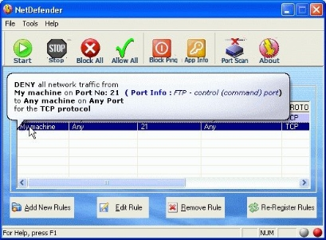

# Программы-брандмауэры для ОС Microsoft Windows

## Comodo Firewall

Один из самых мощных брандмауэров, доступных для Windows

## TinyWall

Легкий, удобный и безопасный брандмауэр для Windows

## ZoneAlarm Free Firewall

Защищает ваш компьютер от всех входящих и исходящих кибератак

## PeerBlock

Бесплатный персональный брандмауэр с открытым исходным кодом, который блокирует пакеты, поступающие или ведущие на обслуживаемый список хостов,
включенных в черный список

## AVS Firewall

Сочетает в себе возможности сетевого экрана, родительского контроля, анти-баннера и защитника системного реестра

## Outpost Firewall

Персональный файрвол, выпускавшийся для защиты компьютера от хакерских атак российской компанией `Agnitum` до 2015 года

## NetDefender

Бесплатный брандмауэр с открытым исходным кодом для `Windows 2000 / XP`

## R-Firewall

Файрвол предназначен для ограничения доступа к компьютеру по сети, контролирует доступ приложений в сеть и препятствует несанкционированному
проникновению злоумышленников, а также, заражению некоторыми типами вирусов

## GlassWire

Удобная программа для сетевой безопасности, которая визуализирует сетевую активность и блокирует соединения

## Privatefirewall

Многоуровневая система безопасности конечных точек, которая защищает компьютеры и серверы Windows от вредоносных программ

