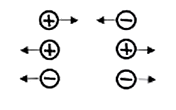
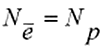
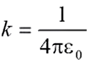

[comment]: <> (https://www.youtube.com/watch?v=ma7vujho1Xw)

# Лекция 1

[comment]: <> (13:05)

!!! warning
    Конспект не завершен

## Кинематика

### Система отсчета

`Механическое движение` — перемещение материальных тел в пространстве

`Материальная точка` — тело, размерами которого в данной задаче можно пренебречь

`Абсолютно твердое тело` — тело, не подверженное деформации (расстояние м/у любой парой его точке не
изменяется в процессе движения). Любое движение твердого тела сводится к комбинации двух основных
видов движения

`Поступательное` - все точки тела движутся с одинаковыми скоростями по параллельным траекториям

[comment]: <> (19:38)

### Кинематика материальной точки (поступательное движение)

При движении материальной точки изменяется ее `радиус-вектор`. Если положение м.т. в каждый момент
времени известно, то говорят, что задан `кинематические закон движения`

Движение точки в трехмерном пространстве закон движения в векторной форме эквивалентен трем
скалярным законам для каждой из координат точки

В декартовой системе координат скалярное произведение может быть представлено как сумма произведений
одноименных проекций двух векторов

`Длина вектора` выражается через его проекции по теореме Пифагора

`Квадрат длины` — результат скалярного произведения вектора на самого себя

`Траектория движения` — воображаемая линия, которую описывает точка в процессе движения

`Перемещение` — вектор, соединяющий начальную и конечную точки траектории

`Пройденный путь` — скалярная положительная величина, равная длине траектории

$$ |\Delta\,\vec{V}\;|\leq S $$

`V` - модуль перемещения

`S` - путь

### Скорость

Отношение перемещения точки к интервалу времени $\Delta {t} = {t}_{2} - {t}_{1}$, в течение которого
это перемещение совершилось, называется `средней скоростью` движения

$$ \vec{\nu}_{ср} = \frac{\Delta{\vec{r}}}{\Delta{\vec{t}}} $$

Скорость по направлению совпадает с перемещением!

$$t+\Delta{t}$$

Если интервал рассматриваемой интервал времени движения $\Delta {t}$ уменьшать, вектор средней
скорости может изменяться как по величине, так и по направлению. При delta $\Delta {t} \to 0$
$\vec{\nu}_{ср}$ перестает изменяться по величине и занимает положение касательной к траектории

Предел отношения перемещения к интервалу времени, в течение которого это перемещение происходит,
называется мгновенной скоростью

$$\vec{v} = \lim _{\Delta{t} \to 0} \frac{\Delta{\vec{r}}}{\Delta{\vec{t}}}$$

В математике такой предел называют производной — мгновенная скорость есть производная перемещения по
времени

$$\vec{v} = \frac{\Delta{d}{\vec{r}}}{\Delta{d}{\vec{t}}}$$

Величину $d\vec{r}$ следует рассматривать как бесконечно малое перемещение за бм. время:

$$d\vec{r} = \vec{\nu}d{t}$$

[comment]: <> (48:59)
