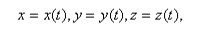

# Кинематическое уравнение движения материальной точки

При движении материальной точки `М` ее координаты `x`, `y`, `z` и радиус-вектор `r` изменяются с течением времени t.

Поэтому для задания закона движения м.т. необходимо указать либо вид функциональной зависимости всех трех ее координат
от времени:

#### (1.2)

либо зависимость от времени радиус-вектора этой точки

#### (1.3)

Три скалярных уравнения [(1.2)](#12) или эквивалентное им одно векторное уравнение [(1.3)](#13) называются
кинематическими уравнениями движения материальной точки.
