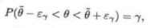

# Доверительные интервалы в случае нормальных выборок

!!! warning
    Формулы могут отображаться некорректно, как и само форматирование. Мне было влом делать нормально

Пусть случайная величина `X` имеет неизвестную характеристику ${\theta}$

Это может быть, например, `числовая характеристика случайной величины`, параметр и т. д. Идея, лежащая в основе
интервального оценивания характеристики ${\theta}$ состоит в том, что по результатам наблюдений ${Х_1, X_2, Х_n}$
определяют две величины ${\underline\theta}$ = ${\underline\theta}$. (${Х_1, X_2, \ ... \ Х_n}$) и ${\overline\theta}$ =
${\overline\theta}$ (${Х_1, X_2, \ ... \ Х_n}$) такие, что

где ${γ}$ — наперед заданная вероятность. Величины ${\theta}$ и ${\overline\theta}$ называют доверительными границами, а
интервал (${\underline\theta}$, ${\overline\theta}$) — доверительным интервалом для ${\theta}$, соответствующим уровню
надежности ${γ}$

Строить доверительный интервал можно исходя из точечной оценки. Пусть для ${\theta}$ известна точечная оценка
${\overline\theta}$. Подберем ${\varepsilon_γ}$ такое, чтобы выполнялось равенство

`(13.1)` 

где ${γ}$ — выбранная заранее вероятность. Тогда

и (${\overline\theta - \varepsilon_γ, \ \overline\theta + \varepsilon_γ}$) можно рассматривать как доверительный
интервал для ${\overline\theta}$. Так что задача состоит в том, чтобы по заданному ${γ}$ выбрать соответствующее
${\varepsilon γ}$

На основании `(13.1)` можно гарантировать, что с вероятностью ${γ}$ значение точечной оценки отличается от неизвестного
значения ${\theta}$ меньше, чем на ${\varepsilon γ}$.

Вероятность ${γ}$ обычно выбирают настолько близкой к единице, чтобы ее можно было считать вероятностью
практически `достоверного события`

Тогда соответствующий доверительный интервал можно считать интервалом практически возможных значений ${\theta}$, или
интервалом значений ${\theta}$, не противоречащих опытным данным

## § 13.1. ДОВЕРИТЕЛЬНЫЙ ИНТЕРВАЛ ДЛЯ МАТЕМАТИЧЕСКОГО ОЖИДАНИЯ

### Случай большой выборки

Пусть закон распределения случайной величины `X` неизвестен.

Неизвестны также `М(Х)` и `D(X)`, причем `D(Х) < ∞`. Над случайной величиной проделано n независимых наблюдений и
получена выборка значений ${Х_1, X_2, \ ... \ Х_n}$.

Если число наблюдений достаточно велико (хотя бы несколько десятков), то

`(13.2)` 

где `X` — среднее арифметическое результатов наблюдений, а ${t_γ}$ выбирается из таблицы функции Лапласа так, чтобы
${2\varphi_0(t_γ) = γ}$. Возможен случай, когда дисперсия случайной величины известна, а неизвестно лишь математическое
ожидание этой величины.

Такая ситуация возникает при измерении постоянной величины с прибором, который не имеет систематической ошибки.

Если дисперсия случайной ошибки прибора предварительно изучена и известна, то `(13.2)` можно рассматривать как
доверительный интервал для истинного значения измеряемой величины. В самом деле, в результате измерения получается
значение случайной величины ${X = a + γ}$, где ${γ}$ — случайная ошибка.

По предположению ${D(γ)}$ — известна, а ${M(γ) = 0}$ ввиду отсутствия систематической ошибки. Тогда

${M(X) = M(a + γ) = a}$

и ${D(X) = D(a + γ) = D(а) + D(Y) = D(Y)}$

Остается подставить найденные величины в `(13.2)`

Если вместе с ${M(X)}$ неизвестна и ${D(X)}$, то из тех же опытных данных можно получить несмещенную и состоятельную
оценку для дисперсии по формуле:

`(13.3)` 

Тогда `(13.2)` имеет вид `(13.4)` 

В выводе формулы `(13.4)` ключевую роль играет тот факт, что при большом числе независимых наблюдений среднее
арифметическое их результатов имеет близкий к нормальному закон распределения

Формулу `(13.4)` можно использовать для любой случайной величины, лишь бы число наблюдений было достаточно велико (хотя
бы несколько десятков)

### Случай малой выборки

При небольшом числе наблюдений для построения доверительного интервала необходима информация о типе закона распределения
случайной величины. Рассмотрим практически важный случай, когда ${X ~ N(m; \ σ^2)}$

Если ${σ^2}$ известно, а неизвестно лишь `m`, то при независимых наблюдениях можно воспользоваться свойством устойчивости
нормального закона распределения

Согласно этому свойству сумма независимых случайных величин, подчиненных нормальному закону распределения, сама имеет
нормальный закон распределения. Поэтому в названных условиях и при небольшом числе наблюдений можно утверждать, что `X`
имеет близкий к нормальному закон распределения и использовать формулу `(13.2)`

Если дисперсия ${σ^2}$ неизвестна, то при небольшом числе наблюдений ее оценка на основе опытных данных получается грубой и
формула `(13.4)` не решает задачи построения доверительного интервала. Английский статистик Студент (У. Госсет)
для ${X ~ N(m; \ σ^2)}$ с неизвестными параметрами и ${σ^2}$ в предположении независимости опытов изучил величину

где ${s^2}$ — оценка дисперсии по формуле `(13.3)`, а `n` — число наблюдений.

Оказалось, что распределение величины `Т` не зависит ни от `X`, ни от `s`, а зависит лишь от числа ${n - 1}$, которое
принято называть числом степеней свободы. Студент нашел функцию плотности вероятности ${f_n-1(t) = γ}$ и с ее помощью
вычислил вероятности

${2\varphi_0(t_γ) = γ}$

`(13.5)` 

которые свел в таблицу `(см. приложение, табл. 3)`

При заданном уровне надежности `γ` по таблице распределения студента для ${n - 1}$ степени свободы можно найти
соответствующее ${t_У}$. Подстановка этого ${t_У}$ в `(13.5)` приводит к

или

`(13.6)` 

Формула (13.6) по структуре похожа на формулу `(13.4)`, но ${t_У}$ в этих формулах определяется по разным таблицам.

### ПРИМЕР 13.1

${Х_1 = 592,\ Х_2 = 595,\ Х_3 = 594.\ Х_4 = 592,\ Х_5 = 593,\ Х_6 = 597,\ Х_7 = 595.\ Х_8 = 589,\ Х_9 = 590}$ Измерения
сопротивления резистора дали следующие результаты `(в омах)`: Известно, что ошибки измерения имеют нормальный закон
распределения. Систематическая ошибка отсутствует. Построить доверительный интервал для истинного сопротивления
резистора с надежностью `0,99` в предположении:

- Дисперсия ошибки измерения известна и равна 4

6) дисперсия ошибки измерения неизвестна

- В данной серии из девяти наблюдений

Если дисперсия ошибки измерения известна, то можно воспользоваться формулой `(13.2)`. Для этого из таблицы функции
Лапласа `(см. приложение, табл. 2)` находим, что ${2\varphi_\theta(2.58) = 0.99}$. Т. е. уровню надежности `0,99`
соответствует значение ${t_У = 2,58}$. Тогда по формуле `(13.2)`

`593 - 2,58 * 2/√9 < М(Х) < 593 + 2,58 * 2/√9` или ${591,28 < М(Х) < 594,72}$ с вероятностью `0,99`

В случае неизвестной дисперсии ее можно оценить на основе тех же опытных данных:

${s = \sqrt{6,5} ≈ 2,55}$

По таблице распределения студента `(см. приложение, табл. 3)` для `n - 1` = `9 - 1 = 8` степеней свободы и заданной
вероятности `γ = 0,99` находим t~У~ = `3,355`. Тогда по формуле `(13.6)`

или ${590,15 < М(X) < 595,85}$ с вероятностью `0,99`

### ПРИМЕР 13.2

В таблице приведены сгруппированные данные измерений роста `у` 50 наугад выбранных студентов:

Оценить средний рост и дисперсию роста студентов. Построить доверительный интервал для среднего роста студентов с
надежностью `0,9`

- Так как данные сгруппированы, то в качестве представителя каждого интервала можно взять середину этого интервала

Тогда:

${2\varphi_\theta(1.65) = 0.9}$, то по формуле `(13.4)` имеем

или ${176,86 < М(Х) < 179,14}$ с вероятностью `0,9`

### ПРИМЕР 13.3

По результатам девяти измерений емкости конденсатора получена оценка `X = 20 мкФ` Среднеквадратическая ошибка измерения
известна и равна `0,04 мкФ`. Построить доверительный интервал для емкости конденсатора с надежностью `0,95`.

- В предположении, что ошибки измерения имеют нормальный закон распределения можно воспользоваться формулой `(13.2)`.
  Так как ${2\varphi_\theta(1,96) = 0,95}$. то `20 - 1,96 * 0,04 / 3 < M (X) < 20 + 1 > 1,96 * 0,04 / 3`
  или `19,974 < М(Х) < 20,026` с вероятностью `0,95`

## § 13.2. ДОВЕРИТЕЛЬНЫЙ ИНТЕРВАЛ ДЛЯ

### ВЕРОЯТНОСТИ СОБЫТИЯ

Пусть вероятность `Р(А) = р` неизвестна. Проделаем `n` независимых опытов и определим `k/n` — частоту события в данной
серии опытов. Если n достаточно велико, то вероятность и частота события связаны соотношением:

`(13.7)` 

К сожалению, в формуле `(13.7)` доверительные границы для вероятности р выражаются через саму эту неизвестную
вероятность. Это затруднение можно обойти заметив, что `pq <= 1/4`. Тогда `(13.7)` можно записать в виде

`(13.8)` 

Оценка pq величиной `1/4` приемлема, если есть уверенность, что неизвестная вероятность p близка к `1/2`. Но при
значениях `р` близких к нулю или единице такая оценка слишком груба. Например, при `р = 0,1` получаем всего
лишь `pq = 0,1 * 0,9 = 0,09` вместо `0,25`. Можно точный доверительный интервал заменить приближенным, если учесть, что
при большом числе опытов `k/n ≈ p` в силу закона больших чисел:

`(13.9)` 

### ПРИМЕР 13.4

Для обследования большой партии изделий `(несколько тысяч штук)` наугад выбрано `160` изделий. Среди них оказалось `56`
изделий низкого сорта. Оценить долю изделий низкого сорта в этой партии с надежностью `0,95`.

- Так как партия изделий крупная, то для упрощения можно считать, что по мере выбора изделий состав партии заметно не
  изменяется и вероятность выбрать наугад изделие низкого сорта равна доле низкосортных изделий в этой партии. Тогда
  задача сводится к построению доверительного интервала для вероятности выбора из этой партии изделия низкого сорта.
  Частота изделий низкого сорта в выборке ${\frac{k}{n} = \frac{56}{160} = 0.35}$. Из таблицы функции `Лапласа` следует,
  что ${2\varphi_\theta(1.96) = 0.95}$. Поэтому 

или `0,27 < р < 0,42`. Итак, по данной выборке можно с вероятностью `0,95` утверждать, что во всей партии содержится
от `27%` до `42%` изделий низкого сорта

### ПРИМЕР 13.5

Было проведено `400` испытаний механизма катапультирования. В этих испытаниях не зарегистрировано ни одного отказа. С
надежностью `0,95` оценить вероятность отказа механизма катапультирования

- В данной серии испытаний частота появления отказа `к/400 = 0`. Поэтому непосредственно использовать формулу `(13.9)`
  нельзя. Заметим, что `p * q <= 1/4`, так как `р + q = 1`. Функция Лапласа ${2\varphi_\theta(x)}$ строго возрастает

Поэтому меньшему значению аргумента соответствует меньшее значение функции. В расчете на худший вариант можно
воспользоваться формулой `(13.8)`. По таблице функции Лапласа находим, что ${2\varphi_\theta(x)(1.96) = 0.95}$. Поэтому
`tγ = 1,65` и `0 < р < 1,65 * 1/2√400 = 0,041`

Доверительный интервал `(0; 0,041)` построен в расчете на худший вариант, когда вероятность события близка к `1/2`. Но
большое число опытов `(n = 400)` и нулевая частота события в них позволяют с уверенностью утверждать, что вероятность
события близка к нулю. Если несколько ухудшить статистику испытаний и посчитать что один отказ все-таки наблюдался,
то `p * q ≈ 1/40 * 399/400 = 0,0025`. Тогда по формуле `(13.9)` получаем приближенный доверительный интервал

или `0 < р < 0,0066`. Это приближенный доверительный интервал, но он определенно более точен, чем грубая оценка по
формуле `(13.8)`

### ПРИМЕР 13.6

Сколько независимых наблюдений нужно проделать, чтобы с вероятностью `0,95` можно было построить доверительный интервал
для вероятности события шириной не более `0,2`?

- По таблице функции Лапласа `(см. приложение, табл. 2)` находим, что ${2\varphi_\theta(x)(1.96) = 0.95}$. Вероятность
  события неизвестна. Так как `pq <= 1/4, то и k/n (1 - k/n) <= 1/4`. Доверительный интервал располагается симметрично
  относительно частоты события, поэтому в формуле `(13.9)` 

Откуда ${\sqrt{n} = \frac{1.96}{0.2} = 9.8}$. Следовательно, `т = 96,04`. Т. е. `т > 96`
