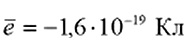
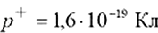
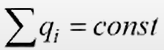
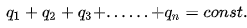

# Лекция 1 - Электромагнетизм

[Учебник, который она назвала лучшим (Алешкевич)](../files/lection_01__book.pdf){:target='_blank'}

## Основные законы:

Весь раздел можно разбить на 3 части: [`электростатика`](#_2), [`электродинамика`](#_3) (электрический ток)
и [`электромагнетизм`](#_4).

### Электростатика

- Закон сохранения заряда
- Закон Кулона (1785)

### Электродинамика

- Закон Ома (1826)
- Закон Джоуля-Ленца (1841-1842)

### Электромагнетизм

- Закон Био-Савара-Лапласа (1820)
- Закон Ампера (1820)
- Закон Фарадея-Максвела (Закон электромагнитной индукции) (1831-1861)

## Закон сохранения заряда

Заряд существует в двух видах: условно `положительный` и `отрицательный`

- В законах `электростатики`, не имея образца для сравнения, мы никогда не сможем сказать какой заряд ==положительный==,
  а какой ==отрицательный==
    - Если заряды разные по знаку — они притягиваются
    - Если одноименные — отталкиваются

        

- `Электрический заряд квантуется`, т.е. существует в природе в виде заряженных частиц, которые мы считаем элементарными.

       Для нас это:

       - Электрон 
       - Протон 
       - Нейтрон 

       Единица измерения `[q] = Кл = А * с`

- Закон сохранения заряда:

       Для изолированной системы алгебраическая сумма зарядов в остается постоянной.

       `Изолированная система` — система, которая не обменивается зарядом с другими системами.

       , где `i` - кол-во зарядов

       Пример разложения по сумме:

       

       В изначальной формулировке был бы возможен следующий процесс: заряд исчезает в одной точке пространства и мгновенно
       возникает в другой.

- Электрический заряд релятивистски инвариантен, т.е. не зависит от скорости координат (а, следовательно, от того
  движется он или покоится). Заряд присущ частице на протяжении всего времени ее жизни.

## Закон Кулона

1. `Закон Кулона` регламентирует количественное взаимодействие, силу взаимодействия точечных зарядов:
    - `Точечный заряд` — это заряд тела, геометрическими размерам которого в условиях данной задачи можно пренебречь.
    - Если мы рассматриваем взаимодействие двух таких зарядов, то сила их взаимодействия:
        1. Направлена вдоль линии соединяющей оба заряда
        1. Прямо пропорциональна величине каждого из зарядов
        1. Обратно пропорциональна квадрату расстояния между зарядами
    - В векторном виде:

        

        `F - сила`, с которой заряд `1` действует на заряд `2`

        `q1` и `q2` - ==величина зарядов==
    
        `r` - ==радиус-вектор== (вектор, направленный от заряда `1` к заряду `2`, и равный, по модулю, расстоянию между
        зарядами)
    
        `k` - коэффициент пропорциональности (зависит от системы единиц, у нас - ,
        где  - электрическая постоянная

1. Одноименные заряды отталкиваются

    

    Сила их взаимодействия прямо пропорциональна модулю произведения зарядов.

1. Закон Кулона справедлив в таком виде только для двух случаев:
    - Первый случай для точечных зарядов, рассмотрен выше.
    - Второй случай, когда заряженные тела имеют шарообразную или сферическую форму и при этом обязательно, чтобы заряд
      был распределен равномерно по поверхности или равномерно по объему.

        

      `Пример:` 2 проводящих тела, по которым заряды могут как-то перераспределяться, то в таком виде закон уже не
      справедлив и приходится придумывать различные методы расчета силы взаимодействия или полей, которые создает одно
      или другой тело.

1. В силе Кулона можно условно правую часть разделить и сказать, что все, что обведено относится например к первому
   заряду, тогда мы говорим о некоторой точке наблюдения, находящейся на расстоянии r от первого заряда, и все это
   вместе характеризует поле первого заряда.

    

1. Напряженность этого заряда:

    

    То же самое можно выполнить наоборот, взяв за точку наблюдения заряд `q1` и расстояние r до заряда `q2`.

    

## Напряженность электростатического поля.

1. Всякое заряженное тело создает вокруг себя поле, чтобы это поле обнаружить используется пробный заряд (`точечный`,
   `маленький` и `положительный`)
1. В данной точке поля пробный заряд отталкивается от поля.

      

1. Чем ближе одноименный заряд, тем сильнее он будет отталкиваться.
1. Отношение действующей силы к величине пробного заряда характеризует конкретную точку поля и называется
   напряженностью. Напряженность определяется как сила, действующая на пробный заряд, помещенный в данную точку поля к
   величине пробного заряда.

    

    `Напряженность` - силовая характеристика поля.

1. Размерность `В/м` ==(Вольт на метр)==
1. Расчет напряженности. Есть 2 глобальных метода: `метод суперпозиции` и `теорема Гаусса`.
    1. Метод суперпозиции.

         Если поле создается одним точечным зарядом `Q`, то на любой пробный заряд действует сила:

         

         Тогда `напряженность`:

          - модуль ==(нет знака)==

         Силу `F` делим на пробный заряд `q`, получаем `напряженность поля точечного заряда`.

         Эту же формулу можно использовать для расчета проекции напряженности на направление от точечного заряда.
         
          - проекция (есть знак `-` или `+`)

         Если у нас есть заряд, мы проводим ось от него и такую ось традиционно называем радиальной.
        
         

         `Напряженность`, если заряд положительный направлена от заряда `Q` и будет проецироваться на эту ось. Если
         заряд `отрицательный`, то `направление силы будет противоположным`.

1. Поле создается `системой точечных зарядов`. Если на тело действует несколько сил, их надо складывать векторно, тогда
   согласно определению напряженности:

     

     `Если результирующая сила определяется как векторная сумма то, при делении на заряд получаем сложение векторов
     напряженности`. Это называется `принцип суперпозиции`. В случае дискретно распределенного заряда он записывается как
     векторная сумма:

     

     `Электрический заряд дискретен` — заряд любого тела составляет целое кратное от элементарного электрического
     заряда `е=1,6×10^-19 Кл`.

1. Поле создается заряженным телом.
    1. Прежде чем рассчитывать напряженность, мы разбиваем тело на точечные заряды

         

         сводим задачу к предыдущей, обозначаем какой-нибудь точечный заряд

         

    1. Каждый точечный заряд создает поле, независимо от существования другого. Поместив в некоторую точку поля пробный
       заряд, находим напряженность от этого точечного, поэтому и обозначаем ее не `E`, а `dE`(некоторая часть всего
       поля)

    1. Для расчета воспользуемся первой формулой:

         

    1. Результирующее поле определяется по принципу `суперпозиции` (для распределения заряда) через интеграл: 

         

[comment]: <> (Задачи)

## Графическое изображение поля. Силовые линии.

Для графического изображения электростатических полей используют силовые линии — воображаемые линии.

Правила построения силовых линий:

1. Касательные к этим линиям в каждой точке совпадают с вектором напряженности.
1. Силовой линии приписывают направление по вектору напряженности.
1. Линии рисуют выборочно, число линий пропорционально напряженности поля. (==Чем больше густота, тем больше
   напряженность==).

    

    где `N - число линий`, пересекающих площадку, `S - площадь`

Густота пропорционально напряженности.

Изображаем напряженность в ряде точек , тогда зеленые — вектора (касательные), коричневый —
силовая линия.

Изобразим 2 площадки, они имеют разную площадь, но одинаковое число силовых линий. Для второй площадки (S2) густота
силовых линий меньше.

Силовые линии начинаются на зарядах (если они положительные)и заканчиваются на зарядах (если они отрицательные).

Силовые линии никогда не пересекаются, потому что в каждой точке напряженность может быть определена 1 раз.

<figure>
  
  <figcaption>Примеры силовых линий.</figcaption>
</figure>

`Однородное поле` - напряженность во всех точках одинаково. Используем параллельные силовые линии, находящиеся на равном
расстоянии друг от друга.

## Потенциал Электростатического поля.

`Электростатический потенциал` — скалярная энергетическая характеристика электростатического поля, характеризующая
потенциальную энергию, которой обладает единичный положительный пробный заряд, помещенный в данную точку поля.

Если мы в поле помещаем какой-нибудь заряд (точечный), то на заряд начинает действовать сила и если его отпустить он
куда-то полетит — исходя из этого у зарядки есть потенциальная энергия. Поделим эту потенциальную энергию на величину
нашего пробного заряда — определяем характеристику данной точки поля, которая называется потенциал.

Потенциал можно определить с точностью до константы (не меньше самой константы), чтобы от константы избавиться удобно
пользоваться не потенциалом, а разностью потенциалов, тогда можно воспользоваться разностью энергии:

Ни одно явление в природе или технике не определяется значением самой потенциальной энергии. Важна лишь разность
значений потенциальной энергии в конечном и начальном состояниях системы тел.

Вспомним из механики — изменение энергии, это минус работа консервативной силы. (Сила Кулона — сила консервативная).
Поэтому разность потенциалов между двумя точками равняется работе сил поля по перемещению пробного заряда из одной точки
в другую, деленную на величину этого заряда.

С точки зрения системы СИ заряд единичный (1 Кулон) - не подходит, так как он очень большой.

Расчет потенциала — это расчет энергии. Энергия — скалярная величина. Если поле создает 1 точечный заряд, то поместив в
это поле пробный заряд, мы получим энергию взаимодействия.

 - формула, выведенная через интегрирование силы. Для того чтобы найти потенциал — делим на
пробный заряд

Константа `k` - обращается в ноль если мы считаем, что нулевой уровень потенциальной энергии или ноль потенциала выбран
на бесконечном удалении от заряда `Q`

Если заряд `Q` создает поле, то чем дальше мы отходим от заряда, тем потенциал меньше. 

Если есть система точечных зарядов — каждый из них создает поле, а значит результирующий потенциал как сумма
потенциалов.

Поле заряженного тела , где `Df` 

## Связываем между собой напряженность и потенциал.

Напряженность характеризует силу, потенциал характеризует энергию.

1. Интегральная связь:

    `Напряженность` — это сила, действующая на точечный заряд, отнесенная к этому заряду.

    

    `Потенциал` -  

    `Работа (А)` - мера действия силы на тело.

    По формуле работа это — интеграл от скалярного произведения.

    

    Для того чтобы посмотреть переменность сил добавляем интеграл.

    Для того чтобы учесть, что не всякая сила вообще совершает работу, а еще работа может быть отрицательной, добавляем
    скалярное произведение (именно скалярное произведение учитывает косинус угла между силой и перемещением.

    Из трех формул получаем интегральную связь.

    Записываем разность потенциалов, вместо работы подставляем интеграл.

    , затем вносим заряд под знак интеграла, делим силу на заряд и получаем напряженность:

    

    Скалярное произведение — это произведение двух векторов, модуля первого на модуль второго и на косинус угла между ними.

    Изобразим 2 вектора: `перемещение` и `напряженность`.

    

    Запишем в скалярное произведение:

    

    где альфа — угол между векторами.

    `А` домножим `E` на `cos(a)` получу проекцию напряженности на направление перемещения (на направление `dr`).

    `Er - проекция перемещения`

    

    Убираем скалярное произведение и оставляем проекцию напряженности на некоторое направление умножить на приращение
    этой координаты.

    Выше формула так называемой интегральной связи, она используется если нам нужно найти потенциал или разность потенциалов по известной напряженности.

    Второй вид связи — дифференциальная.

    Чтобы перейти от дифференциальной связи, нужно избавиться от интеграла.

    Рассмотрим две бесконечно близкие точки 1 и 2 (верхний и нижний пределы)

    Работа подразумевает собой перемещение и точки 1 в точку 2 (суммируя все маленькие перемещения) умножив их на силу
    всего нашего пути.

    Разность потенциалов двух бесконечно близких точек:

    

    Начальное — конечное:

    

    Отсюда выражаем проекцию напряженности на направление `r`

    

    Это взятое с обратным знаком производная от потенциала по этому направлению и по этой координате.

    В декартовой системе координат это соотношение справедливо для любой оси.

     - скорость изменения вдоль координаты `Y`

     - это взятое с обратным знаком производная от потенциала по этому направлению и по этой
    координате.

    В декартовой системе координат это соотношение справедливо для любой оси.

     - скорость изменения вдоль координаты `Y`

     - для `Z`

    Любой вектор в трехмерной системе координат имеет 3 проекции.

    Чтобы собрать вектор, нужно воспользоваться единичным ортогональным базисом. Каждую ось умножаем на ее единичный
    вектор.

    

    Используя данные проекции получаем:

    

    Получаем соотношение, которое в векторном дает нам дифференциальную запись связи.

    У математиков есть формула проще, которая выводится продифференцировав по трем координатам, потом умножить на 3
    единичных вектора и сложить.

    Градиент:

    

    Дифференциальную связь используем когда известно распределение потенциала, нужно найти напряженность.

    Используя интегральную связь можно записать условие потенциальности поля.
    
    Поле потенциально если действующая сила потенциальна.

    

    Если мы и начальной точки дошли до конца и вернулись = 0  

## Эквипотенциальные поверхности.

Поверхность, во всех точках которой потенциал электрического поля имеет одинаковые значения, называется
эквипотенциальной поверхностью.

Между двумя любыми точками на эквипотенциальной поверхности разность потенциалов равна нулю, поэтому работа сил
электрического поля при любом перемещении заряда по эквипотенциальной поверхности равна нулю.

Это означает, что вектор силы в любой точке траектории при движении заряда по эквипотенциальной поверхности
перпендикулярен вектору перемещения. Следовательно, линии напряженности электростатического поля перпендикулярны
эквипотенциальной поверхности

Эквипотенциальными поверхностями поля точечного заряда являются сферы, в центре которых расположен заряд.

Эквипотенциальные поверхности однородного электрического поля представляют собой плоскости, перпендикулярные линиям
напряженности.

Два способа изображения электростатических полей – силовыми линиями и эквипотенциальными поверхностями – эквивалентны:
имея одну из этих картин, легко построить другую

Найдем в пространстве геометрическое место точек, удовлетворяющих условию.

Если потенциал `const`, то изменение потенциала равняется `0`

Мы хотим чтобы изменение потенциала равнялось `0`

Единственная переменная, которая может равняться `0` это cos угла между напряженностью и перемещением.

`Cos = 0`, если угол `90 градусов` или `90 + π`

Эквипотенциальные поверхности всегда перпендикулярны силовым линиям

Самая большая напряженность поля на поверхности φ~1~

Все точки на данной поверхности обладают равным потенциалом.

Чтобы узнать у какой поверхности потенциала больше, нам понадобиться интегральная связь.

Интеграл получится положительным, а значит потенциал первой точки больше, чем второй.

Силовая линия показывает всегда направление максимального быстрого уменьшения потенциала.

Эквипотенциальные поверхности при точечном заряде:

Вблизи заряда при эквипотенциальной поверхности напряженность поля становится больше, а значит расстояние между
плоскостями должно уменьшиться.

## Характеристики распределения заряда.

1. Заряд может быть распределен по стержню, и если заряд распределен равномерно вводится линейная плотность заряда.

    , где `dl` - интересующая нас длина, `dq` - заряд на этой длине
    
    Во всех наших задачах плотность будет константа.
    
     `(Кулон/метр)`

1. Заряд может быть распределен по поверхности.

     - поверхностная плотность

    , заряд/площадь поверхности, на которую он распределен.

1. Объемная плотность заряда, если заряд распределен равномерно, то

    

1. Формулы, по которым можно рассчитать заряд, зная его плотность:

    
