# Ковариация

## Определение

Ковариацией ==cov(X, Y)== случайных величин X и Y называется математическое ожидание произведения случайных величин:

==X - M(X) и Y - M(Y)==, то есть:

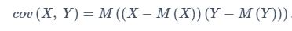

Бывает удобно вычислять ковариацию случайных величин X и Y по следующей формуле:

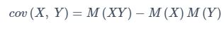

которая может быть получена из первой формулы, используя свойства математического ожидания. Перечислим основные
свойства **Ковариации**:

!!! info
    Ковариация случайной величины с самой собой есть её дисперсия

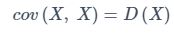

!!! info
    Ковариация симметрична

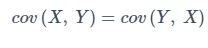

!!! info
    Если случайные величины X и Y независимы, то:

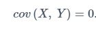

!!! info
    Постоянный множитель можно выносить за знак ковариации

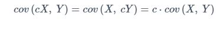

!!! info
    Ковариация не изменяется, если к одной из случайных величин(или двум сразу) прибавить постоянную величину

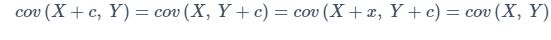

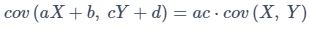

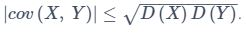

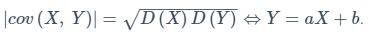

!!! info
    Дисперсия суммы/разности случайных величин равна сумме их дисперсий плюс/минус удвоенная ковариация этих случайных величин:

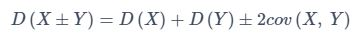

### Пример #1

Дана корреляционная таблица случайного вектора (X, Y). Требуется вычислить ковариацию ==cov(X, Y)==

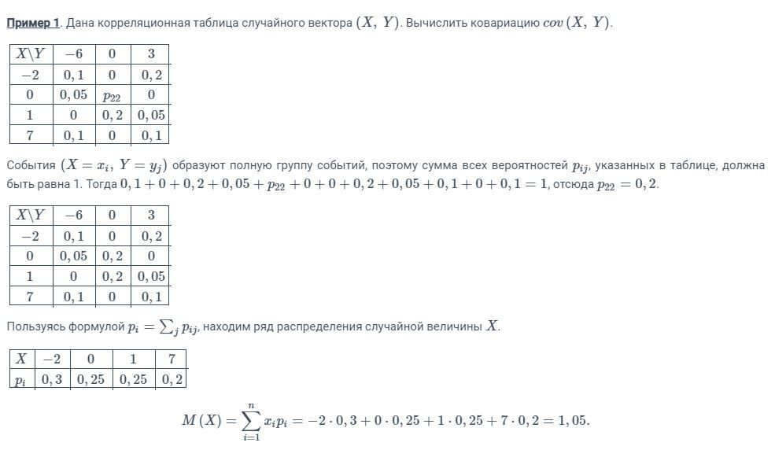

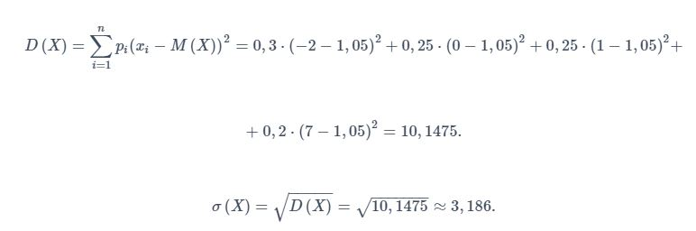

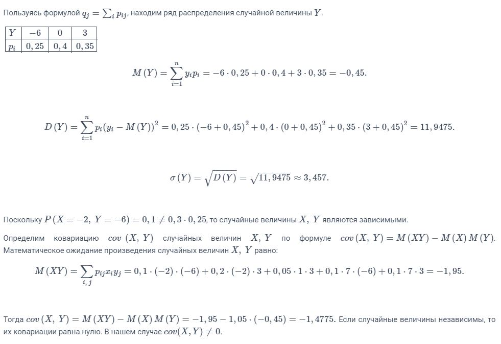

## Корреляция

Коэффициентом корреляции случайных величин X и Y называется число:

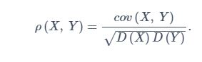

Перечислим **основные свойства** коэффициента корреляции:

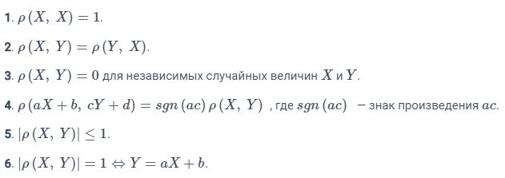

Ранее было сказано, что коэффициент корреляции p(X, Y) отражает степень линейной зависимости между двумя случайными
величинами X и Y.

- При ==p(X, Y) > 0== можно сделать вывод о том, что с ростом случайной величины X случайная величина Y имеет тенденцию
  к **увеличению**. Это называется **положительной корреляционной зависимостью**.
- При ==p(X, Y) < 0== можно сделать вывод о том, что с ростом случайной величины X случайная величина Y имеет тенденцию
  к **уменьшению**. Это называется ==отрицательной корреляционной зависимостью==.
- При ==p(X, Y) = 0== случайные величины X и Y называются **некоррелированными**. Стоит отметить, что
  некоррелированность случайных величин X и Y не означает их статистическую независимость, это говорить лишь о том, что
  между ними нет линейной зависимости.

### Пример #2

Определим коэффициент корреляции **p(X, Y)** для двумерной случайной величины (X, Y) из примера #1

Коэффициент корреляции случайных величин X, Y равен 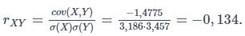

Поскольку r~XY~ < 0, то с ростом X случайная величина Y имеет тенденцию к уменьшению и будет являться отрицательной
корреляционной зависимостью.

