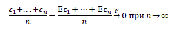
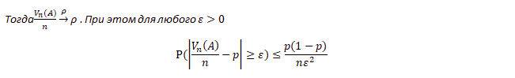
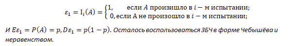

*[ЗБЧ]: Закон больших чисел

# Закон больших чисел

Говорят, что последовательность случайных величин ${\varepsilon_1, \varepsilon_2 ...}$ с конечными первыми моментами
удовлетворяет закону больших чисел (ЗБЧ), если

## Определение

`Законами больших чисел` принято называть утверждения о том, при каких условиях последовательность случайных величин
удовлетворяет закону больших чисел, т.е. обладает свойством.

Выясним сначала, когда выполнен ЗБЧ для последовательности независимых и одинаково распределённых случайных величин.

## Теорема Бернулли

Пусть событие `Α` может произойти в любом из `n` независимых испытаний с одной и той же вероятностью `P`, и
пусть `𝑉𝑛(𝐴)` — число осуществлений события `A` в `n` испытаниях.

Доказательство. Заметим, что `𝑉𝑛(𝐴)` есть сумма независимых, одинаково распределённых случайных величин, имеющих
распределение Бернулли с параметром `p=P(A)` (индикаторов того, что в соответствующем испытании произошло `A`):

`𝑉𝑛(𝐴)`=${\varepsilon_1 + ... \varepsilon_n}$, где

