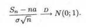
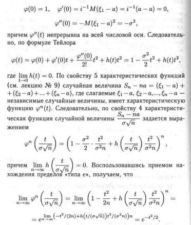
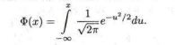
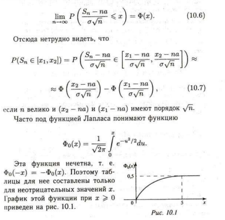
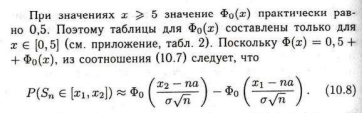
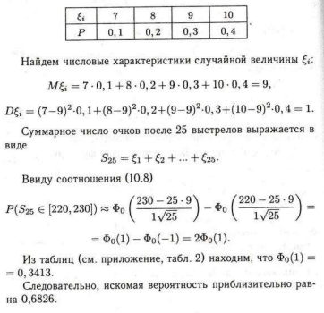
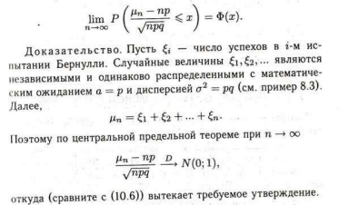

*[ЦПТ]: Центральная предельная теорема

# Центральная предельная теорема

Интегральная предельная теорема `Муавра-Лапласа`, обсуждаемая раннее, интересна тем, что она является частным случаем
общей и универсальной центральной предельной теоремы.

## Теорема 10.3 (Линдеберг-Леви)

Пусть `e1`, `e2` — независимые одинаково распределенные случайные величины с математическим ожиданием `a` и дисперсией
==Q~2~==

Тогда при ${n \rightarrow ∞}$:

## Замечание 10.3

Здесь значок `N(0; 1)` использован для обозначения случайной величины со стандартным нормальным распределением

## Доказательство

Пусть `q(t)` — характеристическая функция случайной величины `e1 - a` (а следовательно, `e2 - a, e3 - a ...`). По
свойствам характеристической функции:

Итак, характеристическая функция случайной величины ${\frac{S_n - n_a}{q \sqrt{n}}}$ сходится при ${n \rightarrow ∞}$ к
характеристической функции стандартного нормального распределения. Отсюда следует утверждение теоремы 10.3

Обозначим ${\Phi(х)}$ функцию распределения случайной величины, имеющей стандартное нормальное распределение, т.е.

Эта функция называется `функцией Лапласа`. Из математического анализа известно, что функция Лапласа не выражается через
элементарные функции, поэтому для нее составлены таблицы. Нетрудно понять, что ${\Phi(х) + \Phi(-х) = 1}$, поэтому
таблицы составлены лишь для неотрицательных значений `Х`.

Если вспомнить определение сходимости по распределению, то `ЦПТ`  означат, что для
произвольного `Х`:

## Пример 10.1

Стрелок попадает:

- в `десятку` с вероятностью `0.4`
- в `девятку` с вероятностью `0.3`
- в `восьмерку` с вероятностью `0.2`
- в `семерку` с вероятностью `0.1`

Он произвел `25` выстрелов. Найти вероятность того, что суммарное
`число выбитых очков находится в пределах от 220 до 230`,

Пусть ==E~i~== — число очков, выбитых при `i-м` выстреле. Ясно, что `E1, E2 ...` — независимые случайные величины,
причем c одинаковым распределением

В качестве следствия центральной предельной теоремы получим результат, называемый теоремой `Муавра-Лапласа`

## Теорема 10.4

Пусть проводятся испытания `Бернулли` с вероятностью успеха в одном испытании `р`, и ==H~n~== — число успехов в `n`
испытаниях. Тогда для произвольного `х`

