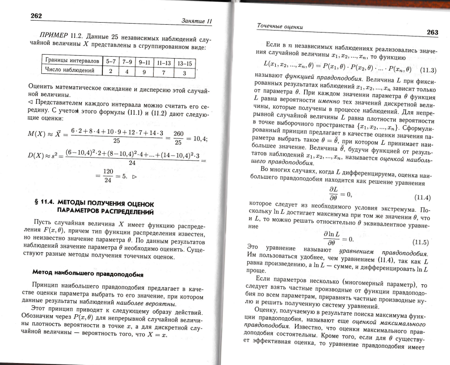
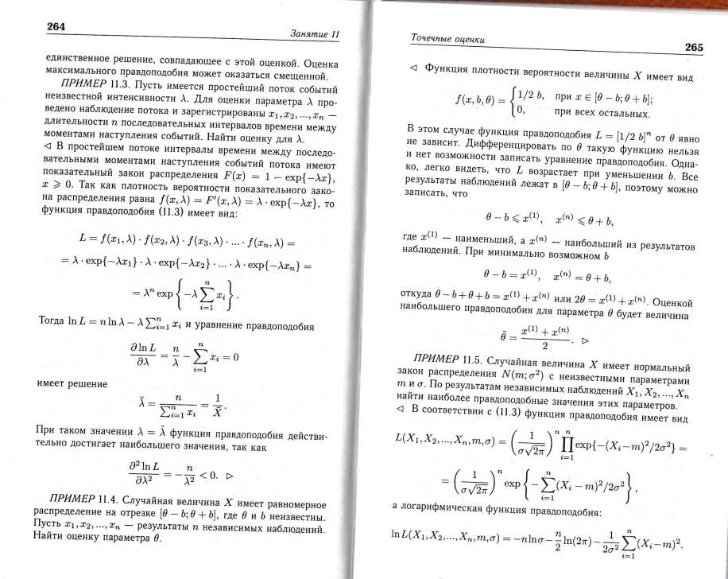
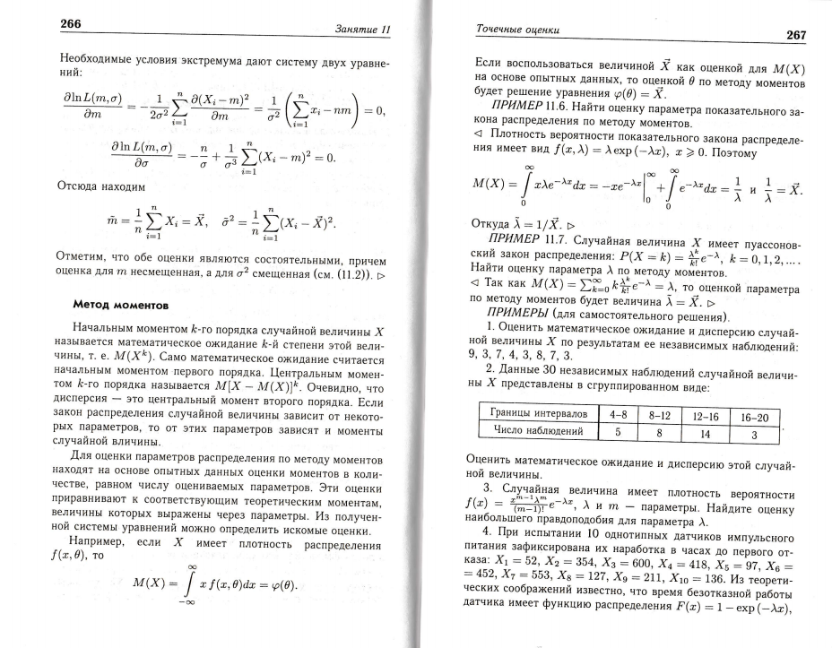
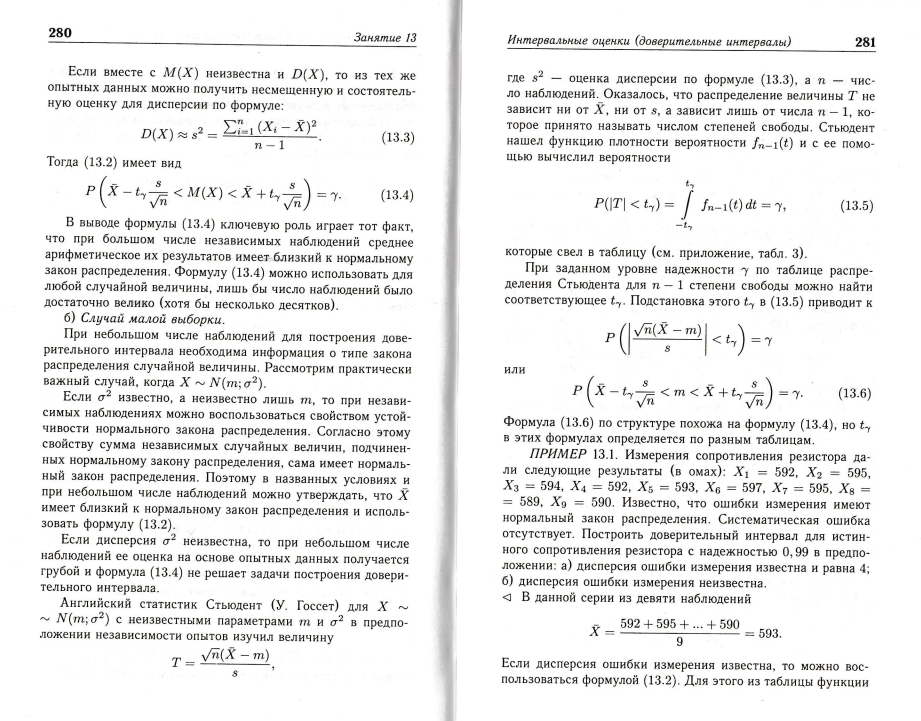
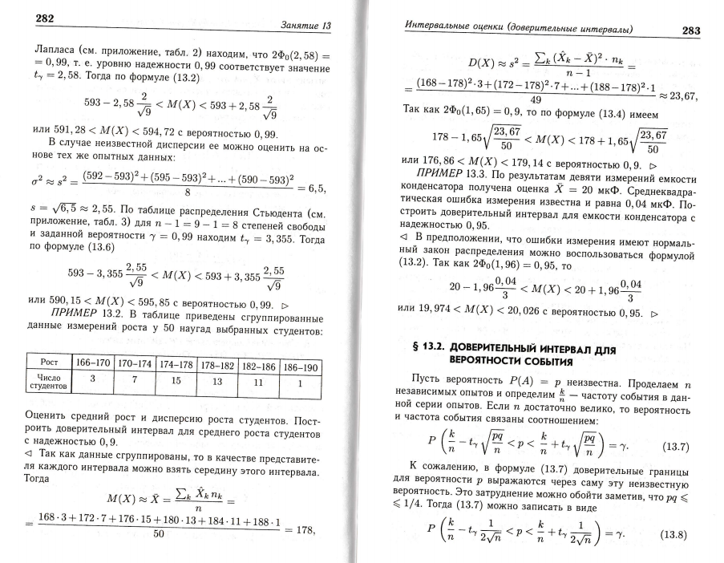
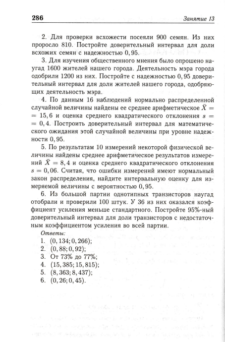

# Виды статистических оценок и случаи их применения

## Примеры

## Определение

### Виды статистических оценок:

- #### Точечная оценка
- #### Интервальная оценка

==Точечная оценка в математической статистике== — это число, оцениваемое на основе наблюдений, предположительно близкое
к оцениваемому параметру

В математической статистике ==интервальной оценкой== называется результат использования выборки для вычисления интервала
возможных значений неизвестного параметра, оценку которого нужно построить. Следует отличать от точечной оценки, которая
даёт лишь одно значение. Самым распространенным видом интервальных оценок являются ==доверительные интервалы==

Инфу можно найти на [123 странице ПДФ учебника](/probability/files/scan__petrushko__teor__ver.pdf){ target='_blank' }

Учебник лежит в чате `МЭИ // ИЭоз-40а-20 // Важная Информация`

Для поиска: `Скан учебника по теории`

<figure>
  
  <figcaption>Точечные оценки 1</figcaption>
</figure>

## Интервальные оценки

