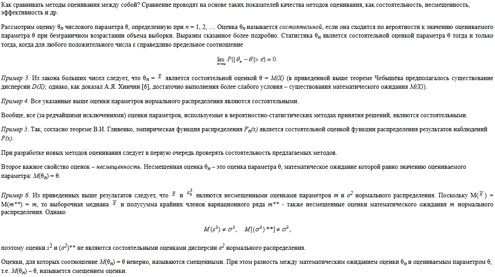
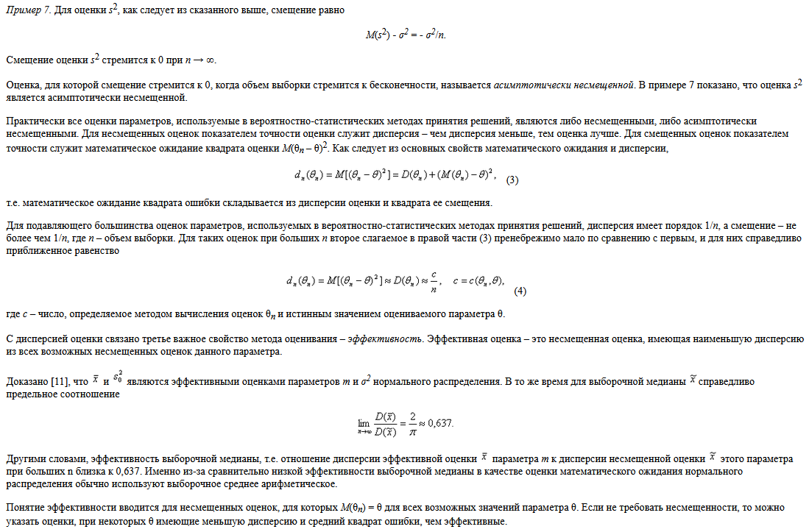
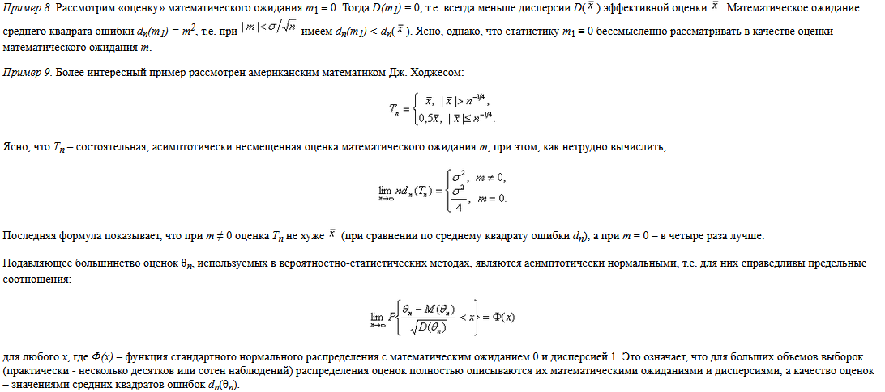

# Несмещенные, эффективные и состоятельные оценки

Одной из центральных задач математической статистики является ==задача оценки теоретического распределения случайной
величины на основе выборочных данных==. При этом предполагается, что закон распределения генеральной совокупности
известен, но неизвестны его параметры, такие, например, как математическое ожидание, дисперсия. Требуется найти
приближенные значения этих параметров, т.е. получить их статистические оценки

Чтобы статистические оценки давали «хорошие» приближения оцениваемых параметров, они должны удовлетворять определенным
требованиям

**Обозначим через оценку $\dot{\theta}$** некоторого теоретического параметра $\dot{\theta}$ закона распределения
случайной величины `Х`. Рассматривая выборочные значения ${x_1, x_2, x_3, x_n}$, как реализации случайных
величин `X1, X2, , ...Хn`, получивших конкретные значения в результате опытов, можно представить оценку как функцию этих
случайных величин: $\dot{\theta} = \varphi (X_1, X_2, ... X_n)$

Это значит, что оценка тоже ==является случайной величиной==. Если для оценки некоторого параметра $\dot{\theta}$ взять
несколько (k) выборок, то в общем случае получим столько же различных случайных оценок $\dot{\theta}_1$ $\dot{\theta}_2$
$\dot{\theta}_3$ Математическое ожидание случайной величины $\dot{\theta}$, имеющей отмеченные реализации, может как
совпадать, так и не совпадать с оцениваемым параметром $\theta$

**Несмещенной называется статистическая оценка** $\dot{\theta}$, математическое ожидание которой равно оцениваемому
параметру, т.е. M($\dot{\theta}$) = $\theta$

**Смещенной называется статистическая оценка** $\dot{\theta}$, математическое ожидание которой равно оцениваемому
параметру. Так же как и для любой случайной величины, оценка может иметь большой или небольшой разброс (дисперсию)
относительно математического ожидания

**Эффективной называется статистическая оценка**, $\dot{\theta}$ которая при одних и тех же объемам выборки имеет
наименьшую дисперсию. В некоторых случаях становится интересным поведение оценки при неограниченном увеличении объема
выборки

**Состоятельной называется статистическая оценка** $\dot{\theta}$, которая при увеличении объема выборки `n`
стремится по вероятности к оцениваемому параметру, т.е. P($\dot{\theta}$ = $\theta$ /$n \to \infty$) = 1. В частности,
если дисперсия оценки при $n \to \infty$ стремится к нулю, то такая оценка ==является состоятельной==

## Примеры

