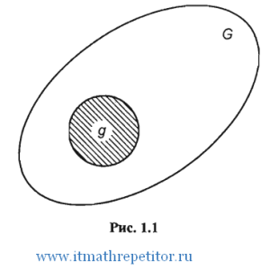

# Геометрические вероятности

Классическое определение вероятности предполагает, что число элементарных исходов конечно. На практике встречаются
опыты, для которых множество таких исходов бесконечно.

Чтобы преодолеть недостаток классического определения вероятности, состоящий в том, что оно неприменимо к испытаниям с
бесконечным числом исходов, вводят геометрические вероятности — `вероятности попадания точки в область`.

На плоскости задана квадрируемая область, т.е. область, имеющая площадь. Обозначим эту область буквой `G`, а ее площадь
${𝑆_𝐺}$. В области `G` содержится область `g` площади ${𝑆_𝑔}$ `(рис. 1.1)`. В область `G` наудачу брошена точка.
Будем считать, что брошенная точка может попасть в некоторую часть области `G` с вероятностью, пропорциональной площади
этой части и не зависящей от ее формы и расположения. Пусть `A` - попадание брошенной точки в область `g`, тогда
геометрическая вероятность этого события определяется формулой

${P(A) = \frac{𝑆_𝑔}{𝑆_𝐺}}$

Аналогично вводится понятие геометрической вероятности при бросании точки в пространственную область `G` объема ${𝑉_
𝐺}$, содержащую область `g` объема ${𝑉_𝑔}$:

${P(A) = \frac{𝑉_𝑔}{𝑉_𝐺}}$

В общем случае понятие геометрической вероятности вводится следующим образом. Обозначим меру
области `(длину, площадь, объем)` через `mes g`, а меру области `G` -
через `mes G` `(mes - первые три буквы французского слова mesure, что значит мера)`;

обозначим буквой `А` событие "попадание брошенной точки в области `g`, которая содержится в области `G`". Вероятность
попадания в область `g` точки, брошенной в область `G`, определяется формулой ${P(A) = \frac{𝑚𝑒𝑠 𝑔}{𝑚𝑒𝑠 𝐺}}$
